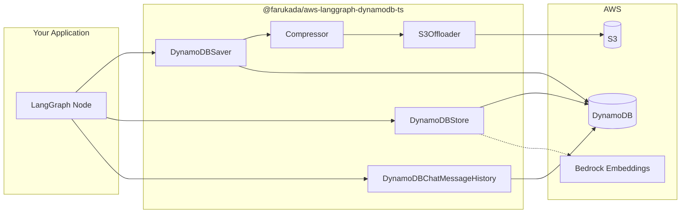

# @farukada/aws-langgraph-dynamodb-ts

[](https://www.npmjs.com/package/@farukada/aws-langgraph-dynamodb-ts)
[](https://github.com/sponsors/FarukAda)


AWS DynamoDB persistence layer for [LangGraph](https://langchain-ai.github.io/langgraphjs/) in TypeScript. Drop-in checkpoint storage, long-term memory with semantic search, and chat message history — all backed by DynamoDB with optional S3 offloading for large payloads.

## Table of Contents

- [Features](#features)
- [Architecture](#architecture)
- [Quick Start](#quick-start)
- [Infrastructure Setup](#infrastructure-setup)
- [Advanced Features](#advanced-features)
- [Configuration Reference](#configuration-reference)
- [IAM Permissions](#iam-permissions)
- [Documentation](#documentation)
- [Testing](#testing)
- [Project Structure](#project-structure)
- [Contributing](#contributing)
- [License](#license)

---

<a id="features"></a>

## Features

| Capability | Description |
|---|---|
| 🔄 **Checkpoint Saver** | Persistent checkpoint storage for LangGraph state management |
| 💾 **Memory Store** | Long-term memory with namespace support and optional semantic search |
| 💬 **Chat History** | Persistent chat message storage with auto-generated session titles |
| 🗜️ **Compression** | Optional gzip compression with smart thresholds (auto-detect on read) |
| ☁️ **S3 Offloading** | Transparent S3 offloading for payloads exceeding DynamoDB's 400 KB limit |
| ⚡ **Performance** | Composite keys, batch operations, exponential-backoff retry |
| ♻️ **TTL Support** | Automatic data expiration (days or seconds) |
| 🔒 **Type-Safe** | Full TypeScript with comprehensive type definitions |
| 🏭 **Factory** | One-line setup via `DynamoDBFactory.createAll()` |

<a id="architecture"></a>

## Architecture



<a id="quick-start"></a>

## Quick Start

### Install

```bash
npm install @farukada/aws-langgraph-dynamodb-ts
```

#### Peer Dependencies

```bash
npm install @aws-sdk/client-dynamodb @aws-sdk/lib-dynamodb \
  @langchain/core @langchain/langgraph @langchain/langgraph-checkpoint

# Optional — semantic search in Memory Store
npm install @langchain/aws

# Optional — S3 offloading for large payloads
npm install @aws-sdk/client-s3
```

### Checkpoint Storage

```typescript
import { StateGraph } from '@langchain/langgraph';
import { DynamoDBSaver } from '@farukada/aws-langgraph-dynamodb-ts';

const checkpointer = new DynamoDBSaver({
  checkpointsTableName: 'langgraph-checkpoints',
  writesTableName: 'langgraph-writes',
  ttlDays: 30,
  clientConfig: { region: 'us-east-1' },
});

const app = workflow.compile({ checkpointer });

// State is automatically persisted and can be resumed
await app.invoke(input, {
  configurable: { thread_id: 'conversation-123' },
});
```

### Memory Store

```typescript
import { DynamoDBStore } from '@farukada/aws-langgraph-dynamodb-ts';
import { BedrockEmbeddings } from '@langchain/aws';

const store = new DynamoDBStore({
  memoryTableName: 'langgraph-memory',
  embedding: new BedrockEmbeddings({
    region: 'us-east-1',
    model: 'amazon.titan-embed-text-v1',
  }),
  ttlDays: 90,
});

// Put memories
await store.batch([
  {
    namespace: ['user', 'preferences'],
    key: 'theme',
    value: { color: 'dark', fontSize: 14 },
  },
], { configurable: { user_id: 'user-123' } });

// Semantic search
const [results] = await store.batch([
  { namespacePrefix: ['user'], query: 'color preferences', limit: 5 },
], { configurable: { user_id: 'user-123' } });
```

### Chat History

```typescript
import { DynamoDBChatMessageHistory } from '@farukada/aws-langgraph-dynamodb-ts';
import { HumanMessage, AIMessage } from '@langchain/core/messages';

const history = new DynamoDBChatMessageHistory({
  tableName: 'langgraph-chat-history',
  ttlDays: 30,
});

await history.addMessages('user-123', 'session-456', [
  new HumanMessage('Hello!'),
  new AIMessage('Hi there!'),
]);

const sessions = await history.listSessions('user-123');
```

### Factory (One-Liner)

```typescript
import { DynamoDBFactory } from '@farukada/aws-langgraph-dynamodb-ts';

const { checkpointer, store, chatHistory, destroy } = DynamoDBFactory.createAll({
  tablePrefix: 'my-app',
  ttlDays: 30,
  clientConfig: { region: 'us-east-1' },
});

// When done, release the shared DynamoDB client
destroy();
```

<a id="infrastructure-setup"></a>

## Infrastructure Setup

Create the required DynamoDB tables using **AWS CDK** or **Terraform**.

<details>
<summary><strong>AWS CDK (TypeScript)</strong></summary>

```typescript
import * as dynamodb from 'aws-cdk-lib/aws-dynamodb';

// Checkpoints
new dynamodb.Table(this, 'Checkpoints', {
  tableName: 'langgraph-checkpoints',
  partitionKey: { name: 'thread_id', type: dynamodb.AttributeType.STRING },
  sortKey: { name: 'checkpoint_id', type: dynamodb.AttributeType.STRING },
  billingMode: dynamodb.BillingMode.PAY_PER_REQUEST,
  timeToLiveAttribute: 'ttl',
});

// Writes
new dynamodb.Table(this, 'Writes', {
  tableName: 'langgraph-writes',
  partitionKey: { name: 'thread_id_checkpoint_id_checkpoint_ns', type: dynamodb.AttributeType.STRING },
  sortKey: { name: 'task_id_idx', type: dynamodb.AttributeType.STRING },
  billingMode: dynamodb.BillingMode.PAY_PER_REQUEST,
  timeToLiveAttribute: 'ttl',
});

// Memory
new dynamodb.Table(this, 'Memory', {
  tableName: 'langgraph-memory',
  partitionKey: { name: 'user_id', type: dynamodb.AttributeType.STRING },
  sortKey: { name: 'namespace_key', type: dynamodb.AttributeType.STRING },
  billingMode: dynamodb.BillingMode.PAY_PER_REQUEST,
  timeToLiveAttribute: 'ttl',
});

// Chat History
new dynamodb.Table(this, 'ChatHistory', {
  tableName: 'langgraph-chat-history',
  partitionKey: { name: 'userId', type: dynamodb.AttributeType.STRING },
  sortKey: { name: 'sessionId', type: dynamodb.AttributeType.STRING },
  billingMode: dynamodb.BillingMode.PAY_PER_REQUEST,
  timeToLiveAttribute: 'ttl',
});
```

</details>

<details>
<summary><strong>Terraform</strong></summary>

```hcl
resource "aws_dynamodb_table" "checkpoints" {
  name         = "langgraph-checkpoints"
  billing_mode = "PAY_PER_REQUEST"
  hash_key     = "thread_id"
  range_key    = "checkpoint_id"
  attribute { name = "thread_id"     type = "S" }
  attribute { name = "checkpoint_id" type = "S" }
  ttl { attribute_name = "ttl" enabled = true }
}

resource "aws_dynamodb_table" "writes" {
  name         = "langgraph-writes"
  billing_mode = "PAY_PER_REQUEST"
  hash_key     = "thread_id_checkpoint_id_checkpoint_ns"
  range_key    = "task_id_idx"
  attribute { name = "thread_id_checkpoint_id_checkpoint_ns" type = "S" }
  attribute { name = "task_id_idx" type = "S" }
  ttl { attribute_name = "ttl" enabled = true }
}

resource "aws_dynamodb_table" "memory" {
  name         = "langgraph-memory"
  billing_mode = "PAY_PER_REQUEST"
  hash_key     = "user_id"
  range_key    = "namespace_key"
  attribute { name = "user_id"        type = "S" }
  attribute { name = "namespace_key"  type = "S" }
  ttl { attribute_name = "ttl" enabled = true }
}

resource "aws_dynamodb_table" "chat_history" {
  name         = "langgraph-chat-history"
  billing_mode = "PAY_PER_REQUEST"
  hash_key     = "userId"
  range_key    = "sessionId"
  attribute { name = "userId"    type = "S" }
  attribute { name = "sessionId" type = "S" }
  ttl { attribute_name = "ttl" enabled = true }
}
```

</details>

<a id="advanced-features"></a>

## Advanced Features

### Gzip Compression

Reduce DynamoDB item sizes and costs by enabling transparent gzip compression:

```typescript
const checkpointer = new DynamoDBSaver({
  checkpointsTableName: 'langgraph-checkpoints',
  writesTableName: 'langgraph-writes',
  compression: {
    enabled: true,
    minSizeBytes: 1024, // Only compress payloads ≥ 1 KB
  },
});
```

### S3 Offloading

Automatically offload payloads exceeding DynamoDB's 400 KB item limit to S3:

```typescript
const checkpointer = new DynamoDBSaver({
  checkpointsTableName: 'langgraph-checkpoints',
  writesTableName: 'langgraph-writes',
  s3OffloadConfig: {
    bucketName: 'my-checkpoints-bucket',
    keyPrefix: 'langgraph/',              // default: 'langgraph-checkpoints/'
    thresholdBytes: 350 * 1024,           // default: 350 KB
    serverSideEncryption: 'aws:kms',      // optional: 'AES256' or 'aws:kms'
    sseKmsKeyId: 'alias/my-key',          // optional: KMS key ID/ARN
    clientConfig: { region: 'us-east-1' },
  },
});
```

When TTL and S3 offloading are both enabled, the library automatically configures an S3 lifecycle expiration rule on the bucket (scoped to the key prefix). This requires `s3:GetBucketLifecycleConfiguration` and `s3:PutBucketLifecycleConfiguration` permissions on the bucket. If these permissions are unavailable, a warning is logged but the saver continues to function normally.

### Store Filters

```typescript
// JSONPath-based filtering: $eq, $ne, $gt, $gte, $lt, $lte
const [results] = await store.batch([
  {
    namespacePrefix: ['products'],
    filter: {
      'value.price': { $gte: 10, $lte: 100 },
      'value.category': { $eq: 'electronics' },
    },
    limit: 10,
  },
], { configurable: { user_id: 'user-123' } });
```

### Namespace Organization

```typescript
// Hierarchical namespace patterns
['user', userId, 'preferences']
['user', userId, 'conversations', threadId]
['documents', 'category', 'subcategory']
```

<a id="configuration-reference"></a>

## Configuration Reference

### DynamoDBSaver

| Option | Type | Default | Description |
|---|---|---|---|
| `checkpointsTableName` | `string` | — | Checkpoints table name (**required**) |
| `writesTableName` | `string` | — | Writes table name (**required**) |
| `ttlDays` | `number` | — | TTL in days |
| `ttlSeconds` | `number` | — | TTL in seconds (overrides `ttlDays`) |
| `compression` | `object` | — | `{ enabled, minSizeBytes?, level? }` |
| `s3OffloadConfig` | `object` | — | `{ bucketName, keyPrefix?, thresholdBytes?, serverSideEncryption?, sseKmsKeyId?, clientConfig? }` |
| `clientConfig` | `object` | — | AWS SDK `DynamoDBClientConfig` |
| `client` | `DynamoDBDocument` | — | Pre-built client (takes precedence over `clientConfig`) |

### DynamoDBStore

| Option | Type | Default | Description |
|---|---|---|---|
| `memoryTableName` | `string` | — | Memory table name (**required**) |
| `embedding` | `EmbeddingsInterface` | — | Any LangChain embeddings provider for semantic search |
| `ttlDays` | `number` | — | TTL in days |
| `clientConfig` | `object` | — | AWS SDK `DynamoDBClientConfig` |
| `client` | `DynamoDBDocument` | — | Pre-built client (takes precedence over `clientConfig`) |

### DynamoDBChatMessageHistory

| Option | Type | Default | Description |
|---|---|---|---|
| `tableName` | `string` | — | Chat history table name (**required**) |
| `ttlDays` | `number` | — | TTL in days |
| `clientConfig` | `object` | — | AWS SDK `DynamoDBClientConfig` |
| `client` | `DynamoDBDocument` | — | Pre-built client (takes precedence over `clientConfig`) |

<a id="iam-permissions"></a>

## IAM Permissions

<details>
<summary><strong>Minimum IAM Policy</strong></summary>

```json
{
  "Version": "2012-10-17",
  "Statement": [
    {
      "Sid": "CheckpointerAccess",
      "Effect": "Allow",
      "Action": [
        "dynamodb:GetItem",
        "dynamodb:PutItem",
        "dynamodb:Query",
        "dynamodb:BatchGetItem",
        "dynamodb:BatchWriteItem",
        "dynamodb:TransactWriteItems"
      ],
      "Resource": [
        "arn:aws:dynamodb:REGION:ACCOUNT:table/langgraph-checkpoints",
        "arn:aws:dynamodb:REGION:ACCOUNT:table/langgraph-writes"
      ]
    },
    {
      "Sid": "StoreAndHistoryAccess",
      "Effect": "Allow",
      "Action": [
        "dynamodb:GetItem",
        "dynamodb:PutItem",
        "dynamodb:UpdateItem",
        "dynamodb:DeleteItem",
        "dynamodb:Query",
        "dynamodb:BatchWriteItem"
      ],
      "Resource": [
        "arn:aws:dynamodb:REGION:ACCOUNT:table/langgraph-memory",
        "arn:aws:dynamodb:REGION:ACCOUNT:table/langgraph-chat-history"
      ]
    },
    {
      "Sid": "OptionalSemanticSearch",
      "Effect": "Allow",
      "Action": ["bedrock:InvokeModel"],
      "Resource": "arn:aws:bedrock:REGION::foundation-model/amazon.titan-embed-text-v1"
    },
    {
      "Sid": "OptionalS3Offloading",
      "Effect": "Allow",
      "Action": [
        "s3:PutObject",
        "s3:GetObject",
        "s3:DeleteObject",
        "s3:DeleteObjects"
      ],
      "Resource": "arn:aws:s3:::YOUR-BUCKET/langgraph-checkpoints/*"
    },
    {
      "Sid": "OptionalS3LifecycleManagement",
      "Effect": "Allow",
      "Action": [
        "s3:GetBucketLifecycleConfiguration",
        "s3:PutBucketLifecycleConfiguration"
      ],
      "Resource": "arn:aws:s3:::YOUR-BUCKET"
    }
  ]
}
```

</details>

<a id="documentation"></a>

## Documentation

- **[Checkpointer Guide](./src/checkpointer/checkpointer.md)** — Checkpoint management, workflow persistence, recovery
- **[Store Guide](./src/store/store.md)** — Memory storage, semantic search, filtering, namespaces
- **[History Guide](./src/history/history.md)** — Chat message storage, session management
- **[API Reference (TypeDoc)](./docs/README.md)** — Full class & interface documentation

<a id="testing"></a>

## Testing

```bash
npm test              # Run all tests
npm test -- --coverage # With coverage
npm run build         # Type-check + compile
npm run lint          # ESLint
```

<a id="project-structure"></a>

## Project Structure

```text
src/
├── checkpointer/     # DynamoDBSaver — checkpoint persistence
│   ├── actions/      # put, putWrites, getTuple, deleteThread, writer
│   ├── types/        # TypeScript interfaces & constants
│   └── utils/        # Deserialization, validation
├── store/            # DynamoDBStore — long-term memory
│   ├── actions/      # get, put, search, listNamespaces
│   ├── types/        # TypeScript interfaces
│   └── utils/        # Validation, filtering
├── history/          # DynamoDBChatMessageHistory — chat sessions
│   ├── actions/      # getMessages, addMessage(s), clear, listSessions
│   ├── types/        # TypeScript interfaces
│   └── utils/        # Validation, title generation
├── shared/           # Cross-cutting utilities
│   └── utils/        # Compressor, S3Offloader, retry, TTL, batch-write, logger
└── factory.ts        # DynamoDBFactory one-liner setup
```

<a id="contributing"></a>

## Contributing

Contributions welcome! Please:

1. Check existing issues or create a new one
2. Fork the repository
3. Create a feature branch
4. Add tests for your changes
5. Submit a pull request

<a id="license"></a>

## License

MIT © [FarukAda](https://github.com/farukada)

---

<p align="center">
  Built with <a href="https://langchain-ai.github.io/langgraphjs/">LangGraph</a> · <a href="https://aws.amazon.com/sdk-for-javascript/">AWS SDK v3</a> · <a href="https://github.com/langchain-ai/langchainjs">LangChain</a>
  <br/>
  <a href="https://www.npmjs.com/package/@farukada/aws-langgraph-dynamodb-ts">npm</a> · <a href="https://github.com/farukada/aws-langgraph-dynamodb-ts">GitHub</a> · <a href="https://github.com/farukada/aws-langgraph-dynamodb-ts/issues">Issues</a>
</p>
