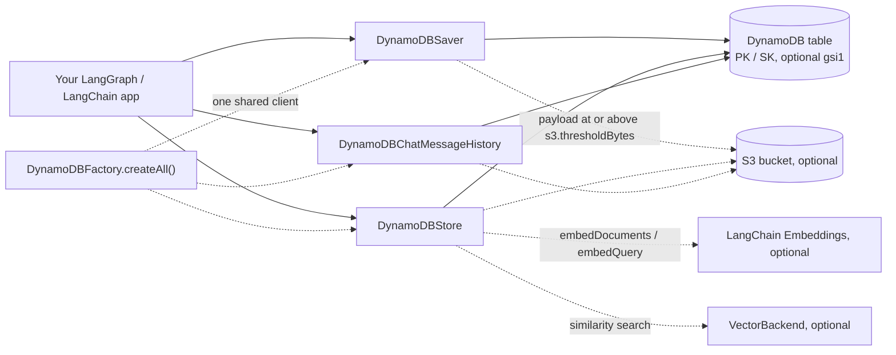

# @farukada/aws-langgraph-dynamodb-ts

[](https://www.npmjs.com/package/@farukada/aws-langgraph-dynamodb-ts)
[](https://github.com/FarukAda/aws-langgraph-dynamodb-ts/actions/workflows/ci.yml)
[](https://github.com/FarukAda/aws-langgraph-dynamodb-ts/actions/workflows/codeql.yml)
[](https://scorecard.dev/viewer/?uri=github.com/FarukAda/aws-langgraph-dynamodb-ts)


[](https://www.npmjs.com/package/@farukada/aws-langgraph-dynamodb-ts#provenance)
[](#testing)
[](https://github.com/sponsors/FarukAda)

Built with [LangGraph](https://langchain-ai.github.io/langgraphjs/) · [LangChain](https://github.com/langchain-ai/langchainjs) · [AWS SDK v3](https://aws.amazon.com/sdk-for-javascript/) — [npm](https://www.npmjs.com/package/@farukada/aws-langgraph-dynamodb-ts) · [GitHub](https://github.com/FarukAda/aws-langgraph-dynamodb-ts) · [Issues](https://github.com/FarukAda/aws-langgraph-dynamodb-ts/issues)

---

A DynamoDB persistence layer for [LangGraph](https://langchain-ai.github.io/langgraphjs/) in TypeScript (an ES-module build and a CommonJS build; Node ≥ 22). It provides three LangGraph/LangChain adapters — a checkpoint saver, a long-term memory store and a chat message history — plus a factory, and all three can live in a single DynamoDB table.

Every adapter supports optional **gzip compression**, **S3 offloading** of payloads over DynamoDB's 400 KB item limit, and **TTL-based expiry**. The store additionally supports **vector semantic search** — in-DynamoDB by default, or delegated to a **pluggable `VectorBackend`** (e.g. OpenSearch / pgvector) for large corpora — via any LangChain `Embeddings` implementation.

> **Independent project.** Maintained by [Faruk Ada](https://github.com/FarukAda), one person, in their own time — see [SUPPORT.md](SUPPORT.md) for what that means for response times. It is **not affiliated with, endorsed by, or sponsored by** Amazon Web Services, Inc. or LangChain, Inc. "AWS", "Amazon DynamoDB" and "Amazon S3" are trademarks of Amazon.com, Inc. or its affiliates; "LangChain" and "LangGraph" are trademarks of LangChain, Inc. They are used here only to name the service this package talks to and the framework it plugs into.

## At a glance

| | |
| --- | --- |
| **What it is** | Three LangGraph/LangChain adapters — a checkpoint saver, a memory store and a chat message history — plus a factory, over one DynamoDB table. [Architecture](#architecture) lists them; [Table schema](#table-schema) shows the layout. |
| **Maturity** | Release candidates of `1.0` come before `1.0.0`; the npm badge above shows the current version. [Versioning and support](#versioning-and-support) says what each release promises and who maintains it. |
| **What it costs** | Nothing for the package: you pay for DynamoDB, for S3 when payloads offload, and for your embeddings provider and `VectorBackend` if you use them. [What each operation costs](#what-each-operation-costs) gives the requests per call. |
| **The limits that bite** | Without `s3`, a payload over 392 KB after compression is refused; `thread_id` and `sessionId` are at most 1024 bytes, `checkpoint_ns` at most 512 bytes, other key segments at most 256 bytes, and no identifier may contain `#`. In-DynamoDB semantic search refuses more than 1000 candidates by default (`maxSearchCandidates`, ceiling 100 000); [full table](#limits). |
| **When it breaks** | One error class, `DynamoDBLangGraphError`, with a `code` from the 20 `ErrorCode` members, a structured `context` and the AWS error as `cause`. [Error handling](#error-handling) is the section to read first. |
| **When *not* to use it** | A large vector corpus with no external `VectorBackend`, writes to one `thread_id` or `sessionId` beyond one partition's throughput ([known limitations](#known-limitations)), or checkpoints to import from another saver, for which the package has [no importer](#migrating-from-another-checkpointer-or-store). Chat turns written to one session by several processes are ordered by their wall clocks ([chat history semantics](#chat-history-semantics)). |

## Table of Contents

- [Key features](#key-features)
- [Versioning and support](#versioning-and-support)
- [Architecture](#architecture)
- [Quick start](#quick-start)
  - [Installation](#installation)
  - [Peer dependencies](#peer-dependencies)
  - [Runtime requirements](#runtime-requirements)
  - [Minimal agent](#minimal-agent)
- [Usage examples](#usage-examples)
  - [Resume a thread and read its history](#resume-a-thread-and-read-its-history)
  - [Long-term memory with semantic search](#long-term-memory-with-semantic-search)
  - [Memory inside a graph](#memory-inside-a-graph)
  - [Chat history](#chat-history)
  - [RunnableWithMessageHistory](#runnablewithmessagehistory)
  - [One client for all three adapters](#one-client-for-all-three-adapters)
  - [Large payloads: S3 offload and compression](#large-payloads-s3-offload-and-compression)
  - [Expiry with TTL](#expiry-with-ttl)
  - [Bring your own DynamoDB client](#bring-your-own-dynamodb-client)
  - [Cancellation and timeouts](#cancellation-and-timeouts)
  - [Listing sessions, threads and namespaces](#listing-sessions-threads-and-namespaces)
- [Configuration reference](#configuration-reference)
  - [Shared options](#shared-options)
  - [Adapter options](#adapter-options)
  - [Nested options](#nested-options)
  - [Per-call options](#per-call-options)
- [Retries and backoff](#retries-and-backoff)
- [Error handling](#error-handling)
- [Logging](#logging)
- [Tracing and metrics](#tracing-and-metrics)
- [Advanced features](#advanced-features)
  - [Gzip compression](#gzip-compression) · [S3 offloading](#s3-offloading) · [Overwrite races and orphaned objects](#overwrite-races-and-orphaned-objects) · [Write idempotency](#write-idempotency) · [What a token guarantees, and what it does not](#what-a-token-guarantees-and-what-it-does-not) · [What a token costs](#what-a-token-costs) · [What a partition delete promises](#what-a-partition-delete-promises) · [What a partition delete costs](#what-a-partition-delete-costs) · [TTL expiry](#ttl-expiry) · [Plain (metadata) search](#plain-metadata-search) · [Semantic search](#semantic-search) · [Vector index consistency](#vector-index-consistency) · [Checkpointer semantics](#checkpointer-semantics) · [Chat history semantics](#chat-history-semantics) · [Differences from `InMemoryStore`](#differences-from-inmemorystore) · [Strong consistency](#strong-consistency)
- [Known limitations](#known-limitations)
  - [From DynamoDB and S3](#from-dynamodb-and-s3) · [From this package](#from-this-package)
- [Migrating](#migrating)
  - [Migrating from another checkpointer or store](#migrating-from-another-checkpointer-or-store) · [Migrating from earlier versions](#migrating-from-earlier-versions)
- [API reference](#api-reference)
  - [DynamoDBSaver](#dynamodbsaver)
  - [DynamoDBStore](#dynamodbstore)
  - [DynamoDBChatMessageHistory](#dynamodbchatmessagehistory)
  - [DynamoDBSessionChatMessageHistory](#dynamodbsessionchatmessagehistory)
  - [DynamoDBFactory](#dynamodbfactory)
  - [Functions and values](#functions-and-values)
- [Infrastructure setup](#infrastructure-setup)
  - [S3 lifecycle rules](#s3-lifecycle-rules)
- [Table schema](#table-schema)
- [IAM permissions](#iam-permissions)
  - [Multi-tenant deployments](#multi-tenant-deployments) · [Trust boundary](#trust-boundary)
- [Operations](#operations)
  - [Limits](#limits) · [What each operation costs](#what-each-operation-costs) · [Monitoring](#monitoring) · [Production notes](#production-notes) · [Maintenance operations](#maintenance-operations) · [What can still go wrong](#what-can-still-go-wrong) · [Finding rows whose payload was released](#finding-rows-whose-payload-was-released) · [Finding objects no row names](#finding-objects-no-row-names) · [Lambda and other short-lived runtimes](#lambda-and-other-short-lived-runtimes) · [Multi-tenancy](#multi-tenancy)
- [Versioning and compatibility](#versioning-and-compatibility)
  - [The public API](#the-public-api) · [The on-disk layout](#the-on-disk-layout) · [Errors, logs and row versions](#errors-logs-and-row-versions) · [Supported runtimes and peers](#supported-runtimes-and-peers) · [Deprecation](#deprecation) · [Not covered](#not-covered) · [Differences from the reference implementations](#differences-from-the-reference-implementations)
- [Testing](#testing)
- [Project structure](#project-structure)
- [Design decisions and evidence](#design-decisions-and-evidence)
- [Contributing](#contributing)
- [License](#license)

## Key features

| Feature | Description |
| --- | --- |
| **One table, disjoint key spaces** | All three adapters share one `PK`/`SK` table. Each tags its partition keys with its own prefix — `CHKPT#`, `STORE#`, `HIST#` — which differ in their first character, so one id reused as a `thread_id` and a `sessionId` can never touch the other adapter's rows. [Table schema](#table-schema) |
| **Tested against LangGraph itself** | The conformance tier runs LangChain's official checkpointer validation suite and a compiled LangGraph graph (interrupt and resume, subgraph namespaces, forks, `Send` fan-out) over the saver; the integration tier checks parity with `InMemoryStore` and `InMemoryChatMessageHistory`. [What the suite proves](#what-the-suite-does-and-does-not-prove) |
| **S3 offload behind a descriptor** | A payload at or above `s3.thresholdBytes` (default 350 KB) goes to S3 and the row keeps a small versioned descriptor; every write uploads under an id of its own, conditionally, so no two writes share an object. [S3 offloading](#s3-offloading) |
| **Gzip with a decompression guard** | `compression: { enabled: true }` gzips payloads of at least `minSizeBytes` (default 1 KB) when that saves more than 10%; reads refuse to inflate past `maxDecompressedBytes` (default 50 MiB), and, from this release on, a payload larger than that is stored uncompressed, so a reader configured like the writer never refuses a payload it wrote. [Gzip compression](#gzip-compression) |
| **TTL with matching S3 lifecycle rules** | `ttl: { days }` or `{ seconds }` stamps a `ttl` attribute and a row past its `ttl` is not served during DynamoDB's sweep lag; `ensureS3LifecycleRule()` installs the lifecycle rules that expire the offloaded objects to match. [S3 lifecycle rules](#s3-lifecycle-rules) |
| **Semantic search, in DynamoDB or delegated** | With an `index`, the store embeds each extracted text and ranks by the best-matching vector in process; with a `vectorBackend` it hands similarity search to OpenSearch, pgvector or anything else, and DynamoDB stays the canonical copy. [Semantic search](#semantic-search) |
| **Listings without table scans** | An opt-in recency index (`indexName`, a GSI on `gsi1pk`/`gsi1sk`) turns `history.listSessions()` and a thread-less `saver.list()` from a `Scan` into sharded `Query`s, newest first; `backfillRecencyIndex` prepares existing rows. [Maintenance operations](#maintenance-operations) |
| **Cancellation** | The long-running methods take an `AbortSignal`, which reaches the AWS SDK on every DynamoDB request and S3 transfer the call makes for you — not on the verification reads and the cleanup after a failure, which must finish, so a cancel ends a request in flight and rejects with `ABORTED`. [Cancellation](#cancellation) |
| **One error class, stable codes, validated input** | Every failure is a `DynamoDBLangGraphError` with a branchable `code`; no raw AWS error escapes a public method. Options and identifiers are checked before any request, and a mistake is a `VALIDATION` error naming the field. [Error handling](#error-handling) |
| **Silent by default, redactable logging** | Nothing is written to your console unless you pass a `logger`; `redactLogger` replaces secret-looking fields with `[REDACTED]` in what you do log. [Logging](#logging) |
| **Supply-chain provenance** | Published to npm with provenance attestations. [npm provenance](https://www.npmjs.com/package/@farukada/aws-langgraph-dynamodb-ts#provenance) |

## Versioning and support

- **Semantic versioning.** A **minor** may add exports, optional options and parameters, optional fields on returned objects, and widen accepted inputs. A **patch** only fixes behaviour against what is documented. Removing or renaming an export, making an option required, narrowing an input or changing a return type needs a **major**, preceded by a deprecation.
- **Which versions get fixes.** Only the current major, `1.x`, is supported, and fixes ship in the latest minor; `0.x` releases are not patched — upgrade to `1.x`. ([SECURITY.md](SECURITY.md))
- **The data on disk.** Every `1.x` release reads every row a `1.0` release wrote; key formats, required attributes and the payload descriptor change only in a major, with a migration note.
- **Errors.** `ErrorCode` values are append-only in `1.x`. Error and log *messages* are not covered — branch on `code` and the structured fields, never on text.
- **Runtimes and the Node floor.** `engines.node` requires Node ≥ 22, and CI runs the unit tier on Node 22, 24 and 26 across Linux, macOS and Windows, and the DynamoDB Local tiers on Linux with Node 22; consumers are checked against TypeScript 5.x and later. Dropping a Node major after its end of life is a **minor**, announced in the CHANGELOG; a peer range is never narrowed in a patch. Peer ranges are in [Supported runtimes and peers](#supported-runtimes-and-peers).
- **Production readiness.** The package is presently a release candidate of `1.0` — the npm badge above shows the exact version — and carries 100% branch coverage enforced on every commit; its behaviour is specified against AWS's own documentation and against [recorded live probes](docs/evidence/README.md) where AWS does not say, rather than against assumption. Read [the decision records](docs/decisions/README.md) and this section before depending on it in production.
- **Who maintains it.** One person, in their own time; response times are best effort ([SUPPORT.md](SUPPORT.md)). Security reports go through [SECURITY.md](SECURITY.md), which commits to an acknowledgement within three business days.

Full detail: [Versioning and compatibility](#versioning-and-compatibility).

## Architecture


```mermaid
graph LR
    App["Your LangGraph / LangChain app"] --> Saver["DynamoDBSaver"]
    App --> Store["DynamoDBStore"]
    App --> History["DynamoDBChatMessageHistory"]
    Factory["DynamoDBFactory.createAll()"] -. "one shared client" .-> Saver
    Factory -.-> Store
    Factory -.-> History
    Saver --> Table[("DynamoDB table<br/>PK / SK, optional gsi1")]
    Store --> Table
    History --> Table
    Saver -. "payload at or above s3.thresholdBytes" .-> Bucket[("S3 bucket, optional")]
    Store -.-> Bucket
    History -.-> Bucket
    Store -. "embedDocuments / embedQuery" .-> Embeddings["LangChain Embeddings, optional"]
    Store -. "similarity search" .-> Backend["VectorBackend, optional"]
```

Four classes do the work:

- **`DynamoDBSaver`** — checkpoint + pending-writes persistence (`extends BaseCheckpointSaver`).
- **`DynamoDBStore`** — long-term memory with optional semantic search (`extends BaseStore`).
- **`DynamoDBChatMessageHistory`** — multi-session chat history, with a single-session adapter (`forSession`) for `RunnableWithMessageHistory`.
- **`DynamoDBFactory`** — convenience constructors, including `createAll` (one shared client + a `destroy()`).

Every payload — a checkpoint, its metadata, a pending write, a store value, a chat message — goes through the same codec.

- **On the way in**, the adapter's `serde` serializes it, and zero bytes are refused. With `compression` enabled, bytes of at least `minSizeBytes` are gzipped, and kept gzipped only when that saves more than 10%. With `s3` configured, stored bytes at or above `thresholdBytes` are uploaded with `If-None-Match: *`, under a key made of the row's identifiers and the write's id, with the row's key as S3 metadata. The row keeps a descriptor saying where the payload is.
- **On the way out**, an offloaded key must lie under the row's own path before it is downloaded. The download is capped at `s3.maxDownloadBytes` and the gunzip at `compression.maxDecompressedBytes`, 50 MiB each by default. The configured `serde` then decodes the bytes.

**Checkpoint write — `saver.put`:**

1. The config and every identifier are validated before anything is encoded.
2. The checkpoint, then its metadata, are encoded as above; the saver's `serde` defaults to LangGraph's `JsonPlusSerializer`. If the metadata cannot be encoded, the checkpoint's upload is released at once.
3. Without `s3`, a payload over 392 KB after compression is refused with a `VALIDATION` error naming `payload` before any write.
4. One `TransactWriteItems` writes the `META` row (the metadata descriptor, the parent checkpoint id, the recency-index keys) and the `PAYLOAD` row (the checkpoint descriptor), both stamped with the `ttl` when one is configured. It carries a client request token drawn once, so every retry re-sends the identical request and a retry after a lost acknowledgement is not applied twice.
5. If the transaction fails with `s3` configured and a payload was offloaded, a consistent `GetItem` of the row carrying the offloaded descriptor decides the outcome: the transaction committed after all (success), did not commit (this call's uploads are deleted, the error is thrown), or cannot be told (nothing is deleted, the error is thrown). With nothing offloaded there is nothing to protect: no read is spent and the error is thrown as it came.

**Checkpoint read — `saver.getTuple`:**

1. A config naming no thread answers `undefined`. Otherwise the `META` row is a consistent `GetItem` when `checkpoint_id` is given, or a consistent newest-first `Query` of the namespace's `META#` rows — one per page without a `ttl`, 50 with one — keeping the first live one.
2. A consistent `GetItem` reads the `PAYLOAD` row; when it is not there the answer is `undefined`.
3. The checkpoint and the metadata are decoded while a consistent `Query` reads every pending `WRITE` row of the checkpoint, uncapped; superseded writes are dropped and the rest decoded `readConcurrency` at a time (8 by default).
4. A row whose format version `v` is newer than this release understands fails with `FORMAT_UNSUPPORTED`. A `META` row past its `ttl` is treated as absent, however long DynamoDB's sweep lags.

**Store — `store.put` and `store.search`:**

1. `put` reads the row it replaces with a consistent `GetItem` for its `createdAt`, revision and descriptor.
2. It embeds with `embedDocuments`: one vector per text the configured fields extract onto the row (a wildcard path such as `sections[*].text` extracts one per element), or — with a `vectorBackend` — one vector over the joined fields for the backend instead, never both. `index: false` embeds nothing.
3. It encodes the value (plain-JSON `JSON_SERDE` by default) under this put's own revision id and writes the row: a `PutItem`, or with `s3` a compare-and-swap on the revision it read — a one-item `TransactWriteItems` with a request token when the payload was offloaded. A failed write is read back before this put's upload is released.
4. Once the row is committed it releases the object the old row named, then syncs the `vectorBackend` best-effort: it upserts the new vector, or deletes the item's vector when the put has nothing to embed (`index: false`, or no indexable text). A backend failure is logged at `warn`, not thrown, and `reconcileVectorIndex` repairs it.
5. `search` with a `query` and a `vectorBackend` embeds the query, asks the backend for the top `offset + limit` matches, reads each canonical item from DynamoDB and applies `filter`, doubling the number it asks for until the page is full. It is capped too: a page with `offset + limit` over `maxSearchCandidates`, or one the filter still leaves short at that cap, is refused with a `VALIDATION` error.
6. Any other `search` — no `query`, or no `vectorBackend` — runs an eventually consistent `Query` of the `STORE#<namespace[0]>` partition (a `Scan` only for the empty prefix `[]`), decodes rows `readConcurrency` at a time and applies `filter` in process — stopping as soon as the page is full when there is nothing to rank, and otherwise refusing more than `maxSearchCandidates` rows before any decode, then ranking every candidate by cosine similarity to the embedded query.

**Chat history — `history.addMessages` and `history.getMessages`:**

1. `addMessages` validates the session id and every message before anything is sent; with a `ttl`, a consistent `GetItem` of the session row reads the conversation's expiry anchor, which every message then shares.
2. Each message is encoded under its own ULID (plain-JSON `JSON_SERDE` by default); if one fails, the uploads before it are released.
3. The messages are cut into chunks of at most 99 messages or 3.5 MB. Each chunk is one `TransactWriteItems` of its message rows plus the update of the `HISTORY#SESSION` row — the message count, `updatedAt`, the title and the TTL anchor — so the count never disagrees with the messages. If a chunk fails — the only one, or a later one — it is read back, then every already-committed chunk is deleted and the session row reverted; `COMPENSATION_FAILED` means either that rollback could not finish or that the failing chunk's own outcome could not be established.
4. `getMessages` is a consistent `Query` of the session's `HISTORY#MSG#` rows — the whole session oldest first, or newest first up to `limit` — skipping expired rows and refusing a row this adapter did not write.
5. Messages are decoded `readConcurrency` at a time and returned oldest first. A message whose payload is permanently lost, or which LangChain cannot rebuild into a message, is handled by `onCorruptMessage` — `'skip'`, the default, logs it at `error` and leaves it out; `'throw'` fails the read — and every other failure fails the read under either setting.

The key each row is stored under is in [Table schema](#table-schema).

---

## Quick start

### Installation

```bash
npm install @farukada/aws-langgraph-dynamodb-ts \
  @aws-sdk/client-dynamodb @aws-sdk/lib-dynamodb \
  @langchain/core @langchain/langgraph-checkpoint \
  @langchain/langgraph
```

`@langchain/langgraph` is your application's own dependency rather than this package's: the minimal agent below imports it to build the graph. The two DynamoDB SDK packages already ship with this package as dependencies; they are listed so that your own code can import them, as [Bring your own DynamoDB client](#bring-your-own-dynamodb-client) does.

Optional peer dependencies, installed only if you use the matching feature:

```bash
# Required only when S3 offloading is enabled
npm install @aws-sdk/client-s3

# Required only for semantic search in the store (any LangChain Embeddings works)
npm install @langchain/aws        # e.g. Bedrock Titan embeddings
```

The package ships two builds from one source: `import` loads an ES-module build and `require` a CommonJS one, each with its own declarations, so an ES-module application loads one copy of `@langchain/core` and `@langchain/langgraph-checkpoint` rather than a CommonJS copy beside its own ([decision record 29](docs/decisions/0029-publish-both-an-es-module-and-a-commonjs-build.md)). Use named imports; the package has no default export:

```typescript
import { DynamoDBSaver } from '@farukada/aws-langgraph-dynamodb-ts'; // ES modules or TypeScript
```

```js
const { DynamoDBSaver } = require('@farukada/aws-langgraph-dynamodb-ts'); // CommonJS
```

### Peer dependencies

| Package | Range | Needed for |
| --- | --- | --- |
| `@langchain/core` | `^1.2.11` | every adapter: messages, `Embeddings`, `RunnableConfig` |
| `@langchain/langgraph-checkpoint` | `^1.1.5` | every adapter: `BaseCheckpointSaver`, `BaseStore`, the serializer protocol |
| `@aws-sdk/client-s3` | `^3.1132.0` | S3 offloading only; an optional peer |
| `@langchain/langgraph` | any 1.x release depending on a supported `@langchain/langgraph-checkpoint` | your application's, not a peer: the graphs in the examples below |

`@aws-sdk/client-dynamodb`, `@aws-sdk/lib-dynamodb` and `@aws-sdk/util-dynamodb` are regular dependencies and install with the package. What each range is tested against is in [Supported runtimes and peers](#supported-runtimes-and-peers).

### Runtime requirements

- **Node.js** 22 or later; CI runs 22, 24 and 26 on Linux, macOS and Windows.
- **Module format:** an ES-module build for `import` and a CommonJS build for `require`, each with its own declarations, as shown above.
- **TypeScript:** the shipped declarations target TypeScript 5.x and later.
- **Tree-shaking:** the package declares `"sideEffects": false`.
- **Bundling:** the optional `@aws-sdk/client-s3` peer is loaded lazily on first use — a dynamic `import()`, which the CommonJS build compiles to `require` — so a bundler (esbuild, rollup, webpack) must either have it installed or mark `@aws-sdk/*` external — CDK's `NodejsFunction` does the latter by default, a bare esbuild build does not.
- **Top-level `await`:** the samples in this README use it, which needs an ES module (a `.mjs` file, `"type": "module"`, or TypeScript emitting ES modules). In CommonJS, wrap a sample's body in an `async` function and call it.

### Minimal agent

The table must exist before the first call: [Infrastructure setup](#infrastructure-setup) creates it, and [IAM permissions](#iam-permissions) lists the actions the adapters call. This is a complete LangGraph agent whose conversation lives in DynamoDB:

```typescript
import type { BaseChatModel } from '@langchain/core/language_models/chat_models';
import { END, MessagesAnnotation, START, StateGraph } from '@langchain/langgraph';
import { DynamoDBSaver } from '@farukada/aws-langgraph-dynamodb-ts';

declare const model: BaseChatModel; // any LangChain chat model, e.g. ChatBedrockConverse

const checkpointer = new DynamoDBSaver({
  tableName: 'langgraph',
  clientConfig: { region: 'eu-west-1' },
});

const agent = new StateGraph(MessagesAnnotation)
  .addNode('model', async (state) => ({ messages: [await model.invoke(state.messages)] }))
  .addEdge(START, 'model')
  .addEdge('model', END)
  .compile({ checkpointer });

const thread = { configurable: { thread_id: 'user-42' } };
await agent.invoke({ messages: [{ role: 'user', content: 'My name is Ada.' }] }, thread);

// A later request, even from another process: the conversation is read back from DynamoDB.
const { messages } = await agent.invoke(
  { messages: [{ role: 'user', content: 'What is my name?' }] },
  thread,
);
console.log(messages.at(-1)?.content);

checkpointer.destroy(); // releases the DynamoDB client this saver created
```

Every step of the graph writes a checkpoint under `thread_id`, and the second `invoke` starts from the newest one, so the model sees both turns. The saver built its own client from `clientConfig`, which is why `destroy()` closes it; an injected `client` is never closed ([Bring your own DynamoDB client](#bring-your-own-dynamodb-client)). The [examples](examples/README.md) directory has runnable scripts against real AWS, including an agent on a Bedrock chat model whose only memory is `DynamoDBSaver`.

## Usage examples

Each example below compiles in CI against the package's source. A sample that uses `saver`, `store`, `history`, `model` or `embeddings` without constructing it assumes an adapter built as in the examples around it, a LangChain chat model and a LangChain `Embeddings`. The [examples](examples/README.md) directory holds scripts that run against real AWS.

### Resume a thread and read its history

Use this when a user comes back to a conversation, or when you need to show, audit or delete what a thread did.

```typescript
import { END, MessagesAnnotation, START, StateGraph } from '@langchain/langgraph';

const agent = new StateGraph(MessagesAnnotation)
  .addNode('model', async (state) => ({ messages: [await model.invoke(state.messages)] }))
  .addEdge(START, 'model')
  .addEdge('model', END)
  .compile({ checkpointer: saver });

const thread = { configurable: { thread_id: 'user-42' } };

// Resume: the graph starts from the thread's newest checkpoint in DynamoDB.
await agent.invoke({ messages: [{ role: 'user', content: 'Where were we?' }] }, thread);

// The newest checkpoint of the thread. A thread with no checkpoint reads as
// { values: {}, next: [] }, so `messages` may be absent.
const current = await agent.getState(thread);
console.log(current.values.messages?.length ?? 0, current.next);

// Every checkpoint of the thread, newest first.
for await (const snapshot of agent.getStateHistory(thread)) {
  console.log(snapshot.config.configurable?.checkpoint_id, snapshot.metadata?.step);
}

// Remove the thread: its checkpoints and pending writes, then (best-effort) their offloaded payloads.
await saver.deleteThread('user-42');
```

`invoke` on an existing `thread_id` continues from its newest checkpoint; on an unknown one it starts empty, and `getState` of an unknown thread returns empty `values` rather than throwing. `getState` reads through `saver.getTuple`, which is strongly consistent, so a checkpoint just written is always seen; `getStateHistory` reads through `saver.list`, which is eventually consistent. `deleteThread` reads the thread's partition once and deletes what it saw, so run it when no graph is still writing to the thread ([Checkpointer semantics](#checkpointer-semantics)).

### Long-term memory with semantic search

Use the store for facts that outlive one thread — a user's preferences, notes, documents — and search them by meaning, by field values, or both.

```typescript
import { BedrockEmbeddings } from '@langchain/aws';
import { DynamoDBStore } from '@farukada/aws-langgraph-dynamodb-ts';

const store = new DynamoDBStore({
  tableName: 'langgraph',
  clientConfig: { region: 'eu-west-1' },
  index: {
    dims: 1024,
    embeddings: new BedrockEmbeddings({ model: 'amazon.titan-embed-text-v2:0', region: 'eu-west-1' }),
    fields: ['text'], // which fields to embed; defaults to the whole document ('$')
  },
});

await store.put(['library'], 'doc-1', {
  text: 'Amazon DynamoDB is a serverless NoSQL database',
  kind: 'note',
  stars: 5,
});
await store.put(['library'], 'doc-2', {
  text: 'Espresso is a concentrated coffee',
  kind: 'recipe',
  stars: 3,
});

// Metadata filtering (operators: $eq, $ne, $gt, $gte, $lt, $lte, $in, $nin)
const notes = await store.search(['library'], { filter: { kind: 'note', stars: { $gte: 4 } } });
const either = await store.search(['library'], { filter: { kind: { $in: ['note', 'recipe'] } } });

// Semantic search — ranked by cosine similarity to the query embedding
const hits = await store.search(['library'], { query: 'cloud database', limit: 5 });
//=> doc-1 should rank first, with a `score` on each SearchItem

await store.get(['library'], 'doc-1');
await store.delete(['library'], 'doc-1');
await store.listNamespaces({ prefix: ['library'], maxDepth: 1 });

store.destroy();
```

With an `index`, `put` embeds each extracted text separately and `search` ranks an item by its best-matching vector, in process; a prefix holding more than `maxSearchCandidates` candidates (default 1000) is refused with a `VALIDATION` error rather than ranked. A filter names top-level fields of the stored value, every condition must hold, and `$gt`/`$gte`/`$lt`/`$lte` compare like types only — numbers with numbers, strings with strings — where `InMemoryStore` converts both sides with `Number()` ([Differences from the reference implementations](#differences-from-the-reference-implementations)). For a corpus larger than that cap, configure a `vectorBackend` ([Semantic search](#semantic-search), [Vector index consistency](#vector-index-consistency)).

### Memory inside a graph

Use this when a node should recall what it learned about a user in earlier threads, and remember new facts for later ones.

```typescript
import { SystemMessage } from '@langchain/core/messages';
import {
  END,
  type LangGraphRunnableConfig,
  MessagesAnnotation,
  START,
  StateGraph,
} from '@langchain/langgraph';
import { randomUUID } from 'node:crypto';

async function respond(state: typeof MessagesAnnotation.State, config: LangGraphRunnableConfig) {
  const userId: unknown = config.configurable?.user_id;
  if (typeof userId !== 'string' || userId === '') {
    throw new Error('configurable.user_id is required: memories are namespaced per user');
  }
  const query = String(state.messages.at(-1)?.content ?? '');

  const memories = (await config.store?.search(['memories', userId], { query, limit: 3 })) ?? [];
  const recalled = memories.map((memory) => String(memory.value.text)).join('\n');

  const reply = await model.invoke([
    new SystemMessage(`What you know about this user:\n${recalled}`),
    ...state.messages,
  ]);
  // Stored verbatim to keep the sample short; a real app would extract facts first.
  await config.store?.put(['memories', userId], randomUUID(), { text: query });
  return { messages: [reply] };
}

const agent = new StateGraph(MessagesAnnotation)
  .addNode('respond', respond)
  .addEdge(START, 'respond')
  .addEdge('respond', END)
  .compile({ checkpointer: saver, store });

await agent.invoke(
  { messages: [{ role: 'user', content: 'I prefer answers in French.' }] },
  { configurable: { thread_id: 'thread-7', user_id: 'user-42' } },
);
```

The checkpointer keeps this thread; the store keeps what outlives it, keyed by user rather than by thread. Inside a graph LangGraph reaches the store through `batch()`, so upstream's `put()`-only namespace rules (no `.` in a label, no `"langgraph"` root) do not apply there, and the per-item `index` argument of `put` is not forwarded ([Production notes](#production-notes), [Differences from `InMemoryStore`](#differences-from-inmemorystore)). Without an `index` on the store, a `search` with a `query` falls back to a plain, unranked search.

### Chat history

Use this when your application stores a plain message list per session — a chat UI, a support transcript — rather than a LangGraph state.

```typescript
import { AIMessage, HumanMessage } from '@langchain/core/messages';
import { DynamoDBChatMessageHistory } from '@farukada/aws-langgraph-dynamodb-ts';

const history = new DynamoDBChatMessageHistory({
  tableName: 'langgraph',
  clientConfig: { region: 'eu-west-1' },
});

await history.addMessages('session-1', [new HumanMessage('Hello!')]);
await history.addMessage('session-1', new AIMessage('Hi!'));
const messages = await history.getMessages('session-1');
const recent = await history.getMessages('session-1', { limit: 20 }); // newest 20, chronological
await history.clear('session-1');

history.destroy();
```

By default a read returns the whole session. `getMessages(sessionId, { limit, before })` returns a window instead — the newest `limit` messages, or only those appended before `before` — and `history.forSession(sessionId, { limit: 50 })` bounds what the adapter feeds the chain to the newest fifty, so a long-lived session does not grow the prompt without limit.

`forSession` checks its arguments when it is called: a malformed session id, a window naming a key other than `limit`, or a `limit` that is not an integer of at least 1 and at most 10,000 throws `VALIDATION` synchronously, rather than returning an adapter that fails on first use. `RunnableWithMessageHistory` calls `getMessageHistory` from inside an async method, so there the throw surfaces as a rejected invocation.

Listing sessions is in [Listing sessions, threads and namespaces](#listing-sessions-threads-and-namespaces).

### RunnableWithMessageHistory

Use this to give a LangChain chain (not a graph) a memory, through the single-session adapter `forSession`.

```typescript
import { ChatPromptTemplate, MessagesPlaceholder } from '@langchain/core/prompts';
import { RunnableWithMessageHistory } from '@langchain/core/runnables';
import { DynamoDBChatMessageHistory } from '@farukada/aws-langgraph-dynamodb-ts';

const history = new DynamoDBChatMessageHistory({
  tableName: 'langgraph',
  clientConfig: { region: 'eu-west-1' },
});

const prompt = ChatPromptTemplate.fromMessages([
  ['system', 'You are a helpful assistant.'],
  new MessagesPlaceholder('history'),
  ['human', '{input}'],
]);

const chat = new RunnableWithMessageHistory({
  runnable: prompt.pipe(model),
  getMessageHistory: (sessionId) => history.forSession(sessionId, { limit: 50 }),
  inputMessagesKey: 'input',
  historyMessagesKey: 'history',
});

const reply = await chat.invoke(
  { input: 'Hi, I am Ada.' },
  { configurable: { sessionId: 'session-1' } },
);

history.destroy();
```

Before each call the chain reads the newest fifty messages of the session into `{history}`; after it, the input and the reply are appended to the session. The window only bounds what is read — every message stays stored until `clear()` or its `ttl`.

### One client for all three adapters

Use the factory when one process runs the checkpointer, the store and the history together and should hold one DynamoDB client and one set of defaults.

```typescript
import { HumanMessage } from '@langchain/core/messages';
import { DynamoDBFactory } from '@farukada/aws-langgraph-dynamodb-ts';

const factory = new DynamoDBFactory({
  clientConfig: { region: 'eu-west-1' },
  ttl: { days: 30 },
  compression: { enabled: true },
});

const { saver, store, history, destroy } = factory.createAll({
  saver: { tableName: 'langgraph' },
  store: { tableName: 'langgraph', index: { dims: 1024, embeddings } },
  history: { tableName: 'langgraph' },
});

try {
  await store.put(['users', 'user-42'], 'profile', { text: 'Prefers French' });
  await history.addMessage('session-1', new HumanMessage('Bonjour'));
  // ... compile graphs with saver and store ...
} finally {
  destroy(); // closes the one shared client
}
```

`createAll` builds all three adapters on **one shared DynamoDB client** and returns a single `destroy()` that tears everything down.

Any section may be omitted (`createAll({ store: { tableName } })` returns `saver` and `history` as `undefined`), the factory's own `ttl`, `compression`, `s3`, `retry` and `logger` apply to every adapter unless a section overrides them, and `createSaver`, `createStore` and `createChatMessageHistory` build one adapter each with the same defaults — on the factory's `client` when it was given one, which the adapter never closes, and otherwise on a client of its own.

`destroy()` on an adapter — `DynamoDBSaver`, `DynamoDBStore` (also `stop()`) or `DynamoDBChatMessageHistory` — offers **every** resource it owns its release before it reports anything, and then raises the first failure as a `DynamoDBLangGraphError` carrying it as `cause`, so a client that refuses to close cannot strand the one behind it. A second `destroy()` does nothing. A `client` you injected is yours and is never destroyed. The factory's `destroy()` is the deliberate exception: it tears down three adapters at once, so it releases them all, logs any that failed and never throws.

The argument of each `create*` method, and each `createAll` section, is one adapter's options, and a mistake in it is named the way that adapter's constructor names it: `options` for a value that is not an object — `null` included, so a `null` section is refused rather than skipped — and `options.<key>`, `tableName` and so on for one inside it. `createAll` also refuses a key other than `saver`, `store` and `history`, naming `options.<key>`. The factory's own options are checked when it is constructed: options that are not an object, an unknown key, a `client` beside a `clientConfig`, a `clientConfig` that is not an object, and a `logger` missing one of its four methods, since `createAll` logs its own teardown failures through it. Its `ttl`, `compression`, `s3` and `retry` are checked by each adapter that inherits them, since an adapter's own options may replace them.

### Large payloads: S3 offload and compression

Use this when a checkpoint, a stored value or a message can approach DynamoDB's 400 KB item limit — long tool outputs, documents in state, many messages in one checkpoint.

```typescript
import { DynamoDBSaver } from '@farukada/aws-langgraph-dynamodb-ts';

const saver = new DynamoDBSaver({
  tableName: 'langgraph',
  clientConfig: { region: 'eu-west-1' }, // the S3 client uses this region too
  compression: { enabled: true },
  s3: { bucketName: 'my-langgraph-payloads' },
  ttl: { days: 30 },
});

await saver.ensureS3LifecycleRule(); // once, from a deployment step

saver.destroy();
```

Compression gzips a payload of at least 1024 bytes at level 6 and keeps the gzipped form only when it is more than 10% smaller. A stored payload of at least 350 KB goes to S3 under the saver's own prefix, `langgraph-checkpoints/checkpointer/`, and the row keeps a descriptor pointing at it; without `s3`, a payload over 392 KB after compression is refused. The S3 client inherits the DynamoDB `clientConfig.region` unless `s3.clientConfig.region` names another, and it needs the optional `@aws-sdk/client-s3` peer. `ensureS3LifecycleRule()` installs the rules that expire offloaded objects to match the `ttl`; it throws when it cannot write them, so it belongs in a deployment step ([S3 lifecycle rules](#s3-lifecycle-rules), [S3 offloading](#s3-offloading)).

### Expiry with TTL

Use this when conversations and memories should disappear on their own after a retention period.

```typescript
import {
  DynamoDBChatMessageHistory,
  DynamoDBSaver,
  DynamoDBStore,
} from '@farukada/aws-langgraph-dynamodb-ts';

const table = { tableName: 'langgraph', clientConfig: { region: 'eu-west-1' } };

const saver = new DynamoDBSaver({ ...table, ttl: { days: 30 } });
const store = new DynamoDBStore({ ...table, ttl: { days: 365 } });
const history = new DynamoDBChatMessageHistory({ ...table, ttl: { seconds: 86_400 } });

saver.destroy();
store.destroy();
history.destroy();
```

`ttl` takes one form, `{ days }` or `{ seconds }`, capped at five years, and is written to the `ttl` attribute as Unix-epoch seconds; enable DynamoDB TTL on that attribute for rows to be deleted. DynamoDB deletes an expired row **within a few days of its expiry — it gives no fixed bound** ([DynamoDB TTL docs](https://docs.aws.amazon.com/amazondynamodb/latest/developerguide/TTL.html)), so readers hide a row past its `ttl` in the meantime (a checkpoint's payload and pending-write rows follow its metadata row). Chat history anchors one TTL for the whole conversation on its session row, set when the session is created and shared by every message. Turning `ttl` on for a table that already holds sessions stamps the session row and every *new* message only: message rows written before keep no `ttl` and outlive their session, so clear or backfill those sessions ([TTL expiry](#ttl-expiry)).

### Bring your own DynamoDB client

Use this when your application already configures a DynamoDB client — credentials, a VPC endpoint, tracing middleware — and the adapters should share it.

```typescript
import { DynamoDBClient } from '@aws-sdk/client-dynamodb';
import { DynamoDBDocument } from '@aws-sdk/lib-dynamodb';
import { DynamoDBSaver } from '@farukada/aws-langgraph-dynamodb-ts';

const client = DynamoDBDocument.from(
  new DynamoDBClient({
    region: 'eu-west-1',
    maxAttempts: 1, // the library retries; SDK retries would stack inside its budget
    requestHandler: { requestTimeout: 10_000, socketTimeout: 5_000, throwOnRequestTimeout: true },
  }),
);

const saver = new DynamoDBSaver({ tableName: 'langgraph', client });
saver.destroy(); // does not close `client`: an injected client is yours
```

The adapter takes a `DynamoDBDocument`, not a raw `DynamoDBClient`, and uses it exactly as handed over. `maxAttempts: 1` keeps the library's retry layer the only one — an injected client whose SDK retries are on logs a `warn` at construction — and the request timeout bounds a single attempt, which `maxAttempts: 1` alone does not, and the socket timeout bounds a response body that stalls after its headers, which the request timeout does not ([Retries and backoff](#retries-and-backoff)).

### Cancellation and timeouts

Use this to bound how long a request may wait on DynamoDB, or to stop work when the caller has gone away. A signal passed to `invoke` bounds the whole run, the model calls included, so size it for the slowest turn you accept rather than for one DynamoDB request.

```typescript
import { END, MessagesAnnotation, START, StateGraph } from '@langchain/langgraph';
import { ErrorCode, isDynamoDBLangGraphError } from '@farukada/aws-langgraph-dynamodb-ts';

const agent = new StateGraph(MessagesAnnotation)
  .addNode('model', async (state) => ({ messages: [await model.invoke(state.messages)] }))
  .addEdge(START, 'model')
  .addEdge('model', END)
  .compile({ checkpointer: saver });
const thread = { configurable: { thread_id: 'user-42' } };

const signal = AbortSignal.timeout(30_000); // the whole turn: DynamoDB, S3 and the model
try {
  const recent = await history.getMessages('session-1', { limit: 20, signal });
  await agent.invoke({ messages: [{ role: 'user', content: 'Hello' }] }, { ...thread, signal });
} catch (error) {
  if (isDynamoDBLangGraphError(error) && error.code === ErrorCode.ABORTED) {
    console.warn('cancelled during a DynamoDB or S3 call', error.context.operation);
  } else if (signal.aborted) {
    console.warn('cancelled by LangGraph outside a saver call');
  } else {
    throw error;
  }
}
```

The signal reaches the AWS SDK on every DynamoDB request and S3 transfer the call makes for you — not on the verification reads and cleanup that follow a failure, which run to completion ([Cancellation](#cancellation)) — so a cancel ends a request in flight and rejects with `ABORTED`. LangGraph passes `config.signal` to the saver, and it also checks the signal itself: a timeout that fires while a node runs rejects `invoke` with LangGraph's own error rather than `ABORTED`, which is why the sample tests `signal.aborted` as well. `store.get`, `store.put` and `store.delete` take no signal, because upstream's `BaseStore` gives them no parameter for one ([Cancellation](#cancellation)).

### Listing sessions, threads and namespaces

Use this for an admin view or a "your conversations" page. Paging sessions by cursor needs the recency index, so the adapters here are built with `indexName`.

```typescript
import { DynamoDBChatMessageHistory, DynamoDBSaver } from '@farukada/aws-langgraph-dynamodb-ts';

const table = { tableName: 'langgraph', clientConfig: { region: 'eu-west-1' }, indexName: 'gsi1' };
const history = new DynamoDBChatMessageHistory(table);
const saver = new DynamoDBSaver(table);

// With `indexName`: newest-updated first, paged by cursor.
// Each page is { sessions: [{ sessionId, title, messageCount, expiresAt?, ... }], nextCursor?: string }
let cursor: string | undefined;
do {
  const page = await history.listSessions({ limit: 50, cursor });
  for (const session of page.sessions) {
    console.log(session.sessionId, session.title, session.messageCount, session.updatedAt);
  }
  cursor = page.nextCursor;
} while (cursor);

// Checkpoints of every thread in the table, newest first, through the recency index.
for await (const tuple of saver.list({}, { limit: 20 })) {
  console.log(tuple.config.configurable?.thread_id);
}

await store.listNamespaces({ prefix: ['memories'], maxDepth: 2 });

history.destroy();
saver.destroy();
```

A `cursor` requires `indexName` and is refused without it. Without `indexName`, `listSessions` is a table scan that cannot be paged: `{ limit: 50 }` returns the newest fifty, and omitting `limit` returns every session. That unpaged scan is still capped: past `maxItems` rows (default 10 000) or `maxIterations` pages (default 1000) it fails with `RESULT_TRUNCATED` rather than returning a partial list. Stop when `nextCursor` is absent, not when a page looks short — expired rows are dropped after the read. These listings cross tenants ([Multi-tenant deployments](#multi-tenant-deployments)), and `backfillRecencyIndex()` must run before `indexName` is set on a table that already holds rows ([Maintenance operations](#maintenance-operations)); the index definition is in [Infrastructure setup](#infrastructure-setup).

## Configuration reference

All adapters share a common base. Provide **either** a prebuilt `client` (which the adapter will not own/close) **or** `clientConfig` (the adapter builds and owns the client).

Options are checked at construction, and a mistake raises `VALIDATION` naming the option:

- **Unknown keys.** An option key the adapter does not read — a misspelling such as `readConcurency`, or an option that belongs to another adapter, such as `vectorBackend` on a saver — is refused, naming `options.<key>`, including in a `DynamoDBFactory` section. So is a key `ttl`, `retry`, `compression`, `s3` or `index` does not read (`ttl.<key>`, `index.<key>`, …): `ttl` takes only `days` or `seconds`, and `index` only `dims`, `embeddings` and `fields`. The four option objects LangGraph itself defines are the exception — `saver.list`'s, `getDeltaChannelHistory`'s, `store.search`'s and `store.listNamespaces`' — which ignore a key this version does not read, because LangGraph passes its own through and a key a later LangGraph adds must not break the call ([decision record 28](docs/decisions/0028-ignore-keys-langgraph-adds-to-option-objects-it-defines.md)). The keys they do read are validated as before.
- **AWS SDK configuration.** `clientConfig` and `s3.clientConfig` must be objects when given, so a string, `null` or an array is refused, naming `clientConfig` or `s3.clientConfig`. The keys inside them are passed to the AWS SDK unchecked: they belong to the SDK's `DynamoDBClientConfig` and `S3ClientConfig`, which gain keys between SDK releases, and your application may install a newer SDK than the one this package was built against, so a key list checked here would refuse valid configuration.
- **Collaborators.** `client`, `logger`, `serde`, `index.embeddings` and `vectorBackend` are checked by shape, not by class, so the check holds when two copies of a dependency are installed. A value that is not an object (`null` included) names the option; an object missing a method this package calls names the first one missing, such as `client.get` or `logger.debug`.
- **Ceilings.** A numeric option above its ceiling is refused. The ceilings are in the tables below and in [Limits](#limits).

In the tables below, *Default* is what an omitted option means and *Ceiling* is the largest value accepted; "—" means there is none. Every numeric option takes an integer. A constructor option takes one of at least 1, except `compression.level` and `compression.minSizeBytes`, which also accept `0`; a per-call `limit` or `offset` accepts `0` too, as its row says. `index.dims` is the one exception: it is not checked at construction at all, and only a positive integer is compared with the vectors the embeddings return — any other value turns that comparison off.

### Shared options

Every adapter — `DynamoDBSaver`, `DynamoDBStore` and `DynamoDBChatMessageHistory` — reads these, except `indexName` and `indexShards`: only the saver and history read those two, and the store refuses them.

| Option | Type | Default | Ceiling | Notes |
| --- | --- | --- | --- | --- |
| `tableName` | `string` | **required** | — | 3–255 characters from `[A-Za-z0-9_.-]`, the rule DynamoDB applies |
| `client` | `DynamoDBDocument` | — | — | a client you built and keep; see the note below the table |
| `clientConfig` | `DynamoDBClientConfig` | none: the SDK resolves the region and credentials itself | — | used to build a client when `client` is omitted; see the note below the table |
| `ttl` | `{ days: number }` \| `{ seconds: number }` | none: rows never expire | five years ([nested options](#nested-options)) | expiry written to the `ttl` attribute; one form only and no other key |
| `logger` | `Logger` | silent | — | per-instance logger; all four methods — `debug`, `info`, `warn`, `error` — are required ([Logging](#logging)) |
| `retry` | `RetryPolicy`: `{ maxAttempts?, baseDelayMs?, maxDelayMs? }` | 5 attempts, 100 ms base, 5 000 ms cap | 100 attempts, 60 000 ms for either delay | retry budget and backoff for every DynamoDB call ([nested options](#nested-options), [Retries and backoff](#retries-and-backoff)) |
| `compression` | `CompressionConfig` | none: payloads are stored uncompressed | per field ([nested options](#nested-options)) | gzip for payloads of at least `minSizeBytes` ([Gzip compression](#gzip-compression)) |
| `s3` | `S3OffloadConfig` | none: a payload over 392 KB after compression is refused | per field ([nested options](#nested-options)) | offload large payloads to S3; needs the optional `@aws-sdk/client-s3` peer ([S3 offloading](#s3-offloading)) |
| `serde` | `SerializerProtocol` | saver: LangGraph's `JsonPlusSerializer`; store and history: the exported `JSON_SERDE` (plain JSON) | — | serializer override; must provide `dumpsTyped` and `loadsTyped`. See the note below the table |
| `indexName` | `string` | none: the listings that cross partitions scan the table | — | the name of the recency index (a GSI on `gsi1pk`/`gsi1sk`) that `saver.list()` without a `thread_id` and `history.listSessions()` read; a non-empty string. Not a store option: the store refuses it. See the note below the table |
| `indexShards` | `number` | 8 | 1024 | index partitions per adapter (saver and history; the store refuses it). Fixed for the table's life: each row keeps the shard it was written with, and the backfill writes keys only to rows that have none, so it cannot move a row. Raising it is safe, since old shards stay queried; lowering it hides the rows on dropped shards from the listings. One partition per adapter would concentrate every listing on one key, which is worse than the scan it replaces |
| `readConcurrency` | `number` | 8 | 128 | payloads decoded at once by a single call. It is the multiplier on this package's memory ceiling — `readConcurrency × (s3.maxDownloadBytes + compression.maxDecompressedBytes)`, 800 MiB at the defaults — so lower it on a small container. It also bounds how many recency-index shards one listing queries at once |

**`client`** — reuse an existing client; not closed by `destroy()`. Passing it together with `clientConfig` is refused, naming `client`. It must provide `get`, `put`, `delete`, `update`, `query`, `scan`, `batchWrite` and `transactWrite`, so a raw `DynamoDBClient` is refused. It must translate the default way: one built with `unmarshallOptions.wrapNumbers` or `marshallOptions.convertEmptyValues: true` is refused, naming `client`, because a wrapped number and a NULL empty string change what every row reads back as. Construct it with `maxAttempts: 1` **and a request timeout of its own** (`DynamoDBDocument.from(new DynamoDBClient({ maxAttempts: 1, requestHandler: { requestTimeout: 10_000, socketTimeout: 5_000, throwOnRequestTimeout: true }, … }))`): the SDK's own retries are not disabled on an injected client and would stack inside the library's retry budget — a `warn` is logged at construction when they would — and an injected client is used exactly as handed over, so one with no handler timeout leaves a single attempt unbounded, which `maxAttempts: 1` does not fix (see [Retries and backoff](#retries-and-backoff))

**`clientConfig`** — used to build a client when `client` is omitted; it must be an object, and its keys go to the AWS SDK unchecked. The client built from it gets `maxAttempts: 1` and a request handler with a 10 s request timeout and a 5 s socket timeout, unless the config names its own `maxAttempts` or `requestHandler` ([Retries and backoff](#retries-and-backoff)).

**`serde`** — serializer override; must provide `dumpsTyped` and `loadsTyped`. The checkpointer defaults to LangGraph's `JsonPlusSerializer`, the store and history adapters to the exported `JSON_SERDE` (plain JSON), and the two disagree in both directions — what each silently substitutes, and the one output no serializer may produce, is tabulated in [Table schema](#table-schema); what each does on the *read* is in [Trust boundary](#trust-boundary).

A serde that stamps a `serdeType` other than `json` is taken at its word: this package has no grammar for that form, so it cannot tell a payload that rotted from one the serializer declined to rebuild, and every failure that serde raises is reported as the `serde` `VALIDATION` — never quarantined as `PAYLOAD_CORRUPT`, and so never dropped by `onCorruptMessage: 'skip'`. `JSON_SERDE` holds itself to the same rule from the other side: it reads only the `json` form it writes and refuses any other with that same `VALIDATION` error, before a byte is parsed

**`indexName`** — the name of the recency index (a GSI on `gsi1pk`/`gsi1sk`) on this table. Naming it turns `history.listSessions()` and a thread-less `saver.list()` from a table scan into a read of the index: each shard is read newest-first one DynamoDB page at a time, and its next page whenever it has no row buffered and the page being built still needs one — which can be a query whose rows that page never takes — with at most `readConcurrency` shards queried at once. A listing holds the page it is building, up to `limit` rows for `listSessions` (whose `limit` is capped at 10,000) and 100 rows at a time for `saver.list`, plus at most one DynamoDB page (up to 1 MB) per shard. Opt-in: whether the table has the index is your deployment fact, not something this package probes for. **Run `backfillRecencyIndex()` before setting it** — a row written before the index carries no keys, so the listings that read it would not find rows that are still there

### Adapter options

**`DynamoDBSaver`** takes nothing beyond the shared options. Its `serde` defaults to LangGraph's `JsonPlusSerializer`, the base class's default, and not to the `JSON_SERDE` the other two adapters use.

**`DynamoDBStore`** also takes:

| Option | Type | Default | Ceiling | Notes |
| --- | --- | --- | --- | --- |
| `index` | `IndexConfig`: `{ dims, embeddings, fields? }` | none: no semantic search | — | semantic search; `embeddings` must provide `embedQuery` and `embedDocuments`, and `fields`, when given, is an array of strings. Any other key is refused, and so is a value that is not an object, `null` included, rather than read as no index. `fields` defaults to `['$']`, the whole value; `dims`, when it is a positive integer, is checked against the length of every vector the embeddings return, and a mismatch is a `VALIDATION` error naming `index.dims` |
| `vectorBackend` | `VectorBackend` | none: ranking happens in process | — | delegate similarity search to an external index; DynamoDB keeps the canonical item. It must provide `upsert`, `query` and `delete`; `listKeys` is optional (see [Vector index consistency](#vector-index-consistency)). **Requires `index`** — constructing a store with a `vectorBackend` and no `index` throws |
| `maxSearchCandidates` | `number` | 1000 | 100 000 | cap for the in-DB ranker before it errors, and the furthest a `vectorBackend` page may reach (`offset + limit`) |
| `maxScanItems` | `number` | 10 000 | 1 000 000 | cap on rows read for one call before it errors; it counts rows, not namespaces. Gates a plain `search()` page only when the page cannot be filled from fewer rows, semantic candidate collection, `listNamespaces()` and `reconcileVectorIndex()` |
| `maxIterations` | `number` | 1000 | none; `Infinity` asks for no cap | DynamoDB pages one `search()`, `listNamespaces()` or `reconcileVectorIndex()` reads before `RESULT_TRUNCATED`; raise it for a rootless scan over a large table whose rows are mostly not store items |
| `vectorScoreDirection` | `'relevance' \| 'distance'` | `'relevance'` | — | the direction of the score a `vectorBackend` returns (`relevance`: higher is better); `distance` negates and re-sorts so a distance-native backend ranks correctly; any other value throws at construction |

**`DynamoDBChatMessageHistory`** also takes:

| Option | Type | Default | Ceiling | Notes |
| --- | --- | --- | --- | --- |
| `onCorruptMessage` | `'skip' \| 'throw'` | `'skip'` | — | see the note below the table |

**`onCorruptMessage`** — what `getMessages` does with an item it cannot decode (default `skip`: drop it, log at `error`, return the rest). It covers a payload nobody can read — bytes that are no longer the form the row declares, a gone S3 object, a descriptor that is not one — and a stored message LangChain cannot rebuild into a message. It does **not** cover a payload larger than this reader's `compression.maxDecompressedBytes` or `s3.maxDownloadBytes` (a limit of this reader's, not a lost payload), a row or a payload a newer release wrote (`FORMAT_UNSUPPORTED`), a row whose `s3Key` lies outside its own path, a payload whose bytes are intact and whose serializer merely refuses to rebuild the value they name (`VALIDATION`, field `serde`), nor any infrastructure failure (a throttle, a permission, a transport error): every one of them rejects the read under either policy, because a silently shorter conversation is what the chain re-persists as the truth.

**`DynamoDBFactory`** — `new DynamoDBFactory(base)` takes the defaults every adapter it builds inherits (`FactoryBaseOptions`); a per-adapter option wins.

| Option | Type | Default | Ceiling | Notes |
| --- | --- | --- | --- | --- |
| `client` | `DynamoDBDocument` | — | — | reused as-is by every adapter the factory builds, and never destroyed by it; construct it with `maxAttempts: 1`, as for an adapter's own `client` |
| `clientConfig` | `DynamoDBClientConfig` | none | — | what each `create*` call builds its own client from, and what `createAll` builds its one shared client from; its `region` is also given to an `s3` config that names none |
| `logger`, `ttl`, `compression`, `s3`, `retry` | as in [Shared options](#shared-options) | as there | as there | applied to every adapter the factory builds |

Anything else — `tableName`, `serde`, `indexName`, `indexShards`, `readConcurrency` and each adapter's own options — is given per adapter. `createSaver(options)`, `createStore(options)` and `createChatMessageHistory(options)` each take one adapter's full options, laid over the factory's defaults, and each builds a client of its own from `clientConfig`, or reuses the factory's `client`; a `client` or `clientConfig` given there replaces the factory's client choice as a unit, while the shared `logger`, `ttl`, `compression`, `s3` and `retry` still apply. `createAll({ saver?, store?, history? })` builds one shared client, or uses the factory's `client`, and takes a section per adapter: that adapter's options without `client` and `clientConfig` (`AdapterSection`). It builds only the adapters whose sections are given, refuses any other key, and returns them with one `destroy()` that releases all of them and the client it built — never a `client` the factory was given.

### Nested options

**`compression`** (`CompressionConfig`):

| Option | Type | Default | Ceiling | Notes |
| --- | --- | --- | --- | --- |
| `compression.enabled` | `boolean` | **required** | — | `false` stores every payload uncompressed |
| `compression.minSizeBytes` | `number` | 1024 (1 KB) | 512 MiB | a smaller payload is not gzipped, and `0` tries every payload; a gzipped one is kept only when it is more than 10% smaller |
| `compression.level` | `number` | 6 | 9 | the zlib level, 0–9 |
| `compression.maxDecompressedBytes` | `number` | 50 MiB | 512 MiB | a read refuses to inflate a payload past it, with `COMPRESSION_LIMIT`; a write stores a payload larger than it uncompressed |

**`s3`** (`S3OffloadConfig`):

| Option | Type | Default | Ceiling | Notes |
| --- | --- | --- | --- | --- |
| `s3.bucketName` | `string` | **required** | — | a non-empty string |
| `s3.keyPrefix` | `string` | the adapter's own: `langgraph-checkpoints/checkpointer/`, `langgraph-checkpoints/store/` or `langgraph-checkpoints/history/` | — | a path ending in `/`; the rules are in the paragraph below |
| `s3.thresholdBytes` | `number` | 350 KB (358 400 bytes) | 392 KB (401 408 bytes), the largest payload stored inline | a stored payload at or above it is uploaded to S3 |
| `s3.serverSideEncryption` | `string` | `'AES256'` | — | one of `'AES256'`, `'aws:kms'` and `'aws:kms:dsse'` |
| `s3.sseKmsKeyId` | `string` | none | — | the KMS key for `'aws:kms'`; a non-empty string |
| `s3.maxDownloadBytes` | `number` | 50 MiB | 512 MiB | the largest offloaded object a read buffers, or `S3_OFFLOAD_FAILED`; an offloaded payload larger than it is refused at the write with `VALIDATION` naming `payload`, and a value below `thresholdBytes` is refused at construction |
| `s3.clientConfig` | `S3ClientConfig` (typed `S3ClientConfigLike`) | none, but for the region the DynamoDB `clientConfig` names | — | the S3 client is built from it with `maxAttempts: 1` and a 5 s socket timeout, unless it names its own `maxAttempts` or `requestHandler` |

**`retry`** (`RetryPolicy`):

| Option | Type | Default | Ceiling | Notes |
| --- | --- | --- | --- | --- |
| `retry.maxAttempts` | `number` | 5 | 100 | attempts per DynamoDB call before `RETRY_EXHAUSTED`; a chat-history append never uses fewer than 18 |
| `retry.baseDelayMs` | `number` | 100 | 60 000 | the first backoff delay, in milliseconds |
| `retry.maxDelayMs` | `number` | 5 000 | 60 000 | the cap on one backoff delay, in milliseconds; at least `baseDelayMs` when that is given |

**`ttl`** (`TtlOption`) — exactly one of:

| Option | Type | Default | Ceiling | Notes |
| --- | --- | --- | --- | --- |
| `ttl.days` | `number` | — | 1825 (five years) | whole days |
| `ttl.seconds` | `number` | — | 157 680 000 (five years) | whole seconds |

`S3OffloadConfig`: `{ bucketName, keyPrefix?, thresholdBytes?, serverSideEncryption?, sseKmsKeyId?, maxDownloadBytes?, clientConfig? }`. `clientConfig` takes an `S3ClientConfig`; it is typed structurally (`S3ClientConfigLike`), so the shipped declarations compile whether or not `@aws-sdk/client-s3` is installed. Like the adapter's own `clientConfig`, it must be an object, and its keys go to the SDK unchecked. `sseKmsKeyId`, when given, must be a non-empty string; whether it names a key you can use is for S3 to answer.

When `clientConfig.region` is omitted here, the S3 client inherits the adapter's DynamoDB `clientConfig.region` (the S3 SDK does not follow region redirects, so a cross-region bucket otherwise fails with `PermanentRedirect`). `maxDownloadBytes` caps the size of an offloaded object the adapter will buffer from S3 — checked against `ContentLength` before the body is read, and while streaming when the length is unknown — so together with `maxDecompressedBytes` no single payload can claim more memory than you allow. The same cap binds the write, too: an offloaded payload larger than `maxDownloadBytes` is refused before it is uploaded, and a `maxDownloadBytes` below `thresholdBytes` — one that could offload a payload it could never read back — is refused at construction. For a customer-managed key, set `serverSideEncryption: 'aws:kms'` plus `sseKmsKeyId`.

When `keyPrefix` is omitted, each adapter defaults to its own sub-prefix under the shared base (`langgraph-checkpoints/store/`, `langgraph-checkpoints/checkpointer/`, `langgraph-checkpoints/history/`) so that multiple adapters can safely share one bucket — their offloaded object keys and `ensureS3LifecycleRule()` TTL rules never collide. An explicit `keyPrefix` is always honored verbatim, including across adapters if you want them to share one; at that point avoiding a lifecycle-rule collision (e.g. by giving them the same TTL) is your responsibility, same as with any other explicit override.

A `keyPrefix` must be a string holding a non-empty path ending in `/`, and every segment before that `/` must be a real name — not empty, not `.`, not `..` — with no control character and no unpaired surrogate anywhere in it. It is also the lifecycle rule's `Filter.Prefix` and the path an IAM object-key condition is written against, so an empty or root prefix would expire the whole bucket, a slash-less one would match sibling prefixes, and one carrying `..`, `.` or an empty segment would address keys outside the path you granted and the rule sweeps — an S3 key is a byte string rather than a path, so `a/../b/x.bin` and `b/x.bin` are two different objects, and the console, a lifecycle filter and anything that normalises a path first disagree about which. All of them are rejected at construction and again by `ensureS3LifecycleRule()`.

### Per-call options

Every page `limit` in this package has a ceiling of 10 000 (`VALIDATION` naming `limit`, raised at the call), and every options object this package defines refuses a key it does not read, naming `options.<key>` (`window.<key>` for `forSession`), except `redactLogger`'s, below; the four LangGraph defines ignore one (see *Unknown keys* under [Configuration reference](#configuration-reference)).

**`history.getMessages(sessionId, options?)`** (`GetMessagesOptions`):

| Option | Type | Default | Ceiling | Notes |
| --- | --- | --- | --- | --- |
| `limit` | `number` | none: the whole session | 10 000 | only the newest `limit` messages, still returned oldest first; `0` is refused, since an empty window is what a chain reads as the whole session |
| `before` | `Date` | none | — | only messages appended before this instant, at millisecond precision; combines with `limit` |
| `signal` | `AbortSignal` | none | — | see [Cancellation](#cancellation) |

**`history.forSession(sessionId, window?)`** takes `{ limit? }`: the same `limit` as `getMessages` (none by default, ceiling 10 000, `0` refused), bounding what the single-session adapter feeds the chain to the newest that many messages.

**`history.listSessions(options?)`** (`ListSessionsOptions`):

| Option | Type | Default | Ceiling | Notes |
| --- | --- | --- | --- | --- |
| `limit` | `number` | 100 with `indexName`; without it, every session | 10 000 | newest-updated first; `0` returns an empty page and reads nothing |
| `cursor` | `string` | none | — | the `nextCursor` of the previous page; **requires `indexName`**, and is refused without it |
| `maxIterations` | `number` | 1000 | none; `Infinity` asks for no cap | scan pages read before `RESULT_TRUNCATED`; the scan path only |
| `maxItems` | `number` | 10 000 | none; `Infinity` asks for no cap | rows held in memory before `RESULT_TRUNCATED`; the scan path only |
| `signal` | `AbortSignal` | none | — | |

**`store.search(namespacePrefix, options?)`** (`SearchOptions`):

| Option | Type | Default | Ceiling | Notes |
| --- | --- | --- | --- | --- |
| `query` | `string` | none: a plain search | — | ranked by similarity when the store has an `index`; an empty string is no query ([Semantic search](#semantic-search)) |
| `filter` | `Record<string, any>` | none | — | conditions on top-level fields of the stored value, all of which must hold ([Differences from `InMemoryStore`](#differences-from-inmemorystore)) |
| `limit` | `number` | 10 | 10 000 | `0` returns an empty page without a read or an embedding |
| `offset` | `number` | 0 | — | items skipped first. `offset + limit` is how far a `vectorBackend` page may reach, against `maxSearchCandidates`; `maxScanItems` counts the rows a call reads, whatever the page |
| `signal` | `AbortSignal` | none | — | |

**`store.listNamespaces(options?)`** (`ListNamespacesOptions`) takes no signal:

| Option | Type | Default | Ceiling | Notes |
| --- | --- | --- | --- | --- |
| `prefix` | `string[]` | none | — | only namespaces starting with these labels; `'*'` matches any one label |
| `suffix` | `string[]` | none | — | only namespaces ending with these labels; `'*'` matches any one label |
| `maxDepth` | `number` | none | — | truncates each namespace to this many labels, listing the ones that become equal once |
| `limit` | `number` | 100 | 10 000 | `0` returns an empty array without a read |
| `offset` | `number` | 0 | — | |

**`saver.list(config, options?)`** (upstream's `CheckpointListOptions`) reads its signal from `config.signal`:

| Option | Type | Default | Ceiling | Notes |
| --- | --- | --- | --- | --- |
| `limit` | `number` | none: every matching checkpoint | 10 000 | `0` yields nothing |
| `before` | `RunnableConfig` | none | — | only checkpoints older than the `checkpoint_id` it names |
| `filter` | `Record<string, any>` | none | — | metadata fields every yielded checkpoint must match |

**`saver.getDeltaChannelHistory(options)`** (`DeltaChannelHistoryOptions`, the shape upstream's `BaseCheckpointSaver` declares) takes exactly two keys:

| Option | Type | Default | Ceiling | Notes |
| --- | --- | --- | --- | --- |
| `config` | `RunnableConfig` | **required** | — | the checkpoint to walk back from, shaped as `getTuple` requires; its `signal` aborts the whole walk, every ancestor read included |
| `channels` | `string[]` | **required** | — | the delta channels to rebuild; `[]` reads nothing and returns `{}` |

**`redactLogger(logger, options?)`** (`RedactLoggerOptions`, see [Logging](#logging)) checks that `options` is an object and each list's element type, but does not refuse a key it does not read:

| Option | Type | Default | Ceiling | Notes |
| --- | --- | --- | --- | --- |
| `extraKeys` | `readonly string[]` | none: the built-in key names only | — | further key names to redact, matched like the built-in ones: a key is redacted when its lower-cased form with punctuation removed equals or ends with the name, so `'ssn'` covers `SSN` and `user_ssn` |
| `extraValuePatterns` | `readonly RegExp[]` | none: the built-in shapes only | — | further secret shapes, redacted wherever they appear inside a string and applied globally with or without the `g` flag; a pattern's first capture group, if it has one, is kept verbatim |

**A trailing `{ signal }`** (`CancelOptions`) is the only option of `saver.deleteThread`, `store.reconcileVectorIndex`, `history.addMessages`, `history.addMessage`, `history.clear` and `history.reconcileMessageCount`. The checkpointer's `getTuple`, `list`, `put`, `putWrites` and `getDeltaChannelHistory` read `config.signal` instead, and `store.get`, `store.put`, `store.delete`, `store.batch` and `store.listNamespaces` take none ([Cancellation](#cancellation)).

**`backfillRecencyIndex(options)`** (`BackfillOptions`), the [maintenance tool](#maintenance-operations) that prepares rows for the recency index:

| Option | Type | Default | Ceiling | Notes |
| --- | --- | --- | --- | --- |
| `client` | `DynamoDBDocument` | **required** | — | must provide `scan` and `update`, and translate the default way — see the note below the shared options table |
| `tableName` | `string` | **required** | — | the adapters' rule |
| `indexShards` | `number` | 8 | 1024 | must equal the saver's and the history's `indexShards`, or rows land on shards no listing queries |
| `pageSize` | `number` | 100 | — | rows per scan page |
| `maxPages` | `number` | none: the whole table | — | stops after this many pages and returns a `nextCursor` |
| `cursor` | `string` | none | — | the `nextCursor` of an earlier run, to resume it |
| `dryRun` | `boolean` | `false` | — | reports what would change without writing |
| `retry` | `RetryOptions` | 5 attempts, 100 ms base, 5 000 ms cap, the default retryable errors | 100 attempts, 60 000 ms for either delay | the full retry surface, not the adapters' `RetryPolicy`: also `retryableErrors` (`string[]`, the error names to retry), `isRetryable` (`(error) => boolean`, which replaces `retryableErrors`), `onRetry` (called before each backoff with `{ attempt, delayMs, error }` — the only way to watch a backfill's retries, since it takes no `logger`), `rng` (`() => number`, the jitter source, default `Math.random`) and `signal` |
| `signal` | `AbortSignal` | none | — | cancels the run; `retry.signal` does when this is absent, and this one wins when both are given |

## Retries and backoff

Every DynamoDB call the library makes runs inside its own retry layer, and that layer is the only one: clients the library constructs disable the SDK's retries (`maxAttempts: 1`) and hand the SDK's request handler a timeout, so the attempt counts below are exact and each of those attempts is bounded. `list()` without a `checkpoint_ns` covers every namespace of the thread (rows come grouped by namespace, newest first within each); with an explicit namespace, `before` is applied in the key condition so newer rows are never read, and a `checkpoint_id` is fetched directly instead of scanning.

An injected `client` that keeps SDK retries stacks them inside each attempt — construct it with `maxAttempts: 1` (a `warn` is logged at construction otherwise) **and give it a request timeout and a socket timeout of its own**. `maxAttempts: 1` is necessary but not sufficient: an injected client is used exactly as it was handed over, so one without a handler timeout leaves a single attempt unbounded, and the write-lifetime deadline below cannot shorten an attempt that has already started.

- **What is retried** — throttling and capacity errors, transaction conflicts (`ReplicatedWriteConflictException` included), `InternalFailure` and the other transient server errors, request timeouts, HTTP 429, 500, 502, 503 and 504 responses (including ones the SDK cannot map to a modeled exception), errors carrying the SDK's `$retryable` trait, and Node socket errors. Everything else — `ValidationException`, `ConditionalCheckFailedException`, `ResourceNotFoundException`, `AccessDeniedException`, a `TransactionCanceledException` with a permanent reason — is thrown on the first attempt. DynamoDB and S3 share one list, derived from the error table under [Error handling](#error-handling): every name it gives `THROTTLED`, `SERVICE_UNAVAILABLE` or `CONTENTION`, plus the Node network error codes.
- **Schedule** — `retry.maxAttempts` (default 5, ceiling 100) attempts with full-jitter exponential backoff from `retry.baseDelayMs` (default 100 ms), doubling per attempt and capped at `retry.maxDelayMs` (default 5 s; a value below a given `baseDelayMs` is refused, and both delays have a ceiling of 60 s): about 1.5 s worst case and 0.75 s expected before `RETRY_EXHAUSTED`. `addMessages` never uses fewer than 18 attempts (about 61 s worst case), because every concurrent append to one session contends on the same metadata row. Those are the figures for *sleeping*; a budget's worst-case wall time adds the attempts themselves, which the per-attempt bound below caps at 10 s each — so about 51.5 s for a five-attempt budget and about 4 minutes for `addMessages`, and a tokened write is cut at 300 s whichever way it gets there. `BatchWriteItem` `UnprocessedItems` are re-submitted for up to 10 rounds with the same backoff.
- **What bounds one attempt** — a client this library builds is given a **10 s request timeout** and a **5 s socket timeout** on the SDK's request handler, so a hung request fails with a retryable `TimeoutError` and is retried instead of hanging forever; `maxAttempts: 1` on its own bounds nothing.
  - The request timeout covers socket acquisition, connect, the request write and the wait for response headers.
  - The socket timeout is an idle timer that activity in either direction resets, so it also covers a response body that stalls mid-stream.
  - **No connect timeout is set, deliberately.** That timer starts when the request is created and is cleared only when the agent assigns one of its sockets (50 by default), so the whole time a request spends queued behind a wide fan-out counts against it. With a one-socket agent, a connect timeout of 800 ms killed 14 of 100 healthy requests and one of 2 500 ms killed 226 of 400 — every one of which succeeded when it was left unset, and this library's own retry layer re-sends each one it kills. A value long enough to be safe bounds nothing the request timeout does not.
  - The **S3 client** gets the idle timeout **only**: a `PutObject`'s response headers do not arrive until the whole body has been uploaded, so a total bound there would be a bound on upload speed. At the 50 MiB default of `s3.maxDownloadBytes`, which an upload may not pass either, 10 s would demand a sustained 5 MB/s for the whole upload, and anything slower would have its upload destroyed *and* re-sent.
  - A `requestHandler` in `clientConfig` or `s3.clientConfig` replaces the defaults whole: the documented way to tune them, and equally the documented way to give them up.
- **The S3 retry budget** — an S3 upload or download retries transient failures up to **3 attempts total**, fixed inside the offloader (`offloader.ts`'s `uploadObject`/`downloadObject`) and independent of the adapter's `retry` option. It uses the same full-jitter backoff (100 ms base, 5 s cap) but never `retry.maxAttempts`; exhausting it is `S3_OFFLOAD_FAILED`, not `RETRY_EXHAUSTED`.
- **The write lifetime** — a write that carries a token (see [Write idempotency](#write-idempotency)) stops starting new attempts **300 s** in, whatever `retry` says: that is half the ten minutes DynamoDB honours the token for, and the other half absorbs the attempt still in flight. The deadline is tested before each backoff, so it can refuse to begin the next wait and can never shorten an attempt already running, which is what the per-attempt bound above is for. A `retry` policy whose nominal worst case is longer logs one `warn` at construction naming both numbers instead of being refused: `retry: { maxDelayMs: 60000 }` alone is already 8.7 minutes of sleep on the `addMessages` path, and such a call ends in `RETRY_EXHAUSTED` where a shorter policy might eventually succeed. Nothing else carries the deadline: a read keeps the full configured budget, `store.delete`'s pre-read included.
- **Visibility** — every retry of a DynamoDB request and of an S3 upload or download is logged at `debug` as `retrying after a transient error`, with the attempt number, the delay about to be slept and the error's name; an S3 transfer's line also names `operation` (`upload` or `download`). Two loops are not logged line by line: `BatchWriteItem`'s re-submission of `UnprocessedItems`, which ends in `BATCH_WRITE_INCOMPLETE` carrying the rounds it spent, and a best-effort S3 delete's retries, which end in the orphan `warn` when they fail. `RETRY_EXHAUSTED` carries the last error as `cause`, and `context.attempts` beside that error's `awsErrorName`, `httpStatusCode` and `requestId`; an `S3_OFFLOAD_FAILED` from an upload or download carries the same three AWS fields for its underlying failure when that failure was AWS's, with no `attempts` of its own.

## Error handling

Every error the library throws is a `DynamoDBLangGraphError` carrying a stable `code` from the `ErrorCode` enum, a structured `context` (`operation` — the public method the error surfaced through, or `upload`/`download` for an S3 transfer; `tableName` — the adapter's table, set by the saver, the store and the chat history; then `field`, `key`, `attempts`, `threadId`, `checkpointId`, and — when the failure underneath came from AWS — `awsErrorName`, `requestId` and `httpStatusCode`, which a `RETRY_EXHAUSTED` and an `S3_OFFLOAD_FAILED` carry for their last or underlying failure too; identifiers and counts, never a payload), `details` for the two codes that carry more, and a native `cause` chain. Raw AWS SDK errors never escape a public method: each one is given the code the classifier assigns (the table below) and keeps the SDK error as `cause`. Construction — `new DynamoDBSaver(...)` and the like, and `DynamoDBFactory`'s `create*`/`createAll` — raises `VALIDATION` the same way but before any adapter method runs, so before any boundary does: that error's `context` carries `field`, never `operation`.

The innermost guarded method a call reaches names the `operation`: `saver.getDeltaChannelHistory`'s own ancestor reads report `saver.getTuple`, and a single-session adapter's calls report the multi-session method they delegate to (`history.getMessages`, and so on) rather than the session method that made the call. The same holds for an `AbortSignal` shared across more than one call whose `reason` is already one of this library's own `ABORTED` errors: whichever call's boundary reaches it first is the one its `context.operation` reports, and the first call's `context.tableName` sticks the same way.

Branch on `code` and detect library errors with the exported brand check rather than `instanceof`, which breaks when a bundler duplicates the package. Earlier releases set the same brand, so an error from an older copy installed beside this one is recognised too — in that release's shape: no `details`, its counts as flat properties, and possibly `code: 'UPSTREAM'`. The check takes the `unknown` a `catch` clause binds under `strict`, with no cast, and is safe on any value, including one that is not an object at all. `ErrorCode` is frozen: a member cannot be reassigned by anything sharing the process, so `error.code === ErrorCode.X` means the same thing to every consumer:

```typescript
import { ErrorCode, isDynamoDBLangGraphError } from '@farukada/aws-langgraph-dynamodb-ts';

try {
  await store.put([''], 'k', { v: 1 });
} catch (error) {
  if (isDynamoDBLangGraphError(error)) {
    switch (error.code) {
      case ErrorCode.VALIDATION:
        console.error('bad input', error.context.field); // names the offending option or argument
        break;
      case ErrorCode.THROTTLED:
        console.warn('back off', error.context.awsErrorName); // says which limit
        break;
      case ErrorCode.COMPENSATION_FAILED:
        console.error(error.details.rollbackError); // typed by the code, no cast; then run reconcileMessageCount
        break;
    }
  }
}
```

An S3 failure during an upload or a download is always `S3_OFFLOAD_FAILED`, whatever S3 answered. S3's own error name is in `context.awsErrorName`, and the S3 error is the `cause` — or, once the transfer's retries are spent, one level below it, under the `RETRY_EXHAUSTED` error that is the `cause`. So the S3 names in the rows below reach a caller under their own code only from `ensureS3LifecycleRule()`.

| `ErrorCode` | Thrown by |
| --- | --- |
| `VALIDATION` | every constructor for a bad option, an option key it does not read, or a collaborator missing a method or a `client` whose translation would change how rows read back; every method for a bad identifier, key, window, value, `config` or options object; `backfillRecencyIndex` for a bad option; S3 offload configured without the `@aws-sdk/client-s3` peer; a descriptor the reader cannot honour; an offloaded payload larger than `s3.maxDownloadBytes`, at the write; a row-sourced `s3Key` outside the path the row's own identifiers produce, on every adapter and under every corruption policy; a store put whose built row — payload plus its inline vectors — would pass DynamoDB's 400 KB item limit, naming `index` when the vectors are what pushed it over and `value` otherwise, before anything is written; a stored payload the configured serializer refuses to reconstruct — an `lc` constructor record naming a class outside its allow-list, or any other refusal the serializer raises — with the serializer's own error as `cause`, except where that refusal is already one of this library's errors and is passed through whole, as `JSON_SERDE`'s refusal of a `serdeType` it does not write is: that one carries no `cause`, because nothing raised it but itself |
| `THROTTLED` | any method, for a throttle no retry layer retried: `ProvisionedThroughputExceededException`, `ThrottlingException`, `RequestLimitExceeded`, S3 `SlowDown`, HTTP 429. An adapter's `retry` takes no list of errors — `retry.retryableErrors` is an unknown key there and is refused — and its retry layer retries every one of these, so on an adapter's DynamoDB call a throttle that outlasts `retry.maxAttempts` is `RETRY_EXHAUSTED`, with the throttle as `cause`, and an S3 transfer that ran out of its retries is `S3_OFFLOAD_FAILED`. `THROTTLED` itself comes from the paths with no retry layer — the S3 lifecycle calls `ensureS3LifecycleRule` makes, and whatever your own `vectorBackend` or `index.embeddings` throws — and from `backfillRecencyIndex` when its own `retry` leaves a throttle out: a `retryableErrors` list without the throttle's name, for an error that carries neither HTTP 429 nor the SDK's `$retryable` trait (both are retried whatever the list says), or an `isRetryable` that returns `false` for it — `isRetryable` replaces the whole decision, so it can leave out even an HTTP 429. Back off and retry later, or raise the table's capacity or the account quota |
| `SERVICE_UNAVAILABLE` | the same, for a transient AWS or network failure: `InternalServerError`, `InternalFailure`, `ServiceUnavailable`, S3 `InternalError`, a request timeout, HTTP 500, 502, 503 or 504, a reset or refused connection — and for a network failure raised by your own `vectorBackend` or `index.embeddings`, which the boundary cannot tell from AWS's (no `awsErrorName` is set on that one). Retry after a backoff; a write that failed this way may have been applied, so read it back before writing it again where that matters |
| `CONTENTION` | the same as `THROTTLED`, for a request that collided with another on the same item or object: `TransactionConflictException`, `TransactionInProgressException`, `ReplicatedWriteConflictException`, S3 `ConditionalRequestConflict`; and `ensureS3LifecycleRule()` when every one of the five rounds it polls needs a write — a competing writer replacing the bucket's lifecycle configuration on every single re-read. Retry soon; more capacity would not help |
| `ACCESS_DENIED` | any method whose credentials or IAM policy AWS refused (`AccessDeniedException`, S3 `AccessDenied`, an expired or unrecognised token, a bad signature). Not retried: fix the credentials or the IAM policy; `context.awsErrorName` says which refusal it was |
| `NOT_FOUND` | any method whose table does not exist (`ResourceNotFoundException`), and `ensureS3LifecycleRule()` when the offload bucket does not (`NoSuchBucket`). A missing index is not this code: DynamoDB refuses a query naming one with a `ValidationException`, which is `AWS_REJECTED`. Not retried: create it, or fix the `tableName` or `s3.bucketName` the adapter was given |
| `AWS_REJECTED` | any method whose request AWS rejected as malformed (`ValidationException` — including a query naming an `indexName` the table does not have — `IdempotentParameterMismatchException`, …). Not retried: the same request fails the same way, so fix the request — `context.awsErrorName` and `cause` say what AWS objected to |
| `AWS_REQUEST_FAILED` | any method, for an AWS failure no narrower code fits; `context.awsErrorName` names it |
| `UNEXPECTED_ERROR` | any method, for a failure that is neither this library's check nor AWS's: what your `vectorBackend`, `index.embeddings`, `serde` or the history a single-session adapter wraps threw, as `cause` |
| `RETRY_EXHAUSTED` | every DynamoDB call after `retry.maxAttempts` transient failures (`context.attempts`, the last error as `cause`) |
| `ABORTED` | any cancellable method whose `AbortSignal` fired, including `saver.deleteThread` and `history.clear` when it fires part-way through the delete, and `saver.getDeltaChannelHistory` when it fires part-way through the ancestor walk — the hop it fires on is the last read the call makes — a cancel is reported as a cancel, unwrapped, and no further row is issued after it. A collaborator's own abort is reported the same way: a `vectorBackend` or `index.embeddings` rejecting with an `AbortError` — from a timeout of its own, say — surfaces as `ABORTED` even though the caller's signal never fired, with that `AbortError` as `cause` |
| `CONDITION_CONFLICT` | `history.reconcileMessageCount` when the session changed while it counted, and when the session does not exist — repairing one that is not there would mean creating a permanent, TTL-less metadata row |
| `COMPENSATION_FAILED` | `history.addMessages` / `addMessage` when a chunk failed — the only one, or a later one — and either the rollback of what committed failed too or the failing chunk's own outcome could not be established (`details.rollbackError`; run `reconcileMessageCount`) |
| `BATCH_WRITE_INCOMPLETE` | `saver.deleteThread`, `history.clear` when a row's delete fails — a cancelled pass raises `ABORTED` instead, and never this. `details.kind` says which shape the error carries: `'drain'` for one `BatchWriteItem` sequence that ran out of `UnprocessedItems` rounds (`details.succeededCount`, `details.unprocessed` — the requests to re-submit — and `details.retries`), `'pass'` for a pass that attempted every chunk or row (`details.unit`, `details.succeededChunks`, `details.totalChunks`, `details.failedChunks`, `details.succeededCount`). A partition delete sends one conditional request per row, so its counts are **rows** (`details.unit: 'row'`): `details.succeededChunks`/`details.totalChunks` are rows deleted and rows attempted across the whole pass, `details.succeededCount` repeats the first, `details.failedChunks` holds each failing row's own error, and the message names the row unit. A row the pin refused is not a failure and is in neither count. The chunked form — `details.unit: 'chunk'`, counts in 25-row `BatchWriteItem` chunks, with a `'drain'` error per failing chunk inside it — is raised only by the rollback of a failed multi-chunk `history.addMessages`, where it reaches a caller as the `COMPENSATION_FAILED` error's `details.rollbackError`; there `details.succeededCount` is the individual writes confirmed persisted across every chunk |
| `RESULT_TRUNCATED` | the paginated reads that keep rows in memory — `store.search`, `store.listNamespaces`, `store.reconcileVectorIndex`, `history.listSessions` — past `maxScanItems` / `maxItems` / `maxIterations` (the store's own `maxIterations` option, and `listSessions({ maxIterations })`); and a listing through the recency index — `history.listSessions`, or `saver.list` without a `thread_id` — for an index shard that needs more than 1000 DynamoDB pages while one page of the listing is built |
| `S3_OFFLOAD_FAILED` | an upload or a download of an offloaded object that failed after the S3 retries (`context.operation` says which), an object over `maxDownloadBytes`, or an object that no longer exists (`context.key`). **Never a delete**: releasing an object is best-effort, so a failed delete is logged as an orphan at `warn` and the call carries on |
| `COMPRESSION_LIMIT` | a payload whose decompressed size would exceed this reader's `maxDecompressedBytes`: a limit of the reader's, not a lost payload, so `getMessages` fails the read under either `onCorruptMessage` policy. From this release on, this package never compresses a payload past its writer's own cap, so a reader configured like the writer never raises it on a payload this release or a later one wrote; a payload an earlier release compressed — which did not check the cap — can still raise it |
| `PAYLOAD_CORRUPT` | a stored payload that can never be read: bytes marked compressed that are not gzip, or bytes that are no longer the form the row declares. The check is this package's own re-derivation of that form, not the serializer's word for it, so which `serde` the adapter carries does not change the verdict. Classified permanent, so a caller reports it instead of retrying |
| `FORMAT_UNSUPPORTED` | a row, or a payload inside one, written by a newer release of this package than the one reading it — `context.field` is `v` for the row and `schemaVersion` for the payload. Raised rather than skipped, on every adapter and whatever `onCorruptMessage` is set to: hiding a row that exists is worse than failing, and a newer reader reads it, so dropping it during a rollback or a canary loses turns that are not lost |
| `ANCESTOR_EXPIRED` | `saver.getDeltaChannelHistory` when a checkpoint a delta channel still needs has expired (`context.threadId`, `context.checkpointId`). Lower `snapshotFrequency`, or do not put a `ttl` on threads that use delta channels. A walk cancelled just as it reached the expired ancestor reports `ABORTED` instead: the caller had stopped waiting for the diagnosis |

`COMPENSATION_FAILED` is the one error that carries a second error beside its `cause`: the append's original failure is `cause`, and `details.rollbackError` is why the append could not be undone or settled — the rollback's own failure (which can itself be a `BATCH_WRITE_INCOMPLETE`), or, when the rollback succeeded but the failing chunk's own outcome could not be established, that chunk's own read-back or write failure. The session's stored `messageCount` may be wrong at that point; `reconcileMessageCount` repairs it.

### Cancellation

Every long-running method takes an `AbortSignal`: the checkpointer reads `RunnableConfig.signal` (which LangGraph propagates) on `getTuple`, `list`, `put` and `putWrites`, and `deleteThread`, `search`, `reconcileVectorIndex`, `getMessages`, `addMessages`, `addMessage`, `clear`, `listSessions` and `reconcileMessageCount` take a trailing `{ signal }`.

- **Validation.** A signal that is not an `AbortSignal` — an object with a boolean `aborted` and callable `addEventListener` and `removeEventListener` — is refused with `VALIDATION` naming `signal`, before any request, wherever it is passed: in a trailing `{ signal }`, or as `config.signal` to the checkpointer's `getTuple`, `list`, `put`, `putWrites` and `getDeltaChannelHistory`, which check it the same way.
- **Firing.** A signal that is already aborted, that aborts while the library waits (a retry backoff, the next page of a paginated read), or that aborts **while a request is in flight**, rejects the call with an `ABORTED` error whatever the abort reason was — the raw reason (a `DOMException` for a bare `controller.abort()`) is kept as `cause`.
- **It ends the request, not just the wait.** The signal is passed to the AWS SDK as `abortSignal` on every DynamoDB request and S3 transfer the call makes for you — not on the verification reads and cleanup that follow a failure (below): a `getTuple` against a server that never answers returns in about the time it takes to call `abort()` rather than at the five-second socket timeout, and an S3 body that stalls after its headers — which no handler timeout releases — ends at the abort too.
- **Never re-sent.** A cancelled request's signal is read before the transport's own rejection is classified, so the socket error a cut request produces is reported as `ABORTED` instead of being retried as transient.
- **`store.get`, `store.put` and `store.delete` take no signal** — upstream's `BaseStore` gives those three no parameter for one, and adding one would change their signatures — so neither the S3 upload a large value costs nor the download reading one back is cancellable; `store.search` and `store.reconcileVectorIndex` do take one.
- **Cleanup is never cancelled, and a cut-short write is not assumed dead.** The verification reads and the cleanup that follow a failure run without the signal. A write the cancel cut short can still be applied by DynamoDB after the call returns, so its uploads are kept rather than released, and a write the cancel came before is never sent. An abort therefore never strands a live row pointing at a deleted object; what it can leave is an object no row names.

### Error ordering and partial progress

Several public methods send more than one request under one call. This is what has already happened when each one raises partway through, and what to do next.

- **`store.batch`** groups independent operations — different items, or reads of the same item — into concurrent runs and issues the runs in the caller's order. Any failure rejects the whole call, but operations in an earlier run, and any operation in the same run as the failure that itself succeeded, are already durably applied and are **not rolled back**: a batch is not a transaction across items. Retrying a `put` or a `delete` from it is safe (both are naturally idempotent), but re-running the whole batch can repeat a `get` or a `search` against state a partial write already changed.
- **`saver.putWrites`** sends one write per pending write — regular writes at most 32 at a time, special-channel writes alongside them (a one-item transaction only for a write whose payload was offloaded) — and a rejection is not a rollback of the others: sibling writes in the same call that landed stay landed. A pending write's identity is `(taskId, channel, occurrence)`, so re-sending the same `writes` array is safe. A regular write is first-write-wins, so a re-sent one that already landed is turned away and the stored row stands. A special write (`__error__`, `__interrupt__`, `__resume__`, `__scheduled__`) overwrites, with the same content.
- **`history.addMessages`** is different: a large append is cut into chunks, each committed as its own transaction, and a chunk that fails is read back, then every already-committed chunk (and the session's message count) is rolled back before the error reaches you. An **ordinary error** means that rollback succeeded and the session is back to its pre-call state, so retrying the whole call is safe. A **`COMPENSATION_FAILED`** error means the session is not known to be restored: either the rollback itself failed, or the failing chunk's own outcome could not be established — its read failed, or some attempt of it may still be applied: it got no answer, or DynamoDB answered that it was still in progress (`TransactionInProgressException`) or failed with a server error (5xx). Committed chunks — and their offloaded objects, deliberately left in place rather than risk deleting one a surviving row still names — may still be in the table, `messageCount` may over-count them, and the remedy is `history.reconcileMessageCount(sessionId)` once the session is idle, not a blind retry. An **`ABORTED`** append rolled back what had committed, but a chunk that was in flight when the signal fired may still commit after the call returns: read the session back before re-sending those messages. Full detail: [Guide → Chat history semantics](docs/guide.md#chat-history-semantics).
- **`saver.deleteThread` and `history.clear`** (a partition delete) never roll anything back, because they only ever delete: each row is removed under a condition pinning the state the partition's one read observed, so a row rewritten since that read is **skipped, not failed** — the call still resolves, and rows already deleted stay deleted. A `BATCH_WRITE_INCOMPLETE` error means a delete request itself failed after its retries, not that a row was skipped; re-running the call once the partition is idle is always safe and is the documented remedy either way. Full detail: [Guide → What a partition delete promises](docs/guide.md#what-a-partition-delete-promises).
- **`backfillRecencyIndex`** writes are conditional on each row's own state (present, and not yet indexed); a refused write is counted as `skipped`, not a failure, and the run continues. An AWS error stops the run and discards its result, but resuming from the returned `nextCursor`, or restarting from scratch, is always safe — the scan's own filter skips whatever a stopped run had already indexed.

## Logging

Logging is **per-instance and silent by default** — the library never writes to your console uninvited. Pass any object matching the `Logger` interface — all four of `info`, `warn`, `error` and `debug` are required, and a logger missing one is refused at construction, naming it (`logger.debug`):

```typescript
import { DynamoDBStore, redactLogger, type Logger } from '@farukada/aws-langgraph-dynamodb-ts';

const logger: Logger = {
  info: (m, ...a) => console.info(m, ...a),
  warn: (m, ...a) => console.warn(m, ...a),
  error: (m, ...a) => console.error(m, ...a),
  debug: () => {},
};

const store = new DynamoDBStore({ tableName: 'langgraph', logger: redactLogger(logger) });
```

**A logger you inject is wrapped, not used as given.** This package calls your `Logger` almost entirely from inside the paths that report or repair a failure, so each of its four methods is delegated through a wrapper that absorbs anything the method throws: nothing your logger does can stop a delete pass reporting what it could not delete, end a retry budget early, or replace the error you actually needed with one about logging. The message and arguments reach your method unchanged, and only a throw out of it is swallowed — so if you want to see your own logger's failures, handle them inside your own methods. One consequence worth knowing: the object the adapters hold is not the object you passed, so identity comparison against it will not match.

`redactLogger` wraps a logger so secret-looking fields (access keys, tokens, passwords, …) are replaced with `[REDACTED]` in structured log arguments. It also scans **string values, including an error's `message` and `stack`**, for recognisable credential shapes — AWS access key ids, `Bearer` tokens, JWTs, and `password=`/`token=` assignments — replacing just the matched substring so the text stays readable. Pass `extraKeys` to add field names and `extraValuePatterns` to add shapes.

`redactSecrets` exposes the same redaction for arbitrary objects. Both helpers refuse what they cannot apply: `redactLogger` names `logger` (or `logger.<method>`) for a logger it cannot delegate to, and `options`/`extraKeys`/`extraValuePatterns` for an option of the wrong type; `redactSecrets` names `patterns`/`valuePatterns` for a list that is not an array of strings or of `RegExp` — a skipped pattern protects nothing while its caller believes it does. Past the wrap call nothing escapes a log call, the wrapped logger's own failure included.

**What is logged.** Identifiers and counts only: thread, namespace, checkpoint, session and task ids, store namespaces and keys, sort keys, channel names, S3 object keys, attempt and row counts, and the *name* of an underlying error — or, for one of this library's own, its `code`, since they all share one name. Never a payload, an embedding, a message body or a credential. `redactLogger` therefore matters most for the application logs around the library; it does not redact identifiers — pass `extraKeys: ['threadId', 'checkpointId', 'checkpointNs', 'sessionId', 'namespace', 'namespacePrefix', 'prefix', 'key', 'sortKey', 'partitionKey']` — every field a log event carries an identifier in — when your deployment treats identifiers as personal data.

**Using pino or winston.** `Logger` methods take a message and then structured arguments — at most one plain object per call. winston and `console` accept that shape directly. pino treats a leading string as a format string and drops trailing objects, so merge the arguments into its first parameter:

<!-- sample:skip pino is not a dependency of this package -->
```typescript
import pino from 'pino';
import type { LogArgument, Logger } from '@farukada/aws-langgraph-dynamodb-ts';

const base = pino();
const fields = (args: LogArgument[]) =>
  Object.assign({}, ...args.filter((arg) => typeof arg === 'object' && arg !== null));
const logger: Logger = {
  info: (message, ...args) => base.info(fields(args), message),
  warn: (message, ...args) => base.warn(fields(args), message),
  error: (message, ...args) => base.error(fields(args), message),
  debug: (message, ...args) => base.debug(fields(args), message),
};
```

**What the library logs.** Nothing until a logger is injected. Every `error` and `warn` below is actionable; the table is generated from the code and a static test fails when a new event is added without a row. `debug` carries retries (`retrying after a transient error`, with the attempt, the delay and the error name), lost-response commits and duplicate pending writes that were skipped.

| Level | Message | Fields | Meaning and what to do |
| --- | --- | --- | --- |
| `error` | `history.addMessages rollback failed; messageCount may have drifted` | `sessionId`, `committedChunks` | a chunk of an append failed and undoing the chunks that had committed failed too (`COMPENSATION_FAILED`) — their delete, or the session-row revert that follows it (the count, or the session itself when this append created it); run `reconcileMessageCount` for the session once it is idle |
| `error` | `history.addMessages could not tell whether a failed chunk committed; messageCount may have drifted` | `sessionId`, `committedChunks`, `reason` | a chunk's read-back failed, or some attempt of it may still be applied (no answer, `TransactionInProgressException`, or a 5xx) — `reason` names that failure; the other chunks were rolled back, this one's objects were kept, and the call fails with `COMPENSATION_FAILED` (or `ABORTED` on a cancel). Run `reconcileMessageCount` once the session is idle |
| `error` | `getMessages: skipped a corrupt message item` | `sessionId`, `sortKey`, `reason` | a message row could not be decoded (or its S3 object is gone) and was dropped under `onCorruptMessage: 'skip'`; inspect or delete the row |
| `warn` | `store.put: compare-and-swap exhausted; overwriting unconditionally` | `namespace`, `key`, `attempts` | three concurrent overwrites of one item; the put succeeded but one S3 object may be orphaned — reclaimed by the lifecycle rule with a `ttl` set, or reported by `scripts/find-orphaned-payloads.mjs` and removed with `--delete` without one |
| `warn` | `store.delete: compare-and-swap exhausted; the item was not deleted` | `namespace`, `key`, `attempts` | three writes landed at one item between this delete's read and its attempt, each time; the item is still there and nothing was released, because the live row names it — re-run the delete once the key is idle |
| `warn` | `putWrites: special-write compare-and-swap exhausted; overwriting unconditionally` | `sortKey`, `channel`, `attempts` | same, for an interrupt/resume/error write written concurrently for one task |
| `warn` | `ensureS3LifecycleRule: wrote the lifecycle rules but a re-read did not show them within the polling window` | `bucket`, `prefix` | S3 documents that a lifecycle configuration can take a few minutes to propagate, so this is most likely lag rather than a lost write; the rules were written — call `ensureS3LifecycleRule()` again later to confirm |
| `warn` | `ensureS3LifecycleRule: versioning is off on the offload bucket, so releasing a payload deletes it outright with no recovery window` | `bucket` | the bucket keeps no versions, so releasing an offloaded payload erases it and no lifecycle rule can hold anything back; enable bucket versioning if you want a mistaken release to be recoverable |
| `warn` | `ensureS3LifecycleRule: versioning is suspended on the offload bucket, so releasing a payload deletes it outright` | `bucket` | same exposure, and not the same remedy: re-enable versioning to restore it from here on, and treat the payloads released during the suspension as gone — nothing brings those back |
| `warn` | `ensureS3LifecycleRule: could not read the offload bucket versioning state, so whether a released payload is recoverable is unknown` | `bucket`, `reason` | the lifecycle rules were written; only the versioning check failed, most often `AccessDenied` on a role without `s3:GetBucketVersioning`. Grant it, or check the state yourself |
| `warn` | `Some orphaned S3 objects could not be deleted after` | `failedCount` | objects leaked after a failed write or a delete; reclaimed by `ensureS3LifecycleRule()` when a `ttl` is set, and found by `scripts/find-orphaned-payloads.mjs` when none is |
| `warn` | `Failed to clean up orphaned S3 objects after` | `reason` | the cleanup itself failed after retries; same remedy |
| `warn` | `: refusing to delete an S3 object outside this row's scope` | `key` | a row referenced an object outside its own key path — a tampered or foreign row; the object was left alone, investigate the writer |
| `warn` | `store vector-index sync failed; reconcileVectorIndex will repair` | `namespace`, `key`, `operation`, `reason` | the `vectorBackend` rejected the `operation` named in the fields, an upsert or a delete; the canonical item is fine, run `reconcileVectorIndex` when convenient |
| `warn` | `factory.destroy: an adapter did not release its resources` | `reason` | one adapter's teardown failed; the rest were released anyway and the process may hold that adapter's sockets until it exits |
| `warn` | `injected DynamoDB client keeps the SDK's own retries` | `maxAttempts` | construct the injected client with `maxAttempts: 1` unless you want the SDK's retries to stack inside the library's budget |
| `warn` | `retry policy outlives the write lifetime; the budget will be cut short` | `budgetMs`, `maxWriteLifetimeMs` | the `retry` policy you configured would nominally back off for `budgetMs`, longer than the 5-minute deadline every write carrying a request token runs under, so such a write gives up at the deadline rather than after its last attempt; the write itself is never at risk, but lower `maxAttempts` or `maxDelayMs` if you expect the whole budget to be spent |
| `warn` | `putWrites: write row held by an unexpected channel; write not persisted` | `sortKey`, `expected`, `found` | another writer holds this task's row for a different channel; only this library should write the key space |
| `warn` | `history.addMessages compensating committed chunks after a chunk failed` | `sessionId`, `committedChunks` | a large append is being rolled back; the caller receives the original error |
| `warn` | `list: scanned a large number of rows without the caller stopping` | `threadId`, `checkpointNs`, `scanned` | a `list()` walked over 10 000 rows; pass `limit` or narrow the filter |
| `warn` | `getMessages: a session holds very many messages; the read is complete but slow. Pass a ` | `sessionId`, `messages` | over 10 000 messages read in one call; pass `limit` to read only the newest turns |
| `warn` | `getTuple: a checkpoint carries very many pending-write rows; the read is complete but slow` | `threadId`, `checkpointId`, `rows` | over 10 000 pending writes on one checkpoint (a huge fan-out or many retried tasks); the read is correct |
| `warn` | `search: some candidates carry an embedding of a different dimension than the query` | `namespacePrefix`, `count` | items embedded with another model or `dims`; re-put them or run `reconcileVectorIndex` |
| `warn` | `search: vectorBackend returned ascending scores; VectorMatch.score must be a relevance` | `namespacePrefix` | the backend reports distances; set `vectorScoreDirection: 'distance'` |
| `warn` | `search: skipped an unusable vectorBackend match` | `namespace`, `key`, `reason` | the backend returned a key this store cannot address — `reason` is always `VALIDATION`, the only failure a match is dropped for; run `reconcileVectorIndex`. A read that *fails* (throttling, an outage, a cancel, an unreadable payload) fails the search instead of being logged here |
| `warn` | `: left a foreign row in place` | `sortKey` | `deleteThread`/`clear` found a row another adapter owns in the partition and kept it |
| `warn` | `: left a row rewritten since the read` | `sortKey` | `deleteThread`/`clear` found the row changed under it: another write landed after the partition was read, so the row and the object it names were kept. Re-run the call once the thread or session is idle |
| `warn` | `: skipped a row whose unit was refused` | `sortKey` | a `deleteThread` kept a checkpoint's payload or pending-write row because the same checkpoint's earlier row was rewritten and kept; re-run once the thread is idle |
| `warn` | `list: skipped a row that is not a checkpoint meta item` | `sortKey` | a foreign row shares the `META#` prefix on a shared table |
| `warn` | `getTuple: skipped a row that is not a checkpoint meta item` | `sortKey` | same, on the read-your-writes path |
| `warn` | `getMessages: refused a row that is not a chat message item` | `sessionId`, `sortKey` | a foreign row shares the `HISTORY#MSG#` prefix in this session's partition, or claims another session; the read is refused rather than answered with a conversation that quietly skips it, whatever `onCorruptMessage` is set to. Inspect or remove the row |
| `warn` | `store.get: ignored a row that is not a store item` | `partitionKey`, `sortKey` | a foreign row at a store key |
| `warn` | `reconcileVectorIndex: skipped a row that is not a store item` | `sortKey` | same, during reconciliation |
| `info` | `: deleted rows` | `deleted`, `skipped` | `deleteThread`/`clear` finished |
| `info` | `reconcileVectorIndex prune skipped: backend has no listKeys` | `prefix` | the backend cannot enumerate vectors, so stale ones were not pruned |
| `info` | `reconcileVectorIndex: kept a vector whose item reappeared` | `namespace`, `key` | an item was written while pruning; nothing to do |
| `info` | `store.delete: kept a vector whose item was not confirmed gone` | `namespace`, `key` | the delete's confirmation did not establish that the key is empty — a row is there because a put recreated it or the compare-and-swap was exhausted, **or the read itself failed and answered nothing** — so the vector was left alone; nothing to do, and `reconcileVectorIndex` clears it if the row really is gone |

## Tracing and metrics

This package has no tracing or metrics integration of its own: it depends on no OpenTelemetry or metrics library, and it writes nothing to the console. What it offers is a place for yours to attach.

**LangSmith and LangChain callbacks.** The adapters are persistence that LangGraph and LangChain call; they register no callbacks and start no runs. A graph or chain you trace is traced exactly as it would be over any other checkpointer, store or chat history, and the package itself emits nothing but what the injected `logger` receives.

**The logger.** Every DynamoDB request retry and S3 transfer retry is a `debug` line, `retrying after a transient error`, carrying the attempt, the delay about to be slept and the error's name, and every `warn` and `error` event is listed under [Logging](#logging). Counting those lines is the cheapest metric this package can give you: retries by error name, orphaned objects, exhausted compare-and-swaps.

**The DynamoDB client.** AWS-level latency, request counts and traces belong to the SDK client, and an injected client is used exactly as it is handed over. So build your own `DynamoDBClient`, add middleware to it (or instrument it the way your tracing setup instruments AWS SDK clients), wrap it with `DynamoDBDocument.from` and pass it as `client`. The wrapper shares the client's middleware stack, so the middleware sees every request the adapters send:

```typescript
import { DynamoDBClient } from '@aws-sdk/client-dynamodb';
import { DynamoDBDocument } from '@aws-sdk/lib-dynamodb';
import { DynamoDBStore } from '@farukada/aws-langgraph-dynamodb-ts';

declare function recordLatency(command: string | undefined, ms: number): void;

const base = new DynamoDBClient({
  region: 'eu-west-1',
  maxAttempts: 1,
  requestHandler: { requestTimeout: 10_000, socketTimeout: 5_000, throwOnRequestTimeout: true },
});
base.middlewareStack.add(
  (next, context) => async (args) => {
    const started = performance.now();
    try {
      return await next(args);
    } finally {
      recordLatency(context.commandName, performance.now() - started);
    }
  },
  { step: 'deserialize', name: 'latency' },
);

const store = new DynamoDBStore({ tableName: 'langgraph', client: DynamoDBDocument.from(base) });
```

`maxAttempts: 1` and the request timeout are there for the reasons under [Retries and backoff](#retries-and-backoff): the library's own retry layer is then the only one, and each attempt is bounded. With `DynamoDBFactory.createAll`, pass the instrumented client as the factory's `client` and all three adapters share it.

**The S3 client.** S3 offload builds its own S3 client, one per adapter, from `s3.clientConfig`, and takes no client of yours. Its requests can be observed only through what an `S3ClientConfig` itself accepts — a `requestHandler` of your own, for instance, which replaces the default one and its 5 s idle timeout whole.

**Audit logs.** DynamoDB item-level calls (`GetItem`, `Query`, `TransactWriteItems`, …) can be recorded as CloudTrail data events on the table, and S3 object calls as data events on the bucket. Neither is recorded by default, and CloudTrail bills data events separately. The table's CloudWatch metrics are covered under [Monitoring](#monitoring).

## Advanced features

Each section below describes one capability and what it promises; the options it names are tabulated in the [Configuration reference](#configuration-reference).

### Gzip compression

Set `compression: { enabled: true }`. Payloads from `minSizeBytes` up to `maxDecompressedBytes` (default 1 KB–50 MiB, ceiling 512 MiB each) are gzipped transparently when that saves more than 10%; a payload larger than `maxDecompressedBytes` is stored uncompressed instead, so a reader configured with the same cap never refuses a payload this release wrote. The stored descriptor records whether a payload was compressed, so reads never infer it from the bytes, and decompression itself is guarded against decompression-bomb expansion by that same `maxDecompressedBytes` cap.

### S3 offloading

Set `s3: { bucketName }`. Any stored payload — serialized, then compressed when `compression` is on — at or above `thresholdBytes` (default 350 KB) is written to S3, with only a reference stored in DynamoDB and reads rehydrating it transparently; the store's inline vectors share the item's 400 KB ceiling and are not weighed against the threshold, and a row they would take past it is refused with `VALIDATION` naming `index` before anything is written. It needs the optional `@aws-sdk/client-s3` peer, and deleting a checkpoint thread or chat session also best-effort deletes its offloaded objects. When a `ttl` is also configured, call `ensureS3LifecycleRule()` once (during deployment, say) to install the matching [S3 lifecycle rules](#s3-lifecycle-rules) — it is opt-in because it needs a broader bucket-level permission, and it **throws**, rather than logging, when a rule cannot be written. Full detail — the inline-vector budget and every reason it is opt-in: [Guide → S3 offloading](docs/guide.md#s3-offloading).

### Overwrite races and orphaned objects

Both the store's concurrent-`put` overwrite race and the checkpointer's *special*-write overwrite race (`__error__`, `__interrupt__`, `__resume__`, `__scheduled__`) are held by two mechanisms answering different questions: a **compare-and-swap** decides *which* payload a write supersedes, and a **client request token** decides that a re-sent request lands *once*. Every write uploads under an id of its own, so no row another write commits ever names its objects, and a leak remains possible only in a handful of backstopped cases — an exhausted compare-and-swap, a best-effort delete that genuinely fails, or a write that cannot be verified — reclaimed by the rule `ensureS3LifecycleRule()` writes when a `ttl` is set, and found by `scripts/find-orphaned-payloads.mjs` when none is ([Finding objects no row names](#finding-objects-no-row-names)). Full detail — every leak case, and the one race the compare-and-swap alone does not close: [Guide → Overwrite races and orphaned objects](docs/guide.md#overwrite-races-and-orphaned-objects).

### Write idempotency

Some writes carry a **client request token**, which DynamoDB honours for ten minutes: every write that references an offloaded S3 object, every `TransactWriteItems` write regardless of offloading (`saver.put`'s two rows, an `addMessages` chunk with its session row, `store.delete`'s row removal), and nothing else. This library's own retry budget stops a tokened write from starting new attempts at 300 s — half that window — so its retries never outlive the token. Full detail — exactly which writes carry one, and why the rest deliberately do not: [Guide → Write idempotency](docs/guide.md#write-idempotency).

### What a token guarantees, and what it does not

A write whose first attempt **committed** applies exactly once; a write **rejected by its condition** carries no idempotency at all, because a cancelled transaction never completes and a retry with the same token is a fresh evaluation, not a replay. "A retried write lands once" is therefore true only of writes this library sends with a token — never of a `BatchWriteItem` — and says nothing about ordering. Full detail: [Guide → What a token guarantees, and what it does not](docs/guide.md#what-a-token-guarantees-and-what-it-does-not).

### What a token costs

A transaction costs 2 write units per KB where a plain write costs 1, on every write this package sends as a transaction (`saver.put`, every `addMessages` chunk, `store.delete`, and an offloaded `store.put` or `putWrites`), and on a contended row it also costs about 2.6 requests per logical write once retried transaction conflicts are counted. A [worked example in request units](docs/guide.md#cost-in-request-units-a-worked-example) makes the 2× concrete for a real `saver.put`. Full detail — the measured conflict rates at two, five and twenty concurrent writers: [Guide → What a token costs](docs/guide.md#what-a-token-costs).

### What a partition delete promises

`deleteThread()` and `clear()` remove exactly the rows their one partition read observed: each row is deleted under the per-write id that read saw on it, so a row **rewritten between the read and its delete is refused rather than removed** — left exactly as its writer left it, logged at `warn` and counted as skipped, while the call itself still resolves. Re-running the call once the partition is idle is the remedy for whatever a pass leaves behind. Full detail — the two limits the pin does not soften, and the temporal caveat for rows older than `1.0.0-rc.2`: [Guide → What a partition delete promises](docs/guide.md#what-a-partition-delete-promises).

### What a partition delete costs

One conditional `DeleteItem` per row — about 25× the requests an unconditional `BatchWriteItem` delete would need, because `BatchWriteItem` cannot carry the condition each row is pinned with — buffered 25 at a time with at most 8 requests in flight. Write capacity for the rows actually deleted is unchanged; what a *refused* delete costs is not a figure this project has measured. Full detail: [Guide → What a partition delete costs](docs/guide.md#what-a-partition-delete-costs).

### TTL expiry

Set `ttl: { days }` or `{ seconds }`; readers hide a row past its `ttl` (a checkpoint's payload and pending-write rows are served only while its metadata row is live), so nothing expired comes back during DynamoDB's sweep lag. The checkpointer reads a thread whose head expired as its newest live checkpoint; chat history keeps one uniform, self-healing whole-conversation TTL on the session row, shared by every message and anchored when the session is created — an active conversation expires `ttl` after it began, not after its last message. Full detail — the self-healing anchor, and what enabling `ttl` retroactively does and does not cover: [Guide → TTL expiry](docs/guide.md#ttl-expiry).

### Plain (metadata) search

A `search()` call with no `query` (or with neither `index` nor `vectorBackend` configured) reads rows under the `namespacePrefix` and decodes them `readConcurrency` at a time until `offset + limit` matches are in hand, then stops — the page is the complete answer. Only a page that cannot be filled from fewer rows is bounded by `maxScanItems` (default 10,000), a different cap from the semantic ranker's `maxSearchCandidates`. Full detail: [Guide → Plain (metadata) search](docs/guide.md#plain-metadata-search).

### Semantic search

Give the store an `index` with a LangChain `Embeddings` implementation: each extracted text is embedded separately, and `search` with a `query` ranks an item by its **best-matching** vector. By default those vectors live on the item and ranking happens in-process, bounded by `maxSearchCandidates` (default 1000, ceiling 100,000); for a larger corpus, pass a `vectorBackend` and DynamoDB stays the canonical copy. Full detail — how a `vectorBackend` search and the in-DynamoDB path answer alike under throttling, and what gets dropped: [Guide → Semantic search](docs/guide.md#semantic-search).

### Vector index consistency

When a `vectorBackend` is configured, DynamoDB holds the canonical item and the embedding is synced to the backend best-effort after each write — a backend failure is logged, never thrown. `store.reconcileVectorIndex(namespacePrefix)` repairs drift by re-pushing every live embedding and, when the backend implements `listKeys`, pruning vectors whose item is gone. Full detail — the two-statement window a delete's confirmation read narrows but does not close: [Guide → Vector index consistency](docs/guide.md#vector-index-consistency).

### Checkpointer semantics

`put()` of an existing `checkpoint_id` is last-writer-wins by commit order, not by retry order — a retry can never overtake a call that committed after it, because each `put()` draws its own token. `putWrites` issues one guarded write per pending write, regular writes at most 32 at a time and special-channel writes alongside them, and `deleteThread()` reads the partition once and deletes what it saw, so call it when the thread is quiescent. Full detail: [Guide → Checkpointer semantics](docs/guide.md#checkpointer-semantics).

### Chat history semantics

Message order is strict within one adapter instance and follows the writers' wall clocks across instances, so a lagging process clock can sort a later turn before an earlier one. A batch over 99 messages or 3.5 MB commits in chunks and is atomic from the writer's perspective only — [Error ordering and partial progress](#error-ordering-and-partial-progress) says what a caller sees when a chunk fails partway. Full detail — serialization defaults and the per-chunk retry cost under contention: [Guide → Chat history semantics](docs/guide.md#chat-history-semantics).

### Differences from `InMemoryStore`

The store follows the reference semantics, and every observable difference is listed under [Versioning and compatibility](#differences-from-the-reference-implementations). The ones a caller meets first: `$gt`/`$gte`/`$lt`/`$lte` compare like types only, where the reference reduces both sides with `Number()` (a stored `'10'` does not match `{ $gt: 5 }` here, and two ISO-8601 date strings compare as dates rather than as `NaN`); results come back in key order, not insertion order; and the per-item `index` argument of `put` is honoured only on direct `DynamoDBStore` calls — LangGraph's `AsyncBatchedStore`, which wraps the store inside a graph, does not forward it.

`$eq`/`$ne`/`$in`/`$nin` and a plain field condition compare by deep equality, where upstream compares with `===`, so there an object- or array-valued field never equals a condition, even an identical one. An empty field condition `{}` constrains nothing, as upstream does. `put()` refuses a `null` value, which the reference treats as a delete; call `delete()` instead.

### Strong consistency

Checkpointer read-your-writes (`getTuple`) and every `store.get` use `ConsistentRead`, so a value written and immediately read back is never served a stale replica. Bulk reads (`list`, `listNamespaces`, `listSessions`) stay eventually consistent for lower cost.

## Known limitations

Each item below is a deliberate limit, not a known defect, and each links to the section with the detail. [What can still go wrong](#what-can-still-go-wrong) lists the narrower cases in which a row and its S3 payload can disagree.

### From DynamoDB and S3

- **400 KB items.** A DynamoDB item holds at most 400 KB, so without `s3` a payload over 392 KB after compression is refused with a `VALIDATION` error before the write; with `s3`, a payload at or above `thresholdBytes` (default 350 KB) is offloaded. The store's inline vectors share the item and are not weighed against the threshold; a row they would push over is refused with a `VALIDATION` error naming `index`. ([Limits](#limits), [S3 offloading](#s3-offloading))
- **One partition's throughput.** A thread's rows share `CHKPT#<thread_id>`, a session's `HIST#<sessionId>` and a store scope's `STORE#<namespace[0]>`, so the writes to one identifier are bounded by what one DynamoDB partition sustains. ([Production notes](#production-notes))
- **TTL deletion lags.** DynamoDB deletes an expired row within a few days of its expiry, with no fixed bound ([DynamoDB TTL docs](https://docs.aws.amazon.com/amazondynamodb/latest/developerguide/TTL.html)), and S3 lifecycle expiry counts whole days. Readers hide a metadata, store or history row past its own `ttl` in the meantime, and a checkpoint's payload and pending-write rows follow its metadata row; the storage is reclaimed later. ([TTL expiry](#ttl-expiry), [S3 lifecycle rules](#s3-lifecycle-rules))
- **Cross-thread and cross-session listings scan the table.** `saver.list()` without a `thread_id` and `history.listSessions()` are `Scan`s until the recency index is created, backfilled with `backfillRecencyIndex()` and named with `indexName`; `store.search([])` and `store.listNamespaces()` without a prefix root stay `Scan`s. Each of them returns every tenant's rows. ([Production notes](#production-notes), [Maintenance operations](#maintenance-operations))
- **Bulk reads are eventually consistent.** `list`, `store.search`, `listNamespaces` and `listSessions` can miss a write that has just returned; `getTuple` and `store.get` are consistent reads. ([Strong consistency](#strong-consistency))
- **A request token deduplicates for ten minutes only.** DynamoDB honours a client request token for ten minutes, and a tokened write stops starting new attempts 300 s in so that its retries stay inside that window; a re-send after it is a new request and is applied. ([Write idempotency](#write-idempotency))

### From this package

- **In-DynamoDB semantic search ranks a bounded candidate set.** Ranking runs in process over at most `maxSearchCandidates` rows (default 1000, ceiling 100 000), and a prefix holding more is refused with a `VALIDATION` error, so a large corpus needs a `vectorBackend`. ([Semantic search](#semantic-search))
- **`vectorBackend` sync is best-effort.** A backend failure after a committed put or delete is logged at `warn`, not thrown, and `store.reconcileVectorIndex()` repairs the drift. ([Vector index consistency](#vector-index-consistency))
- **`deleteThread()` and `clear()` are single-pass.** They delete what one read of the partition saw, so a write that starts during the pass survives it: run them on an idle thread or session, and run them again to clear what a pass left. ([What a partition delete promises](#what-a-partition-delete-promises))
- **`store.get`, `store.put` and `store.delete` take no `AbortSignal`,** because upstream's `BaseStore` gives those three no parameter for one. ([Cancellation](#cancellation))
- **`store.delete()` can resolve with the item still there** when three of its attempts in a row are each turned away by a write that landed since the read that attempt pinned on, which exhausts its compare-and-swap; it logs one `warn`, and a re-run once the key is idle removes the item. ([V-29](#differences-from-the-reference-implementations))
- **Chat order across processes follows the writers' clocks.** Within one adapter instance message ids are strictly monotonic; across processes they are ordered by wall clock at millisecond precision, so a lagging clock can sort a later turn before an earlier one. ([Chat history semantics](#chat-history-semantics))
- **A large append is visible part-way.** An `addMessages` batch over 99 messages or 3.5 MB is committed in chunks, so a concurrent reader can see the first chunks before the append settles. ([Chat history semantics](#chat-history-semantics))
- **Neither default serializer round-trips a `Date`,** and `JSON_SERDE`, the store's and chat history's default, loses the entries of a `Map` or `Set` and stores a `Uint8Array` as an index-keyed object. ([Table schema](#table-schema))
- **The checkpointer's default serializer builds classes named by the row.** `JsonPlusSerializer` reconstructs allow-listed LangChain classes from stored records, so write access to the table is trusted access; `serde: JSON_SERDE` removes that, at the cost of the fidelity above. ([Trust boundary](#trust-boundary))
- **Identifiers follow this package's key rules.** No `#` and no control character; at most 1024 bytes for `thread_id` and `sessionId`, 512 bytes for `checkpoint_ns`, and 256 bytes for every other segment; and `store.put()` also applies upstream's rules of no `.` in a namespace label and no `"langgraph"` root. An id another saver accepts can be refused here with a `VALIDATION` error. ([Production notes](#production-notes), [Limits](#limits))
- **`getDeltaChannelHistory()` tracks an upstream beta API,** so a change there can reach a minor release of this package. ([Not covered](#not-covered))
- **A `listSessions` cursor needs `indexName`.** Without the recency index the listing is an unpaged scan, capped by `maxItems` and `maxIterations`. ([Listing sessions, threads and namespaces](#listing-sessions-threads-and-namespaces))
- **`isDynamoDBLangGraphError` takes an `Error`,** so a caught `unknown` is cast before the check, as the samples do. ([Error handling](#error-handling))
- **A release candidate, maintained by one person.** Release candidates of `1.0` come before `1.0.0`, and response times are best effort. ([Versioning and support](#versioning-and-support))

## Migrating

Two moves are covered here: onto this package from another saver or store, and from an earlier release of this package.

### Migrating from another checkpointer or store

There is **no importer**. Nothing in this package reads data written by `MemorySaver`, `InMemoryStore`, `InMemoryChatMessageHistory`, or a Postgres, SQLite or other saver, and the rows it writes are in its own format ([Table schema](#table-schema)). Moving is a code change, plus a decision about the data you already hold.

**The code change is the constructor.** What consumes the saver and the store — `compile({ checkpointer, store })`, `getState`, a node reading the store — stays as it is.

| Before | After |
| --- | --- |
| `new MemorySaver()` | `new DynamoDBSaver({ tableName, clientConfig })` |
| `new InMemoryStore({ index })` | `new DynamoDBStore({ tableName, clientConfig, index })`, with the same `IndexConfig`: `dims`, `embeddings`, `fields` |
| `new InMemoryChatMessageHistory()` | `history.forSession(sessionId)` on a `DynamoDBChatMessageHistory` ([RunnableWithMessageHistory](#runnablewithmessagehistory)) |

```typescript
import { InMemoryChatMessageHistory } from '@langchain/core/chat_history';
import { END, MessagesAnnotation, START, StateGraph } from '@langchain/langgraph';
import { InMemoryStore, MemorySaver } from '@langchain/langgraph-checkpoint';
import { DynamoDBSaver, DynamoDBStore } from '@farukada/aws-langgraph-dynamodb-ts';

const graph = new StateGraph(MessagesAnnotation)
  .addNode('model', async (state) => ({ messages: [await model.invoke(state.messages)] }))
  .addEdge(START, 'model')
  .addEdge('model', END);
const index = { dims: 1024, embeddings, fields: ['text'] }; // dims: what your embeddings return

// Before: everything lives in the process and is gone when it exits.
const before = graph.compile({ checkpointer: new MemorySaver(), store: new InMemoryStore({ index }) });
const sessionBefore = new InMemoryChatMessageHistory();

// After: the same graph, persisted in one DynamoDB table.
const table = { tableName: 'langgraph', clientConfig: { region: 'eu-west-1' } };
const after = graph.compile({
  checkpointer: new DynamoDBSaver(table),
  store: new DynamoDBStore({ ...table, index }),
});
const sessionAfter = history.forSession('session-1');
```

**Behaviour that differs.** Every observable difference from `MemorySaver` and `InMemoryStore` is a row of [Differences from the reference implementations](#differences-from-the-reference-implementations); read it before switching. The ones a caller meets first are the identifier rules — an id valid elsewhere may be refused here with a `VALIDATION` error — `store.put()` refusing a `null` value, where the reference treats it as a delete, and `$gt`/`$gte`/`$lt`/`$lte` comparing like types only.

**Checkpoints.** This package has no tested way to copy them, so it offers none. Two strategies need no copy: let the threads that already exist finish on the old saver while new threads start on `DynamoDBSaver`, compiling the graph once per saver and choosing between them by `thread_id`; or start fresh, which is what a `MemorySaver` deployment does at every restart anyway.

**Store items.** A `BaseStore` can be copied through the public store API. When the target has an `index`, the copy embeds every item it writes with the target's `index` fields, whatever the source indexed it with — an item put there with `index: false` is embedded here — and each copied item's `createdAt` and `updatedAt` are the time of the copy:

```typescript
import type { BaseStore, PutOperation } from '@langchain/langgraph-checkpoint';
import type { DynamoDBStore } from '@farukada/aws-langgraph-dynamodb-ts';

declare const source: BaseStore; // the store you are leaving
declare const target: DynamoDBStore;

const PAGE = 100;
const copied = new Set<string>();

for (let offset = 0; ; offset += PAGE) {
  // The empty prefix matches every namespace, so one paged walk reaches every item.
  const items = await source.search([], { limit: PAGE, offset });
  const puts: PutOperation[] = [];
  for (const item of items) {
    const id = JSON.stringify([item.namespace, item.key]); // a safety net: each item is written once
    if (copied.has(id)) continue;
    copied.add(id);
    puts.push({ namespace: item.namespace, key: item.key, value: item.value });
  }
  await target.batch(puts);
  if (items.length < PAGE) break;
}
```

The walk is paged because `BaseStore`'s own `search` answers ten items when no `limit` is given, and it pages over the whole store rather than over `listNamespaces()` because `InMemoryStore` keys a namespace by its labels joined with `:` and lists it by splitting on `:` again, so `['user:42', 'memories']` is listed as `['user', '42', 'memories']` — a per-namespace walk would miss that item.

`InMemoryStore` answers `search([])` with every item once, in an order that stays fixed while nothing writes to it — namespaces in the order each was first written, and items within one in the order they were first written — so offset paging is stable only with the source idle: run the copy then. That is the one source this recipe has been checked against. Another backend's `search([])` may order or cap differently — a `DynamoDBStore` source, for one, scans the table for it and refuses with `RESULT_TRUNCATED` a page whose `offset + limit` passes its `maxScanItems` ([Plain (metadata) search](#plain-metadata-search)) — so check how yours pages before relying on this.

The items are written with `batch` rather than `put`: `put()` alone applies upstream's rules of no `.` in a namespace label and no `"langgraph"` root, while a graph writes through `batch()`, which accepts both, so a namespace such as `['memories', 'jane.doe@example.com']` that a graph wrote copies too. An item whose address this package refuses — a label or key holding `#`, say — fails its batch with a `VALIDATION` error naming the field before any of that batch is written; a value it cannot store, or embeddings whose length disagrees with `index.dims`, can fail the batch after other operations in it have run. Either way the batches before it are already in the table, and running the copy again rewrites them.

### Migrating from earlier versions

**0.9.x → 1.0.0.** No data migration: `1.0.0` reads a table `0.9.x` wrote as it is. The attributes `1.0.0` adds are additive:
- the row format version `v`;
- `writeId`;
- `schemaVersion` inside payload descriptors;
- the recency-index keys on checkpoint `META` and history `SESSION` rows.

Before upgrading a live table, take a backup (on-demand or point-in-time recovery). `0.9.x` has not been tested against rows `1.0.0` writes, so a rollback should restore the table, not read it with the older release. Run one version against a table at a time.

What your code has to change, most common first:

- **Errors are one class, branched on by `code`.**
  - `DynamoDbLangGraphError` is now `DynamoDBLangGraphError` (note the capital *B*), with no alias.
  - The subclasses `AbortError`, `BatchWriteAllIncompleteError`, `BatchWriteIncompleteError`, `CompensationFailedError`, `ConflictError`, `ResultTruncatedError`, `RetryExhaustedError` and `ValidationError` are gone. Test with `isDynamoDBLangGraphError(error)` and branch on `error.code`; `error.name` is always `'DynamoDBLangGraphError'`.
  - A validation error names the offending input in `context.field`, not in `context.operation`.
  - The counts a batch error and a compensation error carried (`succeededCount`, `unprocessed`, `failedChunks`, `rollbackError` and the rest) are under `details`, and `JSON.stringify(error)` nests them there.
  - Raw AWS SDK errors no longer escape. Each is wrapped with its classified code (`THROTTLED`, `SERVICE_UNAVAILABLE`, `CONTENTION`, `ACCESS_DENIED`, `NOT_FOUND`, `AWS_REJECTED`, `AWS_REQUEST_FAILED`), and `context.awsErrorName`, `requestId` and `httpStatusCode` are lifted off the SDK error. Code that matched `error.name === 'AccessDeniedException'` reads `error.code` or `error.context.awsErrorName`.
  - `FORMAT_UNSUPPORTED`, `ANCESTOR_EXPIRED`, `PAYLOAD_CORRUPT` and `UNEXPECTED_ERROR` are new codes too (`S3_OFFLOAD_FAILED` already existed in `0.9`).
  - `history.addMessages` fails with `COMPENSATION_FAILED` whenever a chunk's outcome cannot be established, a single-message append included, since it is one chunk. It used to roll back and rethrow the chunk's own error, which tells a caller retrying on ordinary errors that the session is back where it began. Do not retry on `COMPENSATION_FAILED`; run `reconcileMessageCount` ([decision record 25](docs/decisions/0025-treat-a-write-that-got-no-answer-as-one-that-may-still-land.md)).
  - `destroy()` on a factory or an adapter is idempotent and raises a `DynamoDBLangGraphError` (`UNEXPECTED_ERROR`, or the AWS code) when a client fails to close, with the client's error as `cause`. It let the raw error escape.
  - [Error handling](#error-handling) lists every code.

  ```ts
  import {
    DynamoDBStore,
    ErrorCode,
    isDynamoDBLangGraphError,
  } from '@farukada/aws-langgraph-dynamodb-ts';

  const store = new DynamoDBStore({ tableName: 'langgraph' });

  try {
    await store.put(['users', 'u1'], 'profile', { name: 'Ada' });
  } catch (error) {
    // 0.9 tested `error instanceof ValidationError` and read `error.context.operation`.
    if (isDynamoDBLangGraphError(error) && error.code === ErrorCode.VALIDATION) {
      console.warn(error.context.field);
    }
  }
  ```

- **Dependencies.**
  - `@langchain/langgraph` is no longer a peer, so depend on it yourself.
  - The peer floors are `@langchain/core` `^1.2.11` (was `^1.2.9`) and the optional `@aws-sdk/client-s3` `^3.1132.0` (was `^3.900.0`); `@langchain/langgraph-checkpoint` stays `^1.1.5`.
  - The dependencies are `@aws-sdk/client-dynamodb` and `@aws-sdk/lib-dynamodb` `^3.1132.0` (was `^3.1116.0`), and the new `@aws-sdk/util-dynamodb`.
- **Inputs that are now refused with `VALIDATION`**, naming what is wrong. Each was accepted, ignored or reported as an AWS failure before:
  - an option key the adapter does not read (`options.<key>`) on every options object this package defines — the constructors', every `{ signal }`, `getMessages`' and the history window — and a non-object options value. The option objects LangGraph defines (`saver.list`'s, `getDeltaChannelHistory`'s, `store.search`'s and `store.listNamespaces`') ignore a key they do not read, so a LangGraph release that adds one cannot break the call ([decision record 28](docs/decisions/0028-ignore-keys-langgraph-adds-to-option-objects-it-defines.md));
  - a number past its ceiling (see [Limits](#limits)), and a read cap (`maxItems`, `maxIterations`) that is not an integer of at least 1;
  - an identifier over its byte cap (1024 bytes for `thread_id`/`sessionId`, 512 for `checkpoint_ns`, 256 for every other segment) or holding a control character. `0.9` already refused C0 characters and DEL; the byte caps and the C1 range (U+0080 to U+009F) are new, so a row already stored under a longer identifier can no longer be addressed;
  - a `ttl` that is not exactly one unit of at most five years;
  - an `s3.keyPrefix` that is not a real path ending in `/` (no empty, `.` or `..` segment), also from `ensureS3LifecycleRule()`, which refuses an empty or root prefix too;
  - an `s3.maxDownloadBytes` below `s3.thresholdBytes`, refused at construction, and an offloaded payload larger than `s3.maxDownloadBytes`, refused at the write (naming `payload`) before it is uploaded. Both used to fail only at the first read. A payload larger than `compression.maxDecompressedBytes` is now stored uncompressed instead of compressed past the cap;
  - a collaborator missing a method it must provide (`client`, `logger`, `serde`, `index.embeddings`, `vectorBackend`), and an injected `client` built with `unmarshallOptions.wrapNumbers` or `marshallOptions.convertEmptyValues: true`, naming `client`. Such a client silently misread or erased rows, so its translation config must stay at the defaults, and every adapter and `backfillRecencyIndex` refuse it;
  - a `limit` above 10 000, `saver.list(config, { limit: -1 })`, and `limit: 0` on `getMessages` and the `forSession` window;
  - on the saver, a non-object `config` or `configurable`, a checkpoint id of `0`, `false` or `NaN`, and a malformed `before`, `filter`, `checkpoint`, `writes` or `getDeltaChannelHistory` argument;
  - `store.put(namespace, key, null)` (call `delete` instead), an empty namespace or a `"langgraph"` root, and a non-string `query` or a non-object `filter` on `search`;
  - a store row over DynamoDB's 400 KB item limit, refused before anything is written and its upload released, naming `index` when the vectors pushed it over (a wildcard `index.fields` path yields one vector per element);
  - a `serde` that encodes a value to zero bytes, and `getMessages({ before })` with a date before the epoch or at or after 2^50 ms;
  - on the store, `indexName` and `indexShards`, which are unknown options now: drop them. No store read uses the recency index, and store rows no longer carry its keys.
- **Behaviour you may observe:**
  - `history.listSessions()` returns `{ sessions, nextCursor? }`; read `.sessions`.
  - `history.forSession()` checks its arguments at the call, not inside the promise a runnable awaits.
  - `saver.list()` without a `thread_id` lists every thread (it threw).
  - `getTuple` for a config naming no thread answers `undefined`.
  - `saver.put()` of an existing `checkpoint_id` keeps the write that committed last, and a retry of an already-committed write is answered from DynamoDB's idempotency cache instead of landing again.
  - `store.search`, and a search inside `store.batch`, refuse a `null` `offset` or `limit`, which read as 0 and then the default.
  - `saver.put()` persists only the channels `newVersions` names, plus those the parent stored.
  - `store.batch()` answers a put or a delete with `null`.
  - `store.delete()` reads before it deletes, and can resolve with the item still there ([V-29](#differences-from-the-reference-implementations)).
  - `deleteThread()` and `clear()` skip a row rewritten since their read.
  - A read that meets a row a newer release wrote raises `FORMAT_UNSUPPORTED` instead of skipping it.
  - `history.getMessages` reports a row this adapter did not write, an out-of-scope `s3Key` and a payload the serializer refuses (`VALIDATION`, `context.field` `'serde'`) under both `onCorruptMessage` policies, and fails on `COMPRESSION_LIMIT` under `'skip'` too (next item).
  - A `vectorBackend` search fails when it cannot re-read a match.
  - An offloaded write is a one-item transaction (two write units per KB), and a tokened write stops retrying 300 s in.
  - A cancel through an `AbortSignal` ends the request in flight and rejects with `ABORTED`.
- **Rows written by an earlier release past a custom `compression.maxDecompressedBytes`.** Before this release, compression ignored that cap, so a payload could be stored compressed past a reader's custom cap. `COMPRESSION_LIMIT` is now a refusal, not payload loss: a history row written that way makes `getMessages` fail under the default `onCorruptMessage: 'skip'` as well, where it used to drop the message with an `error` log. Raise `compression.maxDecompressedBytes` on the reader to read such rows.
- **Only if you ran `1.0.0-rc.2`** (a `0.9.x` table has none of this):
  - Store rows it wrote keep their `STORE`-tagged `gsi1pk`/`gsi1sk` until the item's next put or delete, or its TTL expiry. No reader sees them, but each keeps an `ALL`-projected copy in the index, billed as index storage. A one-off `UpdateItem` with `REMOVE gsi1pk, gsi1sk` over the `STORE#` rows reclaims it.
  - A session row it wrote with an id of 1000 to 1024 bytes, on a table without the index, has a `gsi1sk` over 1024 bytes. DynamoDB's index backfill leaves it out, and `backfillRecencyIndex()` skips it because it already has keys. Until its next `addMessages` rewrites the key, the session is missing from indexed listings and `reconcileMessageCount` on it is refused.
  - A row with a `checkpoint_ns` of 257 to 512 bytes, which `1.0.0` accepts, cannot be read by `rc.2`.
  - `SessionBackend`, the deprecated alias `rc.1` and `rc.2` exported, is removed (`0.9` never exported it): use `MultiSessionHistory`.
- **`ensureS3LifecycleRule()` writes a different rule.** `0.9` set `Expiration.Days` to the `ttl` in whole days. `1.0.0` sets it to the `ttl` rounded up to whole days plus 2 (plain headroom: an object already expires at or after the `ttl` of every row naming it, so DynamoDB's TTL sweep lag does not matter), so a bucket you re-run it on has its rule rewritten and its objects expire two days or more later than before. It also requires a `keyPrefix` ending in `/`, adds a `NoncurrentVersionExpiration` (one day, or your longer existing value) and a delete-marker reclaim rule, and keeps a longer noncurrent-version retention the bucket already carries. Re-running it after upgrading applies all of this; see [S3 lifecycle rules](#s3-lifecycle-rules). If you lower the `ttl` in the same upgrade, re-run it only once the rows written under the old value have expired — the rewritten rule expires by age every object under the prefix, including those older rows still name. Raising the `ttl` is safe.
- **IAM:**
  - `dynamodb:Scan` is needed only by the table-wide reads (`saver.list()` without a `thread_id`, `history.listSessions()` without `indexName`, a rootless `store.search([])` or `listNamespaces()`, `backfillRecencyIndex()`).
  - `ensureS3LifecycleRule()` also reads `s3:GetBucketVersioning`.
  - `s3:ListBucket` is recommended ([IAM permissions](#iam-permissions)).
- **Packaging:**
  - `import` loads an ES-module build and `require` a CommonJS one. Use named imports: a default import (`import pkg from …`) no longer resolves to the package's exports.
  - The tarball ships no source maps and declares `sideEffects: false`.
  - The `createClient` and `createS3Client` hooks are internal.
  - `package.json` is exported for tooling.

Worth adopting once upgraded:
- the recency index (`indexName`, `indexShards`, `backfillRecencyIndex()` — run the backfill first) for the saver and the history;
- `readConcurrency`, `retry` and `{ signal }` cancellation;
- `getMessages({ limit, before })` and the `forSession` window;
- `JSON_SERDE` for a checkpointer whose table's writers you do not trust ([Trust boundary](#trust-boundary));
- the two operator sweeps ([Finding rows whose payload was released](#finding-rows-whose-payload-was-released), [Finding objects no row names](#finding-objects-no-row-names)); the second has a precondition (every object under its `--prefix` must belong to `--table`) and its `--delete` needs an explicit `--prefix`.

The CHANGELOG's `1.0.0-rc.1` and `1.0.0-rc.2` sections, and the `[Unreleased]` section until `1.0.0` is cut, hold every change in full.

**0.8.x → 0.9.0.** No migration: `0.8.0` data stays readable. The new `occurrence` attribute on checkpointer WRITE rows and `rev` on store rows are additive. The observable changes:
- a malformed store `index` is refused at construction;
- `vectorScoreDirection` is new, for a distance-native `vectorBackend`;
- a stored `NaN` no longer satisfies `$lt`/`$lte`;
- an unquoted credential value is redacted to the end of its line;
- `list()` warns once past 10 000 rows scanned.

See the CHANGELOG's `0.9.0` section.

**0.7.x → 0.8.0**: **every adapter's partition key is now adapter-tagged** —
`PK = <thread_id>` → `CHKPT#<thread_id>`, `PK = <namespace[0]>` →
`STORE#<namespace[0]>`, `PK = <sessionId>` → `HIST#<sessionId>` — and the
checkpointer's pending-write sort key gains a trailing channel segment
(`WRITE#<ns>#<id>#<task>#<idx>` → `…#<idx>#<channel>`).

This closes two real defects on a table shared via `createAll()`. Reusing one
identifier across adapters — a "conversation id" used as both a `thread_id`
and a `sessionId`, an entirely ordinary choice — put unrelated adapters' rows
in a single partition, where `deleteThread()` silently deleted the chat
history (and vice versa), and identically-composed sort keys let one adapter
overwrite another's item or hand its payload back on read. The channel segment
separately stops a retried task whose write mix changed from silently losing a
write; a per-call write group, also stored on each row, keeps such a retry from
replaying a channel twice. See the CHANGELOG for the full mechanism.

**Data written by 0.7.x is not found after upgrading**, for all three
adapters. Back up and recreate the table before upgrading.

Three behaviour changes are also worth checking before you upgrade:
constructing a `DynamoDBStore` with a `vectorBackend` but no `index` now
throws instead of silently returning unranked results; `getMessages` skips and
logs an undecodable message instead of failing the whole read (pass
`onCorruptMessage: 'throw'` to keep the old behaviour); and the store's
`$gt`/`$gte`/`$lt`/`$lte` filters no longer coerce across types, so a stored
`'10'` no longer matches `{ $gt: 5 }`.

**0.6.x → 0.7.0**: chat-history's sort keys now carry a `HISTORY#` item-kind
tag — `SK = SESSION` → `SK = HISTORY#SESSION`, `SK = MSG#<ULID>` →
`SK = HISTORY#MSG#<ULID>`. This closes a real key collision on a table
shared via `createAll()`: an unprefixed `SESSION` sort key was reachable by
an ordinary store call (`store.put([sessionId], 'SESSION', …)`), silently
corrupting both adapters' items. Existing chat history data written before
this change will not be found by `getMessages`/`listSessions`/`clear` after
upgrading — back up and migrate (or recreate) any table with real
chat-history data before upgrading. Checkpointer and store keys are
unaffected.

**0.2.x → 0.3.0** is a complete, ground-up rewrite. The public API is similar, but the table schema, on-disk layout, and several options changed, so existing data is **not compatible** — create a new table.

- **Table schema is now `PK`/`SK` strings** (one table for all adapters) instead of per-adapter custom key names. The key attribute names changed, so CDK/Terraform definitions need updating.
- **Store keys** are `PK = namespace[0]`, `SK = namespace[1..]#key` (was `PK = full namespace`, `SK = key`).
- **Chat history is one item per message** (`SK = MSG#<ULID>`) plus a `SESSION` metadata item, replacing the single per-session item.
- **Single `tableName` option** per adapter (was `checkpointsTableName`/`writesTableName`, etc.).
- **One `ttl` option** — `{ days }` or `{ seconds }` — replaces `ttlDays`/`ttlSeconds`.
- **S3 config option renamed** `s3OffloadConfig` → `s3`.
- **Per-instance `logger` option** replaces the global `setGlobalLogger` singleton; default logging is now silent.
- **Unified error model** — every error is a `DynamoDBLangGraphError`, distinguished by its `ErrorCode`.

## API reference

The full generated reference is [`docs/api`](docs/api/README.md), regenerated from the `src` doc comments by `npm run docs` and checked for drift in CI. The tables below list every method this package declares, with its signature shortened to parameter names and an optional parameter marked `?`, and link to its entry there, which states what it accepts, returns, throws and guarantees. A method a class inherits without overriding keeps LangGraph's or LangChain's own behaviour and is documented in their packages, not repeated here — notably `DynamoDBSaver`'s `get` and `getNextVersion`, and `DynamoDBStore`'s `start`. Every method that returns a promise rejects only with a `DynamoDBLangGraphError` ([Error handling](#error-handling)), and [What each operation costs](#what-each-operation-costs) gives the requests behind each call. No constructor issues a request.

### DynamoDBSaver

A LangGraph `BaseCheckpointSaver`. [Class page](docs/api/classes/DynamoDBSaver.md).

| Method | Returns | Description |
| --- | --- | --- |
| [`new DynamoDBSaver(options)`](docs/api/classes/DynamoDBSaver.md#constructor) | `DynamoDBSaver` | Validates `options`, and builds its own client unless given a `client`. |
| [`getTuple(config)`](docs/api/classes/DynamoDBSaver.md#gettuple) | `Promise<CheckpointTuple \| undefined>` | The checkpoint `config` names, or the newest in its namespace when it names none; strongly consistent. `undefined` for an unknown thread or checkpoint. |
| [`list(config, options?)`](docs/api/classes/DynamoDBSaver.md#list) | `AsyncGenerator<CheckpointTuple>` | Checkpoints newest first, narrowed by `before`, `filter` and `limit`. Without a `thread_id` it scans the table, or reads the recency index when `indexName` is set. A `VALIDATION` error surfaces from the first `.next()`. |
| [`put(config, checkpoint, metadata, newVersions?)`](docs/api/classes/DynamoDBSaver.md#put) | `Promise<RunnableConfig>` | Stores a checkpoint and its metadata in one transaction and returns the config addressing it. `newVersions` is accepted and ignored: every channel value is stored. |
| [`putWrites(config, writes, taskId)`](docs/api/classes/DynamoDBSaver.md#putwrites) | `Promise<void>` | Stores a task's pending writes, one row each, first-write-wins; the special channels (`__interrupt__`, `__resume__`, `__error__`, `__scheduled__`) overwrite. |
| [`deleteThread(threadId, options?)`](docs/api/classes/DynamoDBSaver.md#deletethread) | `Promise<void>` | Deletes every checkpoint, payload and pending write of a thread in one pass, so call it when the thread is quiescent. `BATCH_WRITE_INCOMPLETE` when a row's delete fails. |
| [`getDeltaChannelHistory(options)`](docs/api/classes/DynamoDBSaver.md#getdeltachannelhistory) | `Promise<Record<string, DeltaChannelHistory>>` | Walks a checkpoint's ancestors for the delta channels named; `ANCESTOR_EXPIRED` when an ancestor a channel still needs has expired. |
| [`ensureS3LifecycleRule()`](docs/api/classes/DynamoDBSaver.md#ensures3lifecyclerule) | `Promise<void>` | Installs the two S3 lifecycle rules matching `ttl`, and does nothing without both `s3` and `ttl`. Needs bucket-level permissions, so call it once at deployment ([S3 lifecycle rules](#s3-lifecycle-rules)). |
| [`destroy()`](docs/api/classes/DynamoDBSaver.md#destroy) | `void` | Releases the clients the saver built. Idempotent, and never closes an injected `client`. |

### DynamoDBStore

A LangGraph `BaseStore`. [Class page](docs/api/classes/DynamoDBStore.md).

| Method | Returns | Description |
| --- | --- | --- |
| [`new DynamoDBStore(options)`](docs/api/classes/DynamoDBStore.md#constructor) | `DynamoDBStore` | Validates `options`, `index` and `vectorBackend` included, and builds its own client unless given a `client`. |
| [`get(namespace, key)`](docs/api/classes/DynamoDBStore.md#get) | `Promise<Item \| null>` | One item, or `null` for one that does not exist or has expired. Takes no signal, since upstream's `BaseStore.get` declares none. |
| [`put(namespace, key, value, index?)`](docs/api/classes/DynamoDBStore.md#put) | `Promise<void>` | Stores or replaces an item, embedding its indexed fields when an `index` is configured. Refuses a `null` value, a label holding `.` and a `"langgraph"` root. |
| [`delete(namespace, key)`](docs/api/classes/DynamoDBStore.md#delete) | `Promise<void>` | Removes an item; deleting one that is not there is not an error. The row is read before it is removed. |
| [`search(namespacePrefix, options?)`](docs/api/classes/DynamoDBStore.md#search) | `Promise<SearchItem[]>` | Items under a prefix, narrowed by `filter`, and ranked by `query` when an `index` is configured. In-DynamoDB ranking refuses more than `maxSearchCandidates` candidates. Takes a `signal`. |
| [`listNamespaces(options?)`](docs/api/classes/DynamoDBStore.md#listnamespaces) | `Promise<string[][]>` | Distinct namespaces, sorted, narrowed by `prefix`, `suffix` and `maxDepth` and paged by `limit` and `offset`. Reads one partition when the prefix opens with concrete labels and the whole table otherwise; `RESULT_TRUNCATED` past `maxScanItems`. |
| [`batch(operations)`](docs/api/classes/DynamoDBStore.md#batch) | `Promise<OperationResults<Op>>` | Runs operations in the order written, concurrently where they address different items, sharing one `readConcurrency` budget of payload decodes between them. Every operation is validated before any runs. |
| [`reconcileVectorIndex(namespacePrefix, options?)`](docs/api/classes/DynamoDBStore.md#reconcilevectorindex) | `Promise<VectorReconcileResult>` | Repairs the `vectorBackend` from the items under a prefix, and never writes DynamoDB ([Vector index consistency](#vector-index-consistency)). |
| [`ensureS3LifecycleRule()`](docs/api/classes/DynamoDBStore.md#ensures3lifecyclerule) | `Promise<void>` | As on the saver. |
| [`destroy()`](docs/api/classes/DynamoDBStore.md#destroy) | `void` | As on the saver. |
| [`stop()`](docs/api/classes/DynamoDBStore.md#stop) | `void` | LangGraph's lifecycle hook, and the same call as `destroy()`. |

### DynamoDBChatMessageHistory

Every session through one adapter: each method takes the `sessionId`. [Class page](docs/api/classes/DynamoDBChatMessageHistory.md).

| Method | Returns | Description |
| --- | --- | --- |
| [`new DynamoDBChatMessageHistory(options)`](docs/api/classes/DynamoDBChatMessageHistory.md#constructor) | `DynamoDBChatMessageHistory` | Validates `options`, and builds its own client unless given a `client`. |
| [`getMessages(sessionId, options?)`](docs/api/classes/DynamoDBChatMessageHistory.md#getmessages) | `Promise<BaseMessage[]>` | A session's messages, oldest first, optionally only the newest `limit` or those appended `before` an instant; strongly consistent. |
| [`addMessages(sessionId, messages, options?)`](docs/api/classes/DynamoDBChatMessageHistory.md#addmessages) | `Promise<void>` | Appends messages all or nothing, one transaction per chunk of up to 99, and is safe under concurrent appends. `COMPENSATION_FAILED` when a chunk fails and either the rollback fails too or that chunk's own outcome could not be established. |
| [`addMessage(sessionId, message, options?)`](docs/api/classes/DynamoDBChatMessageHistory.md#addmessage) | `Promise<void>` | Appends one message. |
| [`clear(sessionId, options?)`](docs/api/classes/DynamoDBChatMessageHistory.md#clear) | `Promise<void>` | Deletes a session's messages, metadata and offloaded objects in one pass, so call it when the session is quiescent. |
| [`listSessions(options?)`](docs/api/classes/DynamoDBChatMessageHistory.md#listsessions) | `Promise<SessionPage>` | Session summaries, most recently updated first. Pages by `cursor` through the recency index when `indexName` is set; otherwise a table scan across every tenant, bounded by `maxItems` and `maxIterations`, with no cursor. |
| [`reconcileMessageCount(sessionId, options?)`](docs/api/classes/DynamoDBChatMessageHistory.md#reconcilemessagecount) | `Promise<number>` | Recounts a session's messages and repairs its `messageCount`. |
| [`forSession(sessionId, window?)`](docs/api/classes/DynamoDBChatMessageHistory.md#forsession) | `DynamoDBSessionChatMessageHistory` | A LangChain single-session adapter bound to one session, for `RunnableWithMessageHistory`. |
| [`ensureS3LifecycleRule()`](docs/api/classes/DynamoDBChatMessageHistory.md#ensures3lifecyclerule) | `Promise<void>` | As on the saver. |
| [`destroy()`](docs/api/classes/DynamoDBChatMessageHistory.md#destroy) | `void` | As on the saver. |

### DynamoDBSessionChatMessageHistory

A LangChain `BaseListChatMessageHistory` bound to one session and an optional read window. Build it with `history.forSession(sessionId, window?)` ([RunnableWithMessageHistory](#runnablewithmessagehistory)). [Class page](docs/api/classes/DynamoDBSessionChatMessageHistory.md).

| Method | Returns | Description |
| --- | --- | --- |
| [`new DynamoDBSessionChatMessageHistory(backend, sessionId, window?)`](docs/api/classes/DynamoDBSessionChatMessageHistory.md#constructor) | `DynamoDBSessionChatMessageHistory` | Validates `backend`, `sessionId` and `window`. Normally built through [`forSession`](docs/api/classes/DynamoDBChatMessageHistory.md#forsession), the supported route. |
| [`getMessages()`](docs/api/classes/DynamoDBSessionChatMessageHistory.md#getmessages) | `Promise<BaseMessage[]>` | The session's messages, bounded by the window, which is what keeps a long session from growing the prompt without limit. |
| [`addMessages(messages)`](docs/api/classes/DynamoDBSessionChatMessageHistory.md#addmessages) | `Promise<void>` | Appends messages. The window bounds what is read, never what is written. |
| [`addMessage(message)`](docs/api/classes/DynamoDBSessionChatMessageHistory.md#addmessage) | `Promise<void>` | Appends one message. |
| [`clear()`](docs/api/classes/DynamoDBSessionChatMessageHistory.md#clear) | `Promise<void>` | Deletes the whole session, not only the window. |

### DynamoDBFactory

Builds the adapters over one set of defaults. [Class page](docs/api/classes/DynamoDBFactory.md).

| Method | Returns | Description |
| --- | --- | --- |
| [`new DynamoDBFactory(base?)`](docs/api/classes/DynamoDBFactory.md#constructor) | `DynamoDBFactory` | Checks `base`'s own keys, the client choice and `logger`; each adapter validates the rest of `base` for itself when it is built. Opens nothing. |
| [`createSaver(options)`](docs/api/classes/DynamoDBFactory.md#createsaver) | `DynamoDBSaver` | A saver with `options` laid over the defaults; a per-adapter value wins. |
| [`createStore(options)`](docs/api/classes/DynamoDBFactory.md#createstore) | `DynamoDBStore` | A store, likewise. |
| [`createChatMessageHistory(options)`](docs/api/classes/DynamoDBFactory.md#createchatmessagehistory) | `DynamoDBChatMessageHistory` | A chat history, likewise. |
| [`createAll(options)`](docs/api/classes/DynamoDBFactory.md#createall) | `CreatedAdapters<O>` | The adapters whose sections are given, on one shared DynamoDB client, and one `destroy` that releases them all ([One client for all three adapters](#one-client-for-all-three-adapters)). |

### Functions and values

| Export | Signature | Description |
| --- | --- | --- |
| [`backfillRecencyIndex`](docs/api/functions/backfillRecencyIndex.md) | `(options) => Promise<BackfillResult>` | Gives rows written before the recency index its keys; run it before setting `indexName`. It scans the table, in bounded slices with `maxPages` and `cursor` ([Maintenance operations](#maintenance-operations)). |
| [`isDynamoDBLangGraphError`](docs/api/functions/isDynamoDBLangGraphError.md) | `(value) => value is AnyDynamoDBLangGraphError` | Whether a caught value is this package's error. Recognised by a brand rather than `instanceof`, so it holds across realms and across two copies of the package; never throws. |
| [`redactLogger`](docs/api/functions/redactLogger.md) | `(inner, options?) => Logger` | Wraps a logger so every argument after the message is redacted before it reaches `inner` ([Logging](#logging)). |
| [`redactSecrets`](docs/api/functions/redactSecrets.md) | `(value, patterns?, valuePatterns?) => Redactable` | A redacted clone of one value; the input is never mutated. |
| [`JSON_SERDE`](docs/api/variables/JSON_SERDE.md) | `SerializerProtocol` | The plain JSON serializer the store and chat history use by default, which a saver can be given in place of LangGraph's `JsonPlusSerializer` ([Trust boundary](#trust-boundary)). |
| [`ErrorCode`](docs/api/enumerations/ErrorCode.md) | `enum` | The 20 codes a `DynamoDBLangGraphError` can carry. |
| [`DynamoDBLangGraphError`](docs/api/classes/DynamoDBLangGraphError.md) | `class` | The one error class, with `code`, `context`, `details` and the native `cause`. |

**Exported types.** Every option, result and collaborator type — `DynamoDBSaverOptions`, `SearchOptions`, `SessionPage`, `VectorBackend`, `Logger`, `RetryOptions` and the rest — is listed in [the reference index](docs/api/README.md). The package's exports map admits no deep import, so what the package root exports is the whole surface.

## Infrastructure setup

One table backs all three adapters. Create it with the **AWS CLI**, or from a **DynamoDB Local** endpoint for development; an **AWS CDK** and a **Terraform** definition of the same table are in the guide, for deployments already using one of those tools: [Guide → Infrastructure as code](docs/guide.md#infrastructure-as-code).

<details>
<summary><strong>AWS CLI</strong></summary>

```bash
aws dynamodb create-table \
  --table-name langgraph \
  --attribute-definitions \
      AttributeName=PK,AttributeType=S \
      AttributeName=SK,AttributeType=S \
      AttributeName=gsi1pk,AttributeType=S \
      AttributeName=gsi1sk,AttributeType=S \
  --key-schema \
      AttributeName=PK,KeyType=HASH \
      AttributeName=SK,KeyType=RANGE \
  --billing-mode PAY_PER_REQUEST \
  --global-secondary-indexes \
      'IndexName=gsi1,KeySchema=[{AttributeName=gsi1pk,KeyType=HASH},{AttributeName=gsi1sk,KeyType=RANGE}],Projection={ProjectionType=ALL}'

# Optional; only needed if you use the `ttl` option
aws dynamodb update-time-to-live \
  --table-name langgraph \
  --time-to-live-specification "Enabled=true,AttributeName=ttl"
```

The recency index (the last two `attribute-definitions` and the `--global-secondary-indexes` flag) is optional, exactly as in the CDK and Terraform definitions in the guide: drop them, run `backfillRecencyIndex()` and add the index later, then set `indexName: 'gsi1'` on the saver and the history. The GSI's projection must be `ALL` — the recency-index reads listed under [Maintenance operations](#maintenance-operations) read the row straight off the index, not through a follow-up `GetItem`.

</details>

**DynamoDB Local**, for development without an AWS account: point `clientConfig` at it, with any non-empty region and credentials (the emulator does not check them):

```typescript
import { DynamoDBSaver } from '@farukada/aws-langgraph-dynamodb-ts';

const saver = new DynamoDBSaver({
  tableName: 'langgraph',
  clientConfig: {
    endpoint: 'http://localhost:8000',
    region: 'local',
    credentials: { accessKeyId: 'local', secretAccessKey: 'local' },
  },
});
```

### S3 lifecycle rules

`ensureS3LifecycleRule()` writes **two** rules, both scoped to the adapter's `keyPrefix`, when both
`s3` and a `ttl` are configured. They are given verbatim here so **a deployment with a `ttl`** that
manages its own lifecycle can reproduce them. **A deployment without a `ttl` must not copy these
verbatim** — see the warning below the rules for why, and the safe shape to use instead.

The example below is the checkpointer's **default** `keyPrefix` — no adapter writes to the bare
`langgraph-checkpoints/` base by default; each defaults to its own sub-prefix
(`langgraph-checkpoints/checkpointer/`, `.../store/`, `.../history/`), or to whatever `s3.keyPrefix`
you set explicitly:

```json
{
  "ID": "langgraph-ttl-langgraph-checkpoints-checkpointer",
  "Filter": { "Prefix": "langgraph-checkpoints/checkpointer/" },
  "Status": "Enabled",
  "Expiration": { "Days": 32 },
  "NoncurrentVersionExpiration": { "NoncurrentDays": 1 }
}
```

```json
{
  "ID": "langgraph-ttl-langgraph-checkpoints-checkpointer-markers",
  "Filter": { "Prefix": "langgraph-checkpoints/checkpointer/" },
  "Status": "Enabled",
  "Expiration": { "ExpiredObjectDeleteMarker": true }
}
```

Both ids are slugs of the `keyPrefix`, so each adapter's prefix gets its own pair. `Days` is the
`ttl` rounded up to whole days plus two days of headroom (not a bound on DynamoDB's TTL sweep lag) — 32 above is
`ttl: { days: 30 }` — and it governs the **current** version only. `NoncurrentDays` is the grace a
**released** payload gets: on a versioned bucket, releasing an object does not erase it, it becomes
a noncurrent version behind a delete marker for this window (24–48 h at the one-day floor), and the
second rule reclaims the delete marker itself once that window has passed. Both clauses do nothing
on a bucket **without versioning**: there are no noncurrent versions to keep and no markers to
reclaim, and a release is an ordinary delete with no recovery window at all — `ensureS3LifecycleRule()`
reports the bucket's versioning state at `warn` rather than enforcing it, because versioning is the
operator's to enable, not this library's to require.

**Lowering a `ttl` needs care; raising one does not.** The `Expiration.Days` clause expires
**every** object under the prefix by its age, not only the objects written after the rule was: a
re-run of `ensureS3LifecycleRule()` with a smaller `ttl` replaces `Days` with the smaller value, and
S3 then expires, on the new schedule, objects that rows written under the old, longer `ttl` still
name. Those rows are still live, and a read that needs their payloads fails. So, when you lower a
`ttl`, either:

- keep the old, longer rule in place — do not re-run `ensureS3LifecycleRule()` with the smaller
  `ttl` yet — until every row written under the old value has expired, then re-run it; or
- lower the `ttl` itself only once those rows have expired.

Every such row has expired once the old `ttl` has passed since the last adapter configured with it
stopped writing. That covers history too: a session keeps the expiry it was created with, so a
message appended to it after the change still carries an expiry from the old value, and that expiry
falls within the same window. Raising a `ttl` is safe: the rewritten rule keeps every object at
least as long as before.

**Without a `ttl`, never write the `Expiration` clause above.** `ensureS3LifecycleRule()` is then a
no-op — no row ever expires — so that clause has no row's `ttl` to correlate with: it deletes every
live payload's **current** version once it turns that many days old, whether or not a row still
names it. A deployment with `s3` and no `ttl` that wants
[`scripts/find-orphaned-payloads.mjs`](#finding-objects-no-row-names)'s `--delete` to actually free
storage — rather than only leave a delete marker that nothing then reclaims — adds just the
noncurrent half, never `Expiration`, plus the marker-reclaim rule unchanged:

```json
{
  "ID": "langgraph-ttl-langgraph-checkpoints-checkpointer",
  "Filter": { "Prefix": "langgraph-checkpoints/checkpointer/" },
  "Status": "Enabled",
  "NoncurrentVersionExpiration": { "NoncurrentDays": 1 }
}
```

```json
{
  "ID": "langgraph-ttl-langgraph-checkpoints-checkpointer-markers",
  "Filter": { "Prefix": "langgraph-checkpoints/checkpointer/" },
  "Status": "Enabled",
  "Expiration": { "ExpiredObjectDeleteMarker": true }
}
```

The marker-reclaim rule is identical either way: `ExpiredObjectDeleteMarker` only ever reclaims a
delete marker once its last noncurrent version has expired, never a current, live object, so it
carries no risk with or without a `ttl`.

**Turning a `ttl` off does not remove the rule `ensureS3LifecycleRule()` already wrote.**
`ensureLifecycleFor` returns early without a `ttl`, so a later call — with the `ttl` option simply
dropped — is a no-op: it neither adds nor removes anything, and the `Expiration.Days` rule an
earlier, `ttl`-configured call wrote keeps expiring every live payload's current version on its own
schedule, unaware the `ttl` is gone. Identify it by its id — `langgraph-ttl-<slug of keyPrefix>`,
where the slug is the `keyPrefix` with its trailing `/` trimmed and every character outside
`[A-Za-z0-9-]` turned into `-`, or `default` when nothing usable is left — **and** a `Filter.Prefix` equal to your `keyPrefix`. Neither alone
is enough: the slug is not injective (`a/b/` and `a-b/` share one id), and a rule with your prefix
may be an operator's own. Remove the `Expiration` clause of that rule (or the whole rule, if the
noncurrent-version grace beside it is no longer wanted either) from the bucket's lifecycle
configuration yourself. Delete-marker reclaim lives in the paired `langgraph-ttl-<slug>-markers` rule
(same test), which holds no `Expiration.Days`: leave it while released objects should still be
reclaimed. If you still want a released object's storage reclaimed, replace it with
the safe noncurrent-only shape above rather than leaving nothing at all.

Full detail — exactly which existing lifecycle rules a floor is measured against and why it never
lowers, which fields survive a rewrite, and what "reported, never enforced" costs an operator who
does not read the `warn`: [Guide → S3 lifecycle rules in depth](docs/guide.md#s3-lifecycle-rules-in-depth).

## Table schema

Every adapter uses the **same simple key schema**: a string partition key `PK`, a string sort key `SK`, and an optional Number `ttl` attribute for expiry. **A single table can back all three adapters**, or you can use a separate table per adapter — your choice via the `tableName` option.

| Attribute | Type | Role |
| --- | --- | --- |
| `PK` | String (HASH) | partition key |
| `SK` | String (RANGE) | sort key |
| `ttl` | Number | (optional) Unix-epoch-seconds expiry; enable DynamoDB TTL on this attribute |
| `gsi1pk` | String | (optional) recency-index partition key; written to the rows the recency listings read — checkpointer `META` and history `SESSION`; store rows carry none |
| `gsi1sk` | String | (optional) recency-index sort key: `<updatedAt>#<id>`, or `<updatedAt>#sha256:<hex of id>` when the verbatim form would pass DynamoDB's 1024-byte sort-key cap |

Those two index attributes are always written on checkpoint `META` and history
`SESSION` rows. Until the table carries a global secondary index on them and an
adapter names it with `indexName`, they cost only their own bytes, and every
listing behaves exactly as before. So upgrading changes nothing until you
create the index; see [Infrastructure setup](#infrastructure-setup) for the
definition and [Maintenance operations](#maintenance-operations) for the
backfill that must run first. A store row written by `1.0.0-rc.2` may still
carry the two attributes. Nothing reads them, and the next put of that item
drops them. On a table that already carries the GSI, those leftover keys hold
an `ALL`-projected copy of the row in the index meanwhile, billed as index
storage, until that put, a delete, or the row's TTL expiry; a one-off
`UpdateItem` (`REMOVE gsi1pk, gsi1sk`) over the store's `STORE#` rows reclaims
it sooner.

Payloads live under one reserved attribute per row kind (`checkpoint`, `metadata`, `value`, `message`) as a **payload descriptor**: `{ schemaVersion: 1, location: 'INLINE' | 'S3', serdeType, compressed, writeId, bytes | s3Key }`, where `writeId`, the id of the write that stored it, is absent on descriptors written before `1.0.0-rc.2`. This shape is a compatibility contract. Unknown fields are ignored, and a missing `schemaVersion` reads as 1. A higher `schemaVersion` is refused as `FORMAT_UNSUPPORTED` (field `schemaVersion`), and an unknown `location` as `VALIDATION` (field `descriptor`), rather than misread.

Offloaded S3 keys are `<keyPrefix><the row's identifiers, each base64url-encoded>/<write id>.bin` (for a history message, whose own ULID is the write id, the identifiers above it are its session) — the row above the id, so an object belongs to exactly one row, and below it the id of the write that uploaded it, so two writes never share an object, even when they store the same bytes. The identifier segments are trivially reversible — treat S3 keys and `S3_OFFLOAD_FAILED` error context as identifier-bearing in your log-redaction policy.

**What the default serializers do with a value JavaScript can hold and JSON cannot.** The checkpointer defaults to LangGraph's `JsonPlusSerializer`; the store and history adapters default to this package's plain-JSON `JSON_SERDE`, which is exported, so a checkpointer can be given it too (see [Trust boundary](#trust-boundary) for why you might). They are two different serializers and they disagree, in both directions, and nothing is recorded anywhere to say a value was substituted — so the table below belongs in the decision of whether to pass a `serde` of your own. Each row was measured, not inferred from the implementations.

| A value JavaScript can hold | `JSON_SERDE` (store, history) | `JsonPlusSerializer` (checkpointer) |
| --- | --- | --- |
| `Map`, `Set` | stored as `{}`; every entry is gone | round-trips as a real `Map`/`Set` |
| `Uint8Array` | an index-keyed object, `{"0":1,"1":2}` | round-trips as a `Uint8Array` |
| a Node `Buffer` | `{ type: 'Buffer', data: [1, 2] }` — its own `toJSON` runs first | `{ type: 'Buffer', data: [1, 2] }` too — only a plain `Uint8Array` round-trips |
| `Date` | an ISO string | an ISO string — **neither** default round-trips one |
| `NaN`, `Infinity` | `null` | `null` |
| `-0` | `0` | `0` |
| `undefined` as an object's value | the key is dropped | the key survives, still holding `undefined` |
| `undefined` as an array element | `null` | `undefined` |
| a function or symbol *inside* an object or array | dropped from the object, `null` in an array | dropped from the object, `null` in an array |
| a `BigInt` anywhere in the value | refused at the write: `VALIDATION` naming `value` | the **whole payload** becomes the string `"[unable to serialize, circular reference is too complex to analyze]"` |
| a circular reference | refused at the write: `VALIDATION` naming `value` | the object is kept, with `"[Circular]"` written at the cycle |
| a value that *is* `undefined` | refused at the write | a 27-byte marker; reads back as `undefined` |
| a value that *is* a function or a symbol | refused at the write | zero bytes, refused by this package before the write |

Two rows deserve reading twice. The `BigInt` row is the worst outcome either default produces: one `BigInt` in one nested field of a checkpoint reads back as that placeholder string **instead of your entire state**, not instead of the field that held it, under a message naming a cause it does not have. And the `Map`/`Set`/`Uint8Array` rows are why moving an adapter from one default to the other is not free in either direction: plain JSON loses them, and the checkpointer default restores them by instantiating the class a stored record names.

What no serializer may do is produce **no bytes at all**: zero bytes is not a document in any format, and every later read of such a row fails to parse it, so it is refused at the write with a `VALIDATION` error naming `value`, before anything is stored and before any object is uploaded. The refusal binds whichever `serde` is configured, so a `serde` of your own may not encode any value it accepts to zero bytes; an encoding that legitimately produces an empty buffer needs a byte of framing of its own.

How each adapter lays out keys (informational — you don't manage this):

- **Checkpointer** — `PK = CHKPT#<thread_id>`; `SK` = `META#<ns>#<checkpoint_id>` (metadata), `PAYLOAD#<ns>#<checkpoint_id>` (checkpoint), `WRITE#<ns>#<checkpoint_id>#<task>#<idx>#<channel>` (pending writes).
- **Store** — `PK = STORE#<namespace[0]>` (the scope root); `SK = <namespace[1..]>#<key>`. This makes a scoped prefix search a native `Query` (`PK = root AND begins_with(SK, …)`); only a rootless "search everything" falls back to a `Scan`.
- **Chat history** — `PK = HIST#<sessionId>`; one item per message at `SK = HISTORY#MSG#<ULID>` (ordered, append-only) plus one `SK = HISTORY#SESSION` metadata item.

**Why the key spaces cannot collide.** Each adapter tags its partition key with its own prefix, and those three tags differ in their very first character, so no `CHKPT#…` can ever equal a `STORE#…` or `HIST#…` — whatever identifiers you pass. That matters because reusing one id across adapters (a "conversation id" used as both a `thread_id` and a `sessionId`) is an entirely ordinary design: without the tags it put unrelated adapters' rows in one partition, where `deleteThread()`/`history.clear()` would delete each other's data and identically-composed sort keys could silently overwrite one another.

Two further guards back that up, for a table holding hand-written rows or rows written before an upgrade. First, `deleteThread()`/`clear()` delete only rows whose sort key belongs to the calling adapter and log anything they leave in place. Second, every read tests a row against the attributes its kind must carry before decoding it, rather than trusting the key it was found at: the checkpointer's `META#` rows, the store's items and the chat history's session and message rows are each bound to the key they were found at as well, and a checkpoint's payload and pending-write rows are refused by the descriptor guard, which is the attribute a narrow would have tested.

What a read does with a row that fails differs by read:

- the checkpointer's `getTuple` and `list` skip it and say so at `warn`, as does `store.reconcileVectorIndex`;
- `store.get` answers `null` and warns;
- `store.search` and `history.listSessions` drop it silently, because those two walk a whole prefix or table and one line per foreign row would fill a log rather than inform anyone; and
- a chat-history message read **reports** it whatever `onCorruptMessage` is set to — a conversation that quietly skips a row it cannot account for is the one outcome worse than a failed read. `history.reconcileMessageCount` refuses the same row for the same reason: a repaired count that disagreed with the read would describe a session nobody can open.

Every one of those reads checks the row's own format version **before** its shape, so none of that applies to a row a newer release wrote: attribute names are this release's names rather than a later one's, and a row whose `v` is ahead of this reader is reported as `FORMAT_UNSUPPORTED` (field `v`) instead of being skipped as foreign because its attributes are no longer recognised.

An offloaded payload's `s3Key` is bound the same way: before it is downloaded or deleted it must lie under the adapter's `keyPrefix` *and* the S3 path the row's own identifiers produce (`enc(thread_id)/…`, `enc(namespace…)/enc(key)`, `enc(sessionId)/…`), and a store row's `namespace`/`key` must agree with the partition and sort key it was found at — so a row planted in one partition can never make the library read or delete another tenant's object. A read of such a row fails with a `VALIDATION` error (field `s3Key`) on all three adapters — chat history included, whatever `onCorruptMessage` is set to, because a key outside the row's own path is a configuration or tenancy fault to report rather than a payload to write off — and a delete skips the object with a warning.

## IAM permissions

Transactional writes are authorised by the item-level actions they carry — there is no `TransactWriteItems` action to grant — and the library never calls `BatchGetItem`. A least-privilege policy for one table:

```json
{
  "Version": "2012-10-17",
  "Statement": [
    {
      "Sid": "LangGraphItems",
      "Effect": "Allow",
      "Action": [
        "dynamodb:GetItem",
        "dynamodb:PutItem",
        "dynamodb:UpdateItem",
        "dynamodb:DeleteItem",
        "dynamodb:Query",
        "dynamodb:BatchWriteItem"
      ],
      "Resource": "arn:aws:dynamodb:<region>:<account>:table/langgraph"
    },
    {
      "Sid": "LangGraphTableScans",
      "Effect": "Allow",
      "Action": ["dynamodb:Scan"],
      "Resource": "arn:aws:dynamodb:<region>:<account>:table/langgraph"
    }
  ]
}
```

When the table carries the recency index and an adapter names it with `indexName`, the `Query` action also needs the index's own ARN — a permission on the table alone does not cover its indexes:

```json
"Resource": [
  "arn:aws:dynamodb:<region>:<account>:table/langgraph",
  "arn:aws:dynamodb:<region>:<account>:table/langgraph/index/gsi1"
]
```

`LangGraphTableScans` is needed only by the table-wide reads — a rootless `store.search([])`, `store.listNamespaces()` without a concrete prefix root, `backfillRecencyIndex()`, and, on an adapter without `indexName`, `history.listSessions()` and `saver.list()` without a `thread_id` (with `indexName` those two `Query` the index instead). Every other operation is a `GetItem`, a `Query` or a write. Leave the statement out of any role that must not read across tenants (see below).

When S3 offloading is enabled, the role also needs the object actions under the configured key prefix (`langgraph-checkpoints/` by default; adjust when `keyPrefix` is set) and, only for the deployment-time `ensureS3LifecycleRule()` call, the two lifecycle actions plus the versioning read on the bucket itself:

```json
{
  "Sid": "LangGraphS3Objects",
  "Effect": "Allow",
  "Action": ["s3:GetObject", "s3:PutObject", "s3:DeleteObject"],
  "Resource": "arn:aws:s3:::<bucket>/langgraph-checkpoints/*"
},
{
  "Sid": "LangGraphS3List",
  "Effect": "Allow",
  "Action": ["s3:ListBucket"],
  "Resource": "arn:aws:s3:::<bucket>"
},
{
  "Sid": "LangGraphS3Lifecycle",
  "Effect": "Allow",
  "Action": [
    "s3:GetLifecycleConfiguration",
    "s3:PutLifecycleConfiguration",
    "s3:GetBucketVersioning"
  ],
  "Resource": "arn:aws:s3:::<bucket>"
}
```

`s3:ListBucket` is recommended rather than required. Without it, S3 answers a download of a key that no longer exists with 403 `AccessDenied` instead of 404 `NoSuchKey` ([GetObject](https://docs.aws.amazon.com/AmazonS3/latest/API/API_GetObject.html)). The library then cannot tell a released object from a refused one:
- `store.get` still recovers from a concurrent overwrite, by re-reading the row;
- chat history's `onCorruptMessage: 'skip'` cannot recognise a gone object, so the read fails instead of skipping it.

The action lets the role list every key in the bucket, and those keys carry base64url identifiers. Where that matters, use a bucket dedicated to this package.

`s3:GetBucketVersioning` is the one action there whose absence is **not** fatal: the call reports the bucket's versioning state and logs a `warn` it cannot read it, so a role provisioned before this action existed keeps working and simply learns nothing about its recovery window.

With `serverSideEncryption: 'aws:kms'` the role additionally needs `kms:GenerateDataKey` (uploads) and `kms:Decrypt` (downloads) on the key. Semantic search through Bedrock embeddings needs `bedrock:InvokeModel` on the model. A static test (`test/static/iam-actions.test.ts`) keeps the DynamoDB and S3 actions above equal to the calls the code makes.

### Multi-tenant deployments

Isolation is anchored on the identifiers you choose. The library composes keys safely and never lets one adapter's rows collide with another's, but it does nothing to scope a read to a tenant: put the tenant first in every `thread_id`, `sessionId` and store namespace (`namespace[0]`), with a delimiter other than the reserved `#` (`acme/thread-7`, `acme/session-1`, `['acme', 'users', 'u1']`). Every checkpointer and chat-history operation, and every store operation with a concrete namespace prefix, then touches only that tenant's partitions.

Four operations read the whole table and return **every tenant's** rows by construction: `store.search([])`, `store.listNamespaces()` without a prefix root, `history.listSessions()` and `saver.list()` without a `thread_id` — the first two as table scans, the last two as table scans or, with `indexName`, as reads of the recency index. Treat them as administrative. `listSessions()` also returns each session's `title`, which is derived from the first human message — user content.

Tenancy can be enforced at the IAM layer with `dynamodb:LeadingKeys`, because every partition key starts with the adapter tag and then the identifier. A role for tenant `acme` grants the item actions with a key condition and omits `dynamodb:Scan` entirely (`LeadingKeys` does not apply to scans, so a role that may scan can read every tenant):

```json
{
  "Sid": "LangGraphTenantAcme",
  "Effect": "Allow",
  "Action": [
    "dynamodb:GetItem",
    "dynamodb:PutItem",
    "dynamodb:UpdateItem",
    "dynamodb:DeleteItem",
    "dynamodb:Query",
    "dynamodb:BatchWriteItem"
  ],
  "Resource": "arn:aws:dynamodb:<region>:<account>:table/langgraph",
  "Condition": {
    "ForAllValues:StringLike": {
      "dynamodb:LeadingKeys": ["CHKPT#acme/*", "STORE#acme", "HIST#acme/*"]
    }
  }
}
```

For the store the tenant must be the whole first namespace element (`STORE#acme`), since the partition key is exactly `STORE#<namespace[0]>`; the checkpointer and history patterns match any identifier under the tenant prefix.

Offloaded S3 objects are harder to scope by tenant, because each identifier is base64url-encoded **whole** into the object key (`<keyPrefix><enc(part)>/…/<write id>.bin`):

- **Store.** The tenant is a whole namespace element, so its encoding is a whole key segment: `arn:aws:s3:::<bucket>/langgraph-checkpoints/store/<enc(tenant)>/*` (for `acme`, `…/store/YWNtZQ/*`) scopes exactly that tenant's objects.
- **Checkpointer and chat history.** The tenant is only the start of a `thread_id` or `sessionId`, and base64url encodes three bytes at a time, so the encoding of a prefix is a prefix of the encoded id only when the prefix is a multiple of 3 bytes of UTF-8. `acme/` is 5 bytes and encodes to `YWNtZS8`, while `acme/thread-7` encodes to `YWNtZS90aHJlYWQtNw`: a condition on `YWNtZS8*` matches none of that tenant's objects. A 12-byte prefix such as `acme-tenant/` does work (`YWNtZS10ZW5hbnQv*`).

The simpler control is an adapter per tenant with its own `s3.keyPrefix` (or its own bucket), and an S3 policy scoped to that prefix.

### Trust boundary

**Whoever can write a row chooses a code path in whichever process reads it.** A payload is bytes plus a serializer, and the checkpointer's default serializer — LangGraph's `JsonPlusSerializer` — does more than parse them. A stored record carrying an `lc` marker is a *constructor* record: `{"lc":1,"type":"constructor","id":["langchain_core","messages","HumanMessage"],"kwargs":{…}}` reads back as a real `HumanMessage`, built by calling that class with the stored arguments. The `Map`, `Set` and `Uint8Array` it restores (see [Table schema](#table-schema)), and a `RegExp` and an `Error` besides, come from a second record shape, `{"lc":2,…}`, rebuilt from a fixed list of those five names that never consults the allow-list. The class is chosen by the row, not by your code.

Four measured facts bound what that means:

- **The set of constructible classes is an allow-list, not the module graph** — for the one record shape that reaches it. A record that is `lc: 1`, `type: "constructor"` and carries an array `id` is resolved through LangChain's `load()`, and an `id` that allow-list does not contain — `["evil","Thing"]`, `["node","child_process","exec"]`, and equally `["langchain_core","messages","NoSuchMessage"]` — **fails the read** rather than resolving to anything: a `VALIDATION` error naming `serde`, with LangChain's own resolution failure as `cause`, on all three adapters and under every corruption policy.
  - So this is not a path to arbitrary code — no module outside the import maps `load()` consults can be named — but it is wider than a list of classes. The name is looked up across everything a resolved namespace exports and then invoked with `new`, so an ordinary exported *function* resolves exactly as a class does, and many of the reachable exports are ordinary functions.
  - `load()` then renames what it built, `Object.defineProperty(instance.constructor, "name", …)`, so a name whose function returns a plain object renames the **global `Object`** for the life of the process and every plain object in it reports `constructor.name` as whatever the row chose — the one effect of such a read that is not confined to the value returned.
- **Every other record shape is returned without a word, and two of them are not data.** The second shape, `{"lc":2,"type":"constructor",…}`, is what restores a `Map`, a `Set`, a `RegExp`, an `Error` or a `Uint8Array`, from a fixed list of those five names that never consults the allow-list; an `id` outside it — `{"lc":2,"type":"constructor","id":["child_process"],"method":"exec","args":["…"]}` — reads back as the plain object it is, with nothing resolved, nothing invoked and **nothing raised**. The same holds for an `lc: 1` record whose `id` is not an array, one whose `type` is not `"constructor"`, and an `lc` value that is neither 1 nor 2.
  - Two further `lc: 2` shapes are not constructor records at all and hand back no data: `{"lc":2,"type":"undefined"}` reads back as `undefined` — the key stays, holding `undefined` in place of whatever the row claimed — and `{"lc":2,"type":"delta_snapshot","value":…}` builds a LangGraph `DeltaSnapshot` around whatever the row put in `value`.
  - The *refusal* covers only the shape above, and inertness covers every shape but those two. Read the refusal as containment and not as detection: a planted row of any other shape is neutralised in silence, and the reader is handed a plain object, or nothing at all, where it expected a value.
- **A stored `{"__proto__": {…}}` becomes the revived object's own prototype.** Under `JsonPlusSerializer`, reading those bytes yields an object where `o.isAdmin` is `true` while `Object.hasOwn(o, 'isAdmin')` is `false` — so a `hasOwnProperty` check says the field is absent and a plain read says it is there. It is confined to that object: the process-wide `Object.prototype` is **not** touched. Under `JSON_SERDE` the same bytes parse to an ordinary own key called `__proto__`, and the object's prototype is unchanged.
- **Everything else on the read path is already bounded** and does not depend on this choice: an offloaded object must live under the row's own identifiers, downloads and decompression are capped, and a descriptor the reader does not understand is refused rather than guessed at.

**The control is that table write access is trusted access.** Scope it the way you scope the data: the `dynamodb:LeadingKeys` policy above is what keeps one tenant from writing into another's partitions, and it is the same control, since a row planted in your partition is read by your process. A role that may write the table should be treated as a role that may invoke allow-listed `langchain_core` exports inside every reader of it.

**If that is more trust than you want to grant, pass `serde: JSON_SERDE`** — the plain-JSON serializer this package exports, and the one the store and history adapters already use. It runs `JSON.parse` and reconstructs nothing, so no `lc` record and no `__proto__` key changes what a read produces. Two costs, both real:

- What it stores is the JSON projection recorded in [Table schema](#table-schema): no `Map`, no `Set`, no `Uint8Array`, and a `BigInt` or a cycle refused at the write instead of substituted.
- **It applies to every row it reads, including rows the other serializer wrote**, and almost nothing on the row distinguishes them: both defaults record `serdeType: "json"` for every value but a raw `Uint8Array`, which only `JsonPlusSerializer` writes and which it stamps `"bytes"`. A `HumanMessage` or a `Map` written under `JsonPlusSerializer` reads back as its `lc` record, a plain object, not as the class; a payload that *is* a raw `Uint8Array` is refused outright, as the `serde` `VALIDATION`, because `JSON_SERDE` reads only the `json` form it writes. Choose it for a new deployment, or migrate by rewriting the rows; do not switch it under a live thread and expect the old rows to read as they did.

## Operations

### Limits

*Value* is the limit in force: for an option, its default. *Ceiling* is the largest value that option accepts; a larger one is refused at construction with a `VALIDATION` error naming the option. *Fixed* marks a limit no option changes.

| Limit | Value | Ceiling | Where it bites |
| --- | --- | --- | --- |
| Page size (`limit` on `saver.list`, `store.search`, `store.listNamespaces`, `history.getMessages`, `history.listSessions`) | none — each method's own default | 10 000 | `VALIDATION` naming `limit`, **at the call** rather than at construction. `limit: 0` asks for an empty result and is answered without a read; a negative one is refused. The exception is `history.getMessages` and the `forSession` window, which refuse `0` too — an empty conversation window is what a chain reads as the whole session |
| DynamoDB item size | 400 KB | fixed | a payload over `thresholdBytes` (default 350 KB, ceiling 392 KB) must offload to S3; without `s3` a payload over 392 KB after compression is refused with a `VALIDATION` error before the write |
| Inline vectors on a store row | up to about 10 bytes per dimension per extracted text | the 400 KB item | `VALIDATION` naming `index` at the write; index fewer fields, embed with fewer dimensions, or configure a `vectorBackend` |
| Partition identifiers (`thread_id`, `sessionId`) | 1024 bytes UTF-8 | fixed | `VALIDATION` |
| Checkpoint namespace (`checkpoint_ns`) | 512 bytes UTF-8 | fixed | `VALIDATION`; LangGraph grows it by about forty bytes plus the node name per subgraph level, so this admits roughly eight to twelve levels |
| Sort-key segments (`checkpoint_id`, `taskId`, channel, store namespace element, store `key`) | 256 bytes each, 1024 bytes composed | fixed | `VALIDATION` |
| S3 object key | 1024 bytes | fixed | identifiers are base64url-encoded into it, so long ids reach it first |
| `ttl` | none (no expiry) | 5 years | `VALIDATION` at construction |
| Chat-history append transaction | 99 messages or 3.5 MB per chunk | fixed | larger batches are split into chunks with caller-observed atomicity |
| Append-rollback delete batches | 25 rows per `BatchWriteItem`, `UnprocessedItems` re-driven up to 10 times | fixed | `BATCH_WRITE_INCOMPLETE`, counted in chunks. Rolling back a failed multi-chunk `history.addMessages` is the only path left that deletes in batches |
| Partition delete | 25 rows buffered at a time, 8 requests in flight, one conditional `DeleteItem` per row | fixed | `BATCH_WRITE_INCOMPLETE`, counted in rows. `BatchWriteItem` cannot carry the condition each row is pinned with, so `deleteThread()`/`clear()` trade ~25× the requests for the pin |
| Rows one store read holds in memory (`maxScanItems`) | 10 000 | 1 000 000 | `RESULT_TRUNCATED` |
| Pages one store scan reads (`maxIterations`) | 1000 | none; `Infinity` asks for no cap | `RESULT_TRUNCATED` |
| Rows held in memory by `listSessions({ maxItems })` | 10 000 | none; `Infinity` asks for no cap | `RESULT_TRUNCATED` |
| Pages walked by `listSessions({ maxIterations })` | 1000 | none; `Infinity` asks for no cap | `RESULT_TRUNCATED` |
| In-DB semantic candidates (`maxSearchCandidates`) | 1000 | 100 000 | `VALIDATION` |
| Decompressed payload (`compression.maxDecompressedBytes`) and buffered S3 object (`s3.maxDownloadBytes`) | 50 MiB each | 512 MiB each | `COMPRESSION_LIMIT` / `S3_OFFLOAD_FAILED` on a read; a write never produces a payload over either (see the nested options) |
| Smallest payload compressed (`compression.minSizeBytes`) | 1 KB | 512 MiB | a smaller payload is stored uncompressed; not an error |
| Retries per DynamoDB call (`retry.maxAttempts`) | 5 (about 1.5 s of sleep, about 51.5 s of wall time); message appends 18 (about 61 s of sleep, about 4 minutes) | 100 | `RETRY_EXHAUSTED` |
| Backoff delay (`retry.baseDelayMs`, `retry.maxDelayMs`) | 100 ms base, 5 s cap | 60 s each | latency, not an error |
| Offloaded payloads decoded concurrently by one read, and recency-index shards queried at once by one listing (`readConcurrency`) | 8 | 128 | latency and memory, not an error |
| Index shards per adapter (`indexShards`) | 8 | 1024 | an indexed listing issues at least one `Query` per shard, `readConcurrency` at a time; the saver and history only; `backfillRecencyIndex` takes the same ceiling and must be given the same value, which stays fixed for the table's life |

### What each operation costs

Requests per call, before retries, for every public method; "consistent" reads cost twice an eventually consistent one, and S3 requests apply only to offloaded payloads. Full table, plus a worked request-unit example (one checkpoint put, one `getTuple`, one `addMessages` chunk, one `store.get`): [Guide → What each operation costs](docs/guide.md#what-each-operation-costs) and [Guide → Cost in request units: a worked example](docs/guide.md#cost-in-request-units-a-worked-example). What a request unit costs in your account is on [DynamoDB pricing](https://aws.amazon.com/dynamodb/pricing/) and [S3 pricing](https://aws.amazon.com/s3/pricing/) — this package has no opinion on either.

### Monitoring

Alert on the three `error` events and the five `warn` events that name an orphan or an exhausted compare-and-swap ([Logging](#logging)), and count `RETRY_EXHAUSTED` and the AWS codes by `context.operation`, `context.tableName` and `context.httpStatusCode`. For AWS Support, the `requestId` of the last AWS failure is in `context.requestId`, on a `RETRY_EXHAUSTED` as on a wrapped AWS error. Full detail — exactly which field carries the request id for which error shape, and which CloudWatch metrics to watch per partition key prefix: [Guide → Monitoring](docs/guide.md#monitoring).

### Production notes

- **Sharing one table** across all three adapters is supported — adapter-tagged partition keys make the key spaces provably disjoint (see [Table schema](#table-schema)), and table-wide reads filter to their own items. Checkpointer, chat-history, and *scoped* store reads are all partition-scoped (`Query`/`GetItem`).
- **Scoped reads are `Query`s.** `store.search`/`store.listNamespaces` with a concrete namespace prefix and `history.getMessages` are native `Query`s. Only a rootless `store.search([])` / unprefixed `listNamespaces`, `history.listSessions` and a `saver.list()` called without a `thread_id` (which, like the reference savers, lists every thread in the table) fall back to `Scan` (cost scales with table size, and the result spans every tenant); with `indexName` the last two read the recency index instead, whose result still spans every tenant — keep those rare or use a dedicated table. `listSessions` accepts an optional `{ maxIterations }` override for tables where non-session rows dominate the scan.
- **One S3 GET per offloaded payload per read.** Every offloaded row a read touches (`getTuple` pending writes, a plain `search()` applying its filter, `getMessages`) costs one S3 GET, and the returned bytes are decoded in memory. Reads decode up to 8 offloaded payloads at a time rather than one after another, but the request count is still linear in the offloaded row count — keep `thresholdBytes` high and compression on so that few payloads offload, and prefer a `vectorBackend` over the in-DB ranker for large semantic corpora.
- **Hot partitions.** The store's partition key is `STORE#<namespace[0]>` and chat history's is `HIST#<sessionId>` — the adapter tag is constant, so throughput still concentrates on the identifier you choose. A single partition tops out around ~1000 WCU / 3000 RCU, so avoid funneling very high write throughput through one tenant/session id; spread load across scope roots (e.g. include a tenant id as `namespace[0]`).
- **Identifier rules.** Every caller-supplied identifier (thread_id, checkpoint_ns, checkpoint_id, taskId, sessionId, store namespace elements and keys, pending-write channels) is validated before it reaches DynamoDB: it must be a non-blank, well-formed string (no unpaired surrogate) with no control characters and no reserved `#`, at most 1024 bytes of UTF-8 for the partition identifiers (`thread_id`, `sessionId`), 512 bytes for `checkpoint_ns`, and 256 bytes for every other sort-key segment (an empty `checkpoint_ns` is legal, it is the root namespace). The same rules hold for every label of a `search` namespace prefix and of a `listNamespaces` prefix or suffix (where `'*'` still matches any label), and for `list()`'s `before` checkpoint id.
  - Upstream's two further namespace rules — no `.` in a label, and a root other than `"langgraph"` — are applied by `store.put()` alone, exactly as `BaseStore.put` applies them: `get`, `delete`, `search`, `listNamespaces` and every `batch()` operation, which is how LangGraph reaches a store inside a graph, accept both, so a namespace such as `['memories', 'jane.doe@example.com']` that a graph writes through `batch()` can be read, searched, listed and deleted.
  - Composed keys are checked too: a store namespace + key, or a checkpointer pending-write key, may not exceed DynamoDB's 1024-byte sort-key cap, and an offloaded S3 object key may not exceed S3's 1024 bytes. A violation is a `VALIDATION` error whose `context.field` names the offending value, thrown before any request is sent.
  - Identifiers are stored and compared **as given**: this package does not normalise them, and it does not refuse Unicode format characters. `U+200B`, the zero-width non-joiner and joiner `U+200C` / `U+200D`, `U+FEFF`, the right-to-left override `U+202E` and the separators `U+2028` / `U+2029` are all accepted, and two identifiers differing only in Unicode composition — `café` written with `U+00E9` against `e` + `U+0301` — address two different rows.
    - Both are deliberate: none of them can collide, since DynamoDB compares strings by their UTF-8 bytes, the well-formedness rule above already makes that mapping injective, and an identifier that reaches an S3 key is base64url-encoded on the way, so the character never appears in a key at all.
    - Refusing them would refuse ordinary text rather than hostile text — `U+200C` and `U+200D` carry meaning in Persian, Hindi and the Indic scripts, and `U+200D` is what joins the code points of a multi-person emoji. Normalising would be worse than refusing: it would fold two forms onto one key, so a row written before an upgrade would stop being found after it.
  - What such a character *can* do is make two distinct identifiers render alike in a log line, a terminal or a dashboard; terminal escapes and line breaks, which are an injection rather than a rendering, are refused by the control-character rule above. If you want a normal form or a narrower alphabet, apply it to your own identifiers before you pass them.
- **Very large vector corpora** outgrow the in-DB ranker (`maxSearchCandidates`). Configure a `vectorBackend` (OpenSearch, pgvector, …) — the library keeps DynamoDB as the source of truth and only delegates similarity ranking.
- **TTL deletion timing** is governed by DynamoDB, which deletes an expired row **within a few days of its expiry — it gives no fixed bound** ([DynamoDB TTL docs](https://docs.aws.amazon.com/amazondynamodb/latest/developerguide/TTL.html)), and S3 lifecycle expiry is day-granular. The library writes the expiry timestamp, and readers hide a row past it, but it cannot make DynamoDB delete the row sooner. Readers hide metadata, store and history rows by their own `ttl`; a checkpoint's payload and pending-write rows are not checked against their own `ttl`, only served while the checkpoint's metadata row is live, and they carry the same or a later `ttl`, so they are not served past the checkpoint's expiry (a pre-v4 checkpoint's migration is the exception: it reads its parent's pending writes under the child's metadata row).
  - The matching S3 lifecycle rule is not written automatically: it is installed only when you call `ensureS3LifecycleRule()`. That rule expires objects by age, at or after `ceil(ttl in days) + 2` days after creation, which is at or after the `ttl` of any row naming the object, so DynamoDB's physical-deletion lag does not matter. The two days are headroom, not a bound on that lag.
  - It also expires **noncurrent** versions after the longer of one day and whatever `NoncurrentDays` already governs these keys, so a versioned bucket keeps a recovery window for a released payload without this library ever shortening a retention you chose (on such buckets the library's best-effort deletes only add delete markers).
  - A **second** rule reclaims those delete markers once the last noncurrent version under a key has expired; without it every payload release leaves a marker that never goes away. [Both shapes are given verbatim](#s3-lifecycle-rules), for a deployment with a `ttl` that manages its own lifecycle.
  - `ensureS3LifecycleRule()` is a read-modify-write of the bucket's whole lifecycle configuration, which S3 serves eventually consistently — and AWS documents specifically that a lifecycle configuration can take a few minutes to fully propagate ([S3 docs](https://docs.aws.amazon.com/AmazonS3/latest/userguide/how-to-set-lifecycle-configuration-intro.html)). It re-reads after writing: a re-read that still shows the same rules — by id and the fields this call manages — as the read behind the last write is that propagation lag, and prompts another wait rather than another write; a re-read that instead shows a *different* configuration, still without its rules, is a competing writer, and it rewrites, merged with whatever that read now holds. `CONTENTION` fires only when every one of the five rounds this polls for needs a write — a competing writer replacing the configuration on every single re-read, never once leaving it long enough for lag alone to explain what was seen. A last round that rewrites without reaching that count, or that finds only lag, ends the same way instead: a `warn` and a normal return — the rules were written, only their visibility could not be confirmed in the few seconds this polls for. The 1/2/4/8 s schedule and the five-round limit are this library's own policy, not an AWS-documented bound. None of this protects a call whose own *first* read already raced a different call's write, so call it sequentially all the same — one adapter or process at a time — and, when more than one shares a bucket, run each again after a few minutes once every one of them has run.

### Maintenance operations

Four tools repair or provision state and are meant for deployment scripts and operators, not request paths:

- **`ensureS3LifecycleRule()`** (all three adapters) — installs the two S3 lifecycle rules that match the configured `ttl` under the adapter's key prefix, idempotently. It **throws** when the bucket's lifecycle configuration cannot be read or written (`AccessDenied`, `NoSuchBucket`, throttling) — that part swallows nothing — and `CONTENTION` when every one of the five rounds it polls needs a write, a competing writer replacing the configuration on every single re-read — so call it once at deployment time, from a role that holds the two lifecycle actions, and treat a failure as a deployment failure. When it writes the rules but a re-read never shows them within its polling window, that is more likely propagation lag than a lost write — S3 documents that a lifecycle configuration can take minutes — so it logs a `warn` and returns instead of throwing; run it again later to confirm. One thing it does not raise: the bucket-versioning probe that runs **after** the rules are written is best-effort and reports at `warn` (see [Logging](#logging)), because a role that provisioned rules yesterday without `s3:GetBucketVersioning` must not start failing today. A bucket with no lifecycle configuration at all is not an error either; the rules are written onto an empty set. It is a no-op when `s3` or `ttl` is not configured.
- **`store.reconcileVectorIndex(namespacePrefix)`** — re-pushes every live item's embedding to the configured `vectorBackend` and, when the backend implements `listKeys`, prunes vectors whose item is gone; returns `{ upserted, pruned }`. Run it when the namespace is idle; it reads every row under the prefix (bounded by `maxScanItems`).
- **`backfillRecencyIndex({ tableName, client, … })`** — gives rows written before the recency index their `gsi1pk`/`gsi1sk`. **Run it before setting `indexName` on any adapter**: a row without the keys is not in the index, so enabling the index first makes every pre-existing session and checkpoint vanish from the listings that read it — the rows are still there, and every other read still returns them, but a listing would not. A session `1.0.0-rc.2` or earlier wrote with an id long enough that `<updatedAt>#<id>` alone would pass 1024 bytes keeps that over-length `gsi1sk` after the upgrade; this tool leaves it alone too, since it already carries `gsi1pk`, so the row stays excluded from the index — and `reconcileMessageCount` on it keeps failing — until its own next `history.addMessages` call rewrites the key under the new digest form.
  - Resumable by passing back the `nextCursor` it returns as `cursor`, re-runnable, and safe against a live table: every write is conditional on the row still being there **and** having no keys yet. That first half is not decoration: `UpdateItem` upserts, so a condition naming only the index attribute is satisfied by a key holding nothing at all, and a row deleted between the scan that found it and the update that backfilled it would otherwise come back as a stub of `PK`, `SK` and the two index keys — and therefore *inside* the index, where a thread-less `saver.list()` logged one `warn` for it on every listing thereafter and `history.listSessions()` dropped it silently, one row short of the `limit` its page had asked for.
  - `indexShards` must match what the saver and the history use. The backfill writes keys only to rows that have none, so it cannot re-shard a table written with another count. Every option is checked before the first read, with `VALIDATION` naming it: an unknown key, a `tableName` DynamoDB would refuse, a `client` without `scan` and `update` or whose translation would change how a row reads back, an `indexShards` outside 1–1024, a `pageSize` or `maxPages` that is not an integer of at least 1, a `dryRun` that is not a boolean, a `retry` whose numbers break the adapters' bounds or whose hooks are not functions, a `signal` that is not an `AbortSignal`, and a `cursor` the tool did not issue.
  - `signal` cancels the run; so does `retry.signal` when no top-level `signal` is given, and when both are given the top-level one wins.
  - A refused write is not a failure and does not stop the run. Both halves of the condition refuse exactly the rows this run has nothing to do for — one that already carries keys a live adapter gave it, one that is no longer there — so the row is counted in the `skipped` of the `BackfillResult` and the walk carries on; on a table with adapters writing to it, which is the only kind a backfill is ever run against, the already-indexed refusal is the normal case rather than an edge one.
  - Any *other* AWS SDK error it does not retry reaches the caller with the code the classifier assigns and the SDK error as `cause`, and the run ends there with its result discarded — re-run it, and the scan's own filter skips whatever the stopped run had already indexed.
- **`history.reconcileMessageCount(sessionId)`** — recounts a session's live messages and rewrites the stored `messageCount`; returns the count. Run it after a `COMPENSATION_FAILED` error or the `rollback failed` log event, when the session is idle; it throws `CONDITION_CONFLICT` if an append lands through every one of its three attempts, and for a session that does not exist rather than creating one. It also refuses, with a `VALIDATION` error naming `message`, a session whose message key space holds a row this adapter did not write — the same row `getMessages` refuses — because a count written back for a session no read can open repairs nothing. It reads each row's identity, format version and ttl only; no message payload is transferred.

### What can still go wrong

A row in DynamoDB and its payload in S3 are two writes with no transaction across them: a compare-and-swap and a request token prevent the losses they can, S3 versioning contains what slips through, and the sweep below finds the rest — no layer is total, and none of what follows is a known defect rather than a deliberate, backstopped limit. Full detail — every specific shape this can take, from a write that outlives the token window to a partition delete split from its pending writes: [Guide → What can still go wrong](docs/guide.md#what-can-still-go-wrong).

### Finding rows whose payload was released

On a versioned bucket a released payload becomes a noncurrent version behind a delete marker for the grace window the [lifecycle rules](#s3-lifecycle-rules) set, and `scripts/find-stranded-payloads.mjs` **in the repository** — deliberately not in the npm tarball — sweeps that window for a **stranded row**: one still live and still naming an object whose payload was released. It needs `s3:ListBucketVersions`/`s3:GetObjectVersion` on the bucket and `dynamodb:GetItem` on the table — permissions the operator running it holds, not the application role — and costs about one to two cents in AWS requests per sweep at realistic volumes. Full detail — what it reads, what it cannot find, and what to do with a finding: [Guide → Finding rows whose payload was released](docs/guide.md#finding-rows-whose-payload-was-released).

### Finding objects no row names

Without a `ttl` nothing reclaims an orphaned object. Such objects come from:
- a write that may still land after failing — no answer, or DynamoDB answering `TransactionInProgressException` or a server error — and kept its upload;
- a write whose read-back itself failed, so its own uploads could not be confirmed unreferenced;
- a best-effort delete that failed;
- an exhausted compare-and-swap.

`scripts/find-orphaned-payloads.mjs` **in the repository** finds them. Like the stranded-row sweep, it is deliberately not in the npm tarball. It lists the offload prefix, reads each object's backlink and then its row, and reports every object older than `--min-age-hours` (at least 1, default 24) as one of: `row-gone` or `row-names-another-object` (deletable orphans), or `row-expired` (the row's `ttl` has passed but DynamoDB has not yet removed it — a checkpoint's PAYLOAD and pending-WRITE rows are served without checking their own `ttl`, so such a row may still be read; **never deleted** here).

**Precondition: every object under `--prefix` must belong to `--table`.** Neither a key nor a backlink carries a table name.
- The default prefix is the parent of every adapter's own default `keyPrefix` (`langgraph-checkpoints/{checkpointer,store,history}/`), so it is safe only when **one** table backs every adapter under it.
- With a table per adapter, sweep each adapter's own `keyPrefix` against its own table, not the shared base prefix.
- Tables that share a bucket need `keyPrefix` values that are non-overlapping — neither one a prefix of the other — regardless: `app/` for one table and `app/store/` for another still lists the nested adapter's live objects as the first table's orphans.

`--delete` **requires an explicit `--prefix`**; the default applies to report-only runs only. It also refuses to run when there is something to delete but no checked object had evidence of the right table — a live row, or an expired row that still names *that exact object* — in `--table`. A row found at the backlinked key that names a *different* object is not evidence: object ids are unique per write, so a table written independently of this one never names this bucket's exact key, while the right table's rows do; a `--table` that merely collides with one unrelated row at a backlinked key (ordinary, since store keys are deterministic) is still refused. A table restored from a point-in-time or backup copy of this one, or seeded from it, is not independent and passes: every object written after the copy was taken would be reported as an orphan, so never point `--table` at one. This is the signature of a `--table` or `--prefix` that matches nothing here; it cannot catch a prefix shared with another table's live objects (only an explicit, adapter-scoped `--prefix` does that), and it cannot tell that apart from a `--table` that is genuinely correct where every one of these objects really is an orphan (for example, after every thread under this prefix was deleted) — the remedy there is to confirm from the report and delete the flagged keys directly, with the AWS CLI or console.

On a versioned bucket, `--delete` leaves a delete marker rather than erasing an object outright; freeing that storage still needs a `NoncurrentVersionExpiration` rule plus the delete-marker-reclaim rule — **never** the `Expiration.Days` clause `ensureS3LifecycleRule()` writes, which deletes live payloads outright without a `ttl` ([the safe shape](#s3-lifecycle-rules)). An object from before `1.0.0-rc.2` carries no backlink at all, so it is always reported `UNREADABLE`; a flood of those on an upgraded bucket is expected, not a fault. It needs:
- `s3:ListBucket` and `s3:GetObject` on the bucket;
- `dynamodb:GetItem` on the table;
- `s3:DeleteObject` as well, to delete.

These already sit on the documented application role too, but attribute them to whoever runs this script — an operator's own session, not the always-running application. Full detail: [Guide → Finding objects no row names](docs/guide.md#finding-objects-no-row-names).

### Lambda and other short-lived runtimes

Construct the adapters once at module scope (or one `DynamoDBFactory.createAll()`), reuse them across invocations, and pass a `client` you own if the function also uses DynamoDB elsewhere. Size the function timeout against the retry budgets under [Retries and backoff](#retries-and-backoff): each chunk of a heavily contended chat append can spend about four minutes across its attempts. Full detail: [Guide → Lambda and other short-lived runtimes](docs/guide.md#lambda-and-other-short-lived-runtimes).

### Multi-tenancy

See [Multi-tenant deployments](#multi-tenant-deployments) under IAM permissions for the identifier convention, the table-scan operations that are cross-tenant by construction, and the `dynamodb:LeadingKeys` policy.

## Versioning and compatibility

This package follows [Semantic Versioning](https://semver.org/spec/v2.0.0.html). For a persistence adapter the storage layout is as much a contract as the TypeScript API, so both are stated here: what a `1.x` release promises to keep, what a minor may add, and what only a `2.0` may change.

### The public API

The public API is everything exported from the package entry point (`dist/esm/index.js` for `import` and `dist/cjs/index.js` for `require`, each beside its `index.d.ts`): the five classes `DynamoDBSaver`, `DynamoDBStore`, `DynamoDBChatMessageHistory`, `DynamoDBSessionChatMessageHistory` and `DynamoDBFactory`; the error model (`DynamoDBLangGraphError`, `ErrorCode`, `isDynamoDBLangGraphError`); the operator tool `backfillRecencyIndex`; the logging helpers (`redactLogger`, `redactSecrets`); the `JSON_SERDE` serializer; and every exported type. A test (`test/types/public-surface.test.ts`) enumerates the set and pins the adapter method signatures.

- A **minor** may add exports, add optional options and parameters, add optional fields to returned objects, and widen accepted inputs.
- A **patch** changes behaviour only to fix a defect against the documented behaviour.
- Removing or renaming an export, making an option required, narrowing an input, or changing a return type requires a **major**, preceded by a deprecation.
- Deep imports (`@farukada/aws-langgraph-dynamodb-ts/dist/...`) are blocked by the `exports` map and are not part of the API. The `createClient` / `createS3Client` seams are test hooks stripped from the shipped declarations and are not supported.

### The on-disk layout

Every `1.x` release reads every row a `1.0` release wrote; new attributes may be added in a minor, and the key formats, required attributes and payload descriptor change only in a major, with a migration note. [Table schema](#table-schema) shows the current attributes per adapter, and offloaded objects live at a stable `<keyPrefix><base64url(part)/...>/<write id>.bin` path carrying their row's key as S3 user metadata. Full detail — the full per-adapter attribute table, and what `gsi1pk`, `embeddings` and the retired `storedChannels` mean for a row written by an earlier release: [Guide → The on-disk layout](docs/guide.md#the-on-disk-layout).

### Errors, logs and row versions

Every row carries `v`, its format version; a row whose `v` is higher than the reader understands fails with `FORMAT_UNSUPPORTED` rather than being read as though its unknown attributes did not matter, and `ErrorCode` values are append-only in `1.x`. Text this library did not length-check is cut before it is logged or quoted in an error — 256 characters for an identifier-adjacent string, 1024 for a relayed cause's own text — but the structured `context` you branch on is never cut. Full detail — exactly which fields are capped, and the one field deliberately left alone: [Guide → Errors, logs and row versions](docs/guide.md#errors-logs-and-row-versions).

### Supported runtimes and peers

| Dependency | Supported | Verified by |
| --- | --- | --- |
| Node.js | 22, 24 and 26 | the unit tier on Linux, macOS and Windows |
| TypeScript (consumers) | 5.x and later | the package smoke type-checks the shipped declarations with both the 5.x floor and the newest release |
| `@langchain/langgraph-checkpoint` | `^1.1.5` | the conformance tier against the floor and the latest release, including LangChain's checkpointer validation suite |
| `@langchain/langgraph` | any 1.x release depending on a supported `@langchain/langgraph-checkpoint` (not a peer of this package) | the compiled-graph conformance tests |
| `@langchain/core` | `^1.2.11` | the differential and history tests |
| AWS SDK v3 (`@aws-sdk/client-dynamodb`, `lib-dynamodb`, optional `client-s3`) | the ranges in `package.json` | every tier |

Raising a floor (dropping a Node major after its end of life, requiring a newer LangChain minor) is a **minor** and is announced in the CHANGELOG. A peer range is never narrowed in a patch.

### Deprecation

Anything scheduled for removal is marked `@deprecated` in its JSDoc and listed in the CHANGELOG for at least one minor before the major that removes it. Deprecated members keep working until then.

### Not covered

`saver.getDeltaChannelHistory()` tracks an upstream API that `@langchain/langgraph-checkpoint` marks beta: its signature and return shape follow that contract, so a change there can reach a minor of this package. The `ANCESTOR_EXPIRED` code it raises is covered like every other code.

Also not covered: the wording of error messages and log lines, the order of rows returned by table scans, the exact request counts in the [cost table](#what-each-operation-costs), the layout of `docs/api`, timing characteristics, and the internal module structure.

### Differences from the reference implementations

`MemorySaver` and `InMemoryStore` are the behaviour this package matches. Every observable difference is listed here; anything not in this table is a defect, not a choice, and the differential tests are what enforce that. From `1.0.0`, adding a row is a **minor** at most, and only when the reference itself is the defect or this package's storage and key rules require the difference; changing one a caller may already rely on is a **major**.

Full table (V-1 through V-30) and the note on V-7's withdrawal: [Guide → Differences from the reference implementations](docs/guide.md#differences-from-the-reference-implementations).

## Testing

```bash
npm test            # unit + static-guard + property + type tests, 100% coverage
npm run test:static # the static guards alone
npm run typecheck
npm run lint
npm run build       # removes dist/ first, so no output outlives its source
npm run test:scripts        # node --test suites for the maintenance scripts
npm run test:package-smoke  # pack, install and import the tarball (needs network)
npm run test:consumer-types # type-check a consumer pinned to an older AWS SDK against the tarball (needs network)
```

The surface tier runs the public API against a large table of malformed inputs and compares the result — one line per case — to a committed baseline, so any change to what the package accepts or rejects shows up as a reviewed diff. It runs against the built package, so build first:

```bash
npm run build
npm run test:surface         # compare against test/surface/baseline.txt
npm run test:surface:update  # accept the current behaviour as the new baseline
```

Only run `test:surface:update` after reading the diff `test:surface` printed. A line that changed for a reason you cannot name is a regression, not a baseline to refresh.

Integration and contract tiers run against DynamoDB Local (Docker) and are kept out of the default `npm test`:

```bash
npm run test:integration:up     # docker compose up -d (DynamoDB Local)
npm run test:integration        # integration flows and the adapter contract suites
npm run test:conformance        # LangChain's checkpointer validation suite and a compiled LangGraph graph
npm run test:integration:down
```

The real-AWS tier runs the same adapters against real DynamoDB, S3 and Bedrock. Every suite creates and tears down its own uniquely named table and bucket (`aws-langgraph-<suite>test-<uuid>`) in the account of the default credential chain. It runs on every release tag, assuming the OIDC role named by the repository variable or secret `AWS_TEST_ROLE_ARN` in the region `AWS_TEST_REGION` names, and the release does not publish unless it passed; it runs on no schedule, so no job bills the account between releases. A maintainer can also run it locally.

```bash
npm run test:aws                # needs AWS credentials and AWS_REGION; refuses to run without a region
```

The `examples/live-*.mjs` scripts are demos against real AWS, not a test tier. [`examples/README.md`](examples/README.md) says what each one does, which services it calls, which leave a table behind and how to delete it.

### Documentation checks

```bash
npm run check:docs   # type-check every TypeScript sample in README.md, CONTRIBUTING.md, docs/guide.md and CHANGELOG.md against src
npm run check:links  # resolve every relative link and #anchor across the hand-written documents
```

`check:docs` compiles each `ts` and `typescript` block as an ES module with bundler resolution, so a documented call whose signature changed fails the build instead of the reader; a block that cannot compile carries a `<!-- sample:skip … -->` marker with its reason, and the number of skips is asserted. `check:links` is offline: it fetches no URL, and checks that every linked file exists and every `#anchor` matches a heading by GitHub's rule, which is what a renamed heading or a moved file breaks. CI runs both, and a separate job regenerates [`docs/api`](docs/api/README.md) with `npm run docs` and fails when the committed copy differs.

### What the suite does and does not prove

| Tier | Runs | Proves |
| --- | --- | --- |
| Unit, static guards, type locks, property tests (`npm test`) | every push and PR, three OSes × Node 22, 24 and 26 | every code path (100 % coverage), the repository rules (`/** */` only for interface documentation and `//` for every other comment, with no block comments and no lint or TypeScript directives, per decision record 23; no `any`/`unknown`/`instanceof`, no re-exports, no import cycles, no dead error codes, every public async method behind the error boundary, no planning references or raw control characters in committed code), the exact public export set and adapter signatures, the stated invariants (sort-key order, item-size estimate, write resolution, redaction, backoff) |
| Integration (`npm run test:integration`, DynamoDB Local) | every push and PR | end-to-end adapter flows and fault injection; the write races the compare-and-swap exists for, with an in-memory S3 in the loop; the DynamoDB semantics the unit mocks assume; parity with `InMemoryStore` and `InMemoryChatMessageHistory` under `RunnableWithMessageHistory`; a 30-way single-session append storm |
| Conformance (`npm run test:conformance`, DynamoDB Local) | every push and PR, against the declared floor and the latest `@langchain/langgraph-checkpoint` | a compiled LangGraph graph over the saver (interrupt/resume, subgraph namespaces, forks, history windows, crash-and-resume, `Send` fan-out) and LangChain's official checkpointer validation suite |
| Package smoke (`npm run test:package-smoke`) | every push and PR | the packed tarball installs and imports without the optional S3 peer, and its declarations type-check without it |
| Real AWS (`npm run test:aws`) | every release tag, gating publish; on demand locally | S3 offload, lifecycle rules, bucket versioning, the stranded-row sweep and the S3 error taxonomy against the real services; real 30-way append contention; Bedrock embeddings (skipped with a reason when the model is not enabled) |

Nothing in the suite provokes real throttling or `ProvisionedThroughputExceededException` (only its classification is tested), receives `UnprocessedItems` from a batch write (DynamoDB Local and on-demand tables never return them), observes DynamoDB's TTL sweep (only the stamped attribute is asserted), exercises a hot partition, or measures the write capacity the compare-and-swap fallback consumes. An injected `client` that keeps the SDK's own retries multiplies the library's attempt budget; the integration tier pins that count once and every adapter warns about it at construction.

## Project structure

Each module under `src/` opens with a header naming the one decision it hides; the comments below are those headers, shortened.

```text
src/
├── index.ts                    # The public surface: re-exports only, so no module's location is part of the API
├── checkpointer/               # DynamoDBSaver
│   ├── saver.ts                # The saver behind LangGraph's BaseCheckpointSaver contract
│   ├── types.ts                # The option shapes a caller types against
│   ├── actions/                # getTuple, list, put, putWrites and deleteThread, one module each
│   └── internal/               # Input parsing, the row format, reads, listings, pending writes, delta history, setup
├── store/                      # DynamoDBStore
│   ├── store.ts                # Which public methods share one guarded dispatch
│   ├── vector-backend.ts       # The VectorBackend contract: which vector index the store talks to
│   ├── types.ts                # The store's option and result shapes
│   ├── actions/                # put, search, listNamespaces and reconcileVectorIndex
│   └── internal/               # Operation parsing, the row format, batch ordering, filters, table and semantic search
├── history/                    # DynamoDBChatMessageHistory
│   ├── chat-message-history.ts # Chat history as a set of actions behind one error boundary
│   ├── session-adapter.ts      # DynamoDBSessionChatMessageHistory: one session behind LangChain's interface
│   ├── types.ts                # The types a caller names
│   ├── actions/                # addMessages, getMessages, clear, listSessions, reconcileMessageCount
│   └── internal/               # Input parsing, the key layout, the SESSION row, all-or-nothing appends, reads
├── factory/                    # DynamoDBFactory: several adapters on one client and one set of defaults
├── backfill/                   # backfillRecencyIndex: index keys for rows written before the index
└── shared/                     # What every adapter shares; reached by a caller only through index.ts
    ├── adapter.ts              # What an adapter owns for its lifetime, and how it lets go of it
    ├── options.ts              # The options every adapter shares, declared once
    ├── clock.ts, ulid.ts       # The current time; sortable unique ids
    ├── concurrency.ts          # How many calls run at once, and which failure a fan-out reports
    ├── codec/                  # A value to a stored payload and back: JSON form, gzip
    │   └── s3/                 # S3 offload: the key layout, the lazily loaded client, lifecycle rules
    ├── dynamodb/               # The client, retries, pagination, batch writes, idempotent writes,
    │                           # partition deletes, the recency index and the table's row conventions
    ├── errors/                 # The one error class, the codes, AWS failure classification, the public boundary
    ├── logging/                # The caller's logger as foreign code, redaction, secret patterns, truncation
    └── validation/             # The rules every option, primitive, collaborator and ttl must pass

test/
├── unit/                       # Mirrors src; 100 % coverage over mocked AWS clients
├── static/                     # The repository rules and the README-reading guards, as tests
├── types/                      # Compile-time locks on the public API
├── property/                   # fast-check invariants (sort keys, item size, redaction, backoff, …)
├── integration/                # End-to-end flows, races and fault injection on DynamoDB Local
├── contract/                   # Adapter contracts against DynamoDB Local, run with the integration tier
├── conformance/                # LangChain's checkpointer validation suite and a compiled LangGraph graph
├── aws/                        # The real-AWS tier (DynamoDB, S3, Bedrock); gates a release
├── surface/                    # Malformed-input fuzzing of the built package against a committed baseline
├── package-smoke/              # Packs, installs and imports the tarball; type-checks it as a consumer would
├── scripts/                    # node --test suites for scripts/
└── shared/                     # Helpers and fixtures the tiers share

scripts/
├── check-doc-samples.mjs       # Type-checks every TypeScript sample in the documents a reader copies from
├── check-doc-links.mjs         # Resolves every relative link and #anchor in the hand-written documents
├── find-stranded-payloads.mjs  # Reports rows whose offloaded payload was released (not in the tarball)
├── find-orphaned-payloads.mjs  # Reports objects no live row names (not in the tarball)
├── pack-check.mjs              # The tarball holds exactly dist, the licence, the README and the manifest
├── peer-floors.mjs             # The lowest version each peer range admits, for the peer-floor CI job
├── require-green-ci.mjs        # The release gate: every required check present and successful
├── required-checks.json        # The check names that gate reads
├── changelog-section.mjs       # One release's CHANGELOG section, for the GitHub Release body
├── generate-sbom.mjs           # The runtime and build SBOMs a release attaches
├── run-with-timeout.mjs        # Runs a command and kills its process tree past a timeout
├── update-surface-baseline.mjs # Regenerates test/surface/baseline.txt
├── clean.mjs                   # Removes dist/ before a build
└── is-main.mjs                 # Whether a script is the program being run, whatever path reached it

examples/                       # live-*.mjs demos against real AWS; see examples/README.md

docs/
├── api/                        # The generated API reference (npm run docs), checked for drift in CI
├── decisions/                  # Architecture decision records
├── evidence/                   # Live-AWS probes of behaviour AWS does not document
├── guide.md                    # In-depth guide the README's summaries link out to
├── coding-guidelines.md        # The standard the source is held to
└── README.md                   # The documentation index

.github/workflows/
├── ci.yml                      # Every push and PR to main: three OSes × Node 22/24/26, integration, conformance,
│                               # peer floors, docs drift, package smoke, hygiene, npm audit
├── codeql.yml                  # Static analysis of the source and the workflows; push, PR and weekly
├── dependency-review.yml       # Fails a PR that adds a dependency with a high or critical advisory
├── scorecard.yml               # OpenSSF Scorecard; push to main, branch-protection changes and weekly
├── integration-live.yml        # The real-AWS tier, on every v* tag and never on a schedule
└── release.yml                 # Tag-triggered publish with npm provenance and SBOMs, gated on green CI
```

## Design decisions and evidence

Two directories worth reading before depending on this, and two guides worth reading before touching the source or going deeper than this README does. [The documentation index](docs/README.md) links all four, the API reference and the examples.

**[`docs/decisions/`](docs/decisions/README.md) — the choices that are expensive to reverse.** Twenty-seven architecture decision records, each stating the context, the decision and the consequences including the negative ones: why the DynamoDB SDK ships as a dependency while LangChain and S3 are peers, why every adapter shares one table under a structured key, why a large payload offloads to S3 behind a descriptor instead of being written inline, why `MemorySaver` and `InMemoryStore` are treated as the behavioural oracle, why file length and function complexity are not capped, why the live-AWS tier gates a release rather than running on a schedule, why every failure is one error class classified in one place, and why caller input is parsed once at the boundary into types only a parser can build. If a constraint you have hit looks arbitrary, this is where the answer is.

**[`docs/evidence/`](docs/evidence/README.md) — what DynamoDB and S3 actually do, where AWS does not say.** Seventeen claims across nine files, established by probing the live services: how the idempotency cache treats a cancelled transaction's replay, that `BatchWriteItem` accepts a condition on a `DeleteRequest` and silently ignores it, what a conditional delete against an already-gone row reports, how a versioned bucket's delete markers and lifecycle rules behave. Each claim is paired with a named live test that fails if the service's answer ever changes, and the file records the date, Region and SDK version each probe ran under — a claim is only as fresh as the last run that checked it.

**[`docs/guide.md`](docs/guide.md) — the in-depth guide.** Longer-form than this README on the mechanism behind a promise summarised above: S3 offload's compare-and-swap and request-token machinery, what a partition delete promises and costs, search and vector-index consistency, checkpointer and chat-history semantics, the request-unit cost of every call with a worked example, what can still go wrong between a row and its payload, and the on-disk layout and error/version guarantees behind [Versioning and compatibility](#versioning-and-compatibility). Its samples are compiled against `src` on every CI run, like this document's.

**[`docs/coding-guidelines.md`](docs/coding-guidelines.md)** is the standard the source is held to, if you are contributing or auditing.

## Contributing

Contributions are welcome; please open an issue to discuss a non-trivial change before submitting a pull request. [CONTRIBUTING.md](CONTRIBUTING.md) covers the setup, the rules the guards enforce, the test tiers, the toolchain, commits and releases, and [CODE_OF_CONDUCT.md](CODE_OF_CONDUCT.md) sets the expectations for the project's spaces. [SUPPORT.md](SUPPORT.md) says where to ask and what to include.

Found a security issue? Report it privately as [SECURITY.md](SECURITY.md) describes, never in a public issue; it also sets the response targets and says what the library does and does not do.

[Versioning and compatibility](#versioning-and-compatibility) says what `1.x` promises for the API, the on-disk layout, error codes and peer ranges.

## License

MIT © [Faruk Ada](https://github.com/FarukAda)

---

<p align="center">
  Built with <a href="https://langchain-ai.github.io/langgraphjs/">LangGraph</a> · <a href="https://aws.amazon.com/sdk-for-javascript/">AWS SDK v3</a> · <a href="https://github.com/langchain-ai/langchainjs">LangChain</a>
  <br/>
  <a href="https://www.npmjs.com/package/@farukada/aws-langgraph-dynamodb-ts">npm</a> · <a href="https://github.com/FarukAda/aws-langgraph-dynamodb-ts">GitHub</a> · <a href="https://github.com/FarukAda/aws-langgraph-dynamodb-ts/issues">Issues</a>
</p>
